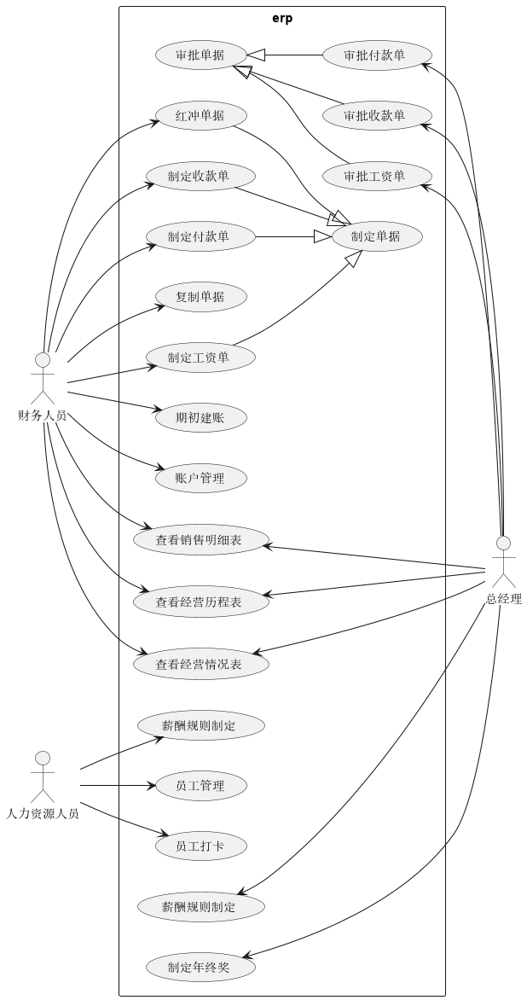
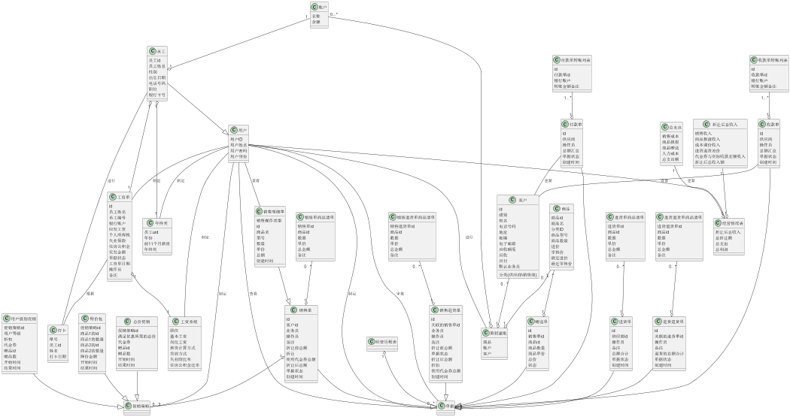

[TOC]

# 1. 引言

## 1.1. 目的

ERP销售管理系统是南鲸软件科技公司为一灯具开关民营企业开发的ERP 系统，开发的目的是帮助该企业处理日常的重点服务，主要包括库存管理、销售管理、财务管理、人事管理和企业经营管理。

## 1.2 参考文献

1. IEEE标准
2. 《软件开发的技术基础》丁二玉、刘钦编著；

# 2. 变更日志

| 修改人员 | 日期     | 修改原因                                         | 版本号 |
| -------- | -------- | ------------------------------------------------ | ------ |
| 陈亦骁   | 2022.7.5 | 创建了用例文档                                   | v1.0   |
| 陈亦骁   | 2022.7.6 | 创建了用例图、财务人员和总经理的用例描述、顺序图 | v1.1   |
| 胡雨翎   | 2022.7.6 | 完善了财务人员和总经理的用例描述、顺序图         | v1.2   |
| 陈灵灵   | 2022.7.6 | 完善了人力资源人员的用例描述、顺序图             | v1.3   |
| 陈超     | 2022.7.6 | 完善了总经理的用例描述、顺序图                   | v1.4   |
|          |          |                                                  |        |
|          |          |                                                  |        |
|          |          |                                                  |        |
|          |          |                                                  |        |

# 3. 用例图

# 4. 用例列表

| 参与者       | 用例                                                         |
| ------------ | ------------------------------------------------------------ |
| 财务人员     | 1. 账户管理 2. 制定收款单 3. 制定付款单  4. 制定工资单  5. 查看销售明细表 6. 查看经营历程表 7. 红冲单据 8. 复制单据 9. 查看经营情况表 10. 期初建账 |
| 人力资源人员 | 11. 员工管理 12. 员工打卡 13. 薪酬规则制定           |
| 总经理       | 14. 制定促销策略 15. 制定年终奖 16. 查看销售明细表 17. 查看经营历程表 18. 查看经营情况表 19. 审批收款单 20. 审批付款单 21. 审批工资单 |

# 5. 详细用例描述

## 5.1. 账户管理

| 用例编号       | 1                                                            |
| -------------- | ------------------------------------------------------------ |
| 名称           | 账户管理                                                     |
| 创建者         | 胡雨翎                                                       |
| 创建日期       | 2022.7.6                                                     |
| 最后一次更新者 | 胡雨翎                                                       |
| 更新日期       | 2022.7.7                                                     |
| 参与者         | 财务人员                                                     |
| 触发条件       | 财务人员请求对员工账户进行修改                               |
| 前置条件       | 若是修改则该员工已登记员工信息，存在账户                     |
| 后置条件       | 系统更新该账户                                               |
| 优先级         | 低                                                           |
| 正常流程       | 1. 系统确认是财务人员登录，显示账户管理的界面 2. 用户编辑想要新增或修改的账户，确认修改 3. 系统更新账户余额，在账户管理页面显示更新后的账户，并显示操作成功 |
| 扩展流程       |                                                              |

## 5.2. 制定收款单

| 用例编号       | 2                                                            |
| -------------- | ------------------------------------------------------------ |
| 名称           | 制定收款单                                                   |
| 创建者用例     | 胡雨翎                                                       |
| 创建日期       | 2022.7.6                                                     |
| 最后一次更新者 | 胡雨翎                                                       |
| 更新日期       | 2022.7.7                                                     |
| 参与者         | 财务人员                                                     |
| 触发条件       | 财务人员发起制定收款单的请求                                 |
| 前置条件       | 收款单中的客户在系统记录的客户列表中，账户在系统记录的账户列表中 |
| 后置条件       | 系统生成新的收款单，包括单据编号、客户id、操作员、总额汇总、详细转账列表清单，在收款单界面显示，并显示操作成功 |
| 优先级         | 高                                                           |
| 正常流程       | 1. 系统确认是财务人员登录，显示收款管理的界面 2. 用户新增收款单，选择客户id 3. 填写转账记录 重复第3步，直到所有转账记录填写完毕 |
| 扩展流程       |                                                              |

## 5.3. 制定付款单

| 用例编号       | 3                                                            |
| -------------- | ------------------------------------------------------------ |
| 名称           | 制定付款单                                                   |
| 创建者         | 胡雨翎                                                       |
| 创建日期       | 2022.7.6                                                     |
| 最后一次更新者 | 胡雨翎                                                       |
| 更新日期       | 2022.7.7                                                     |
| 参与者         | 财务人员                                                     |
| 触发条件       | 财务人员发起制定付款单的请求                                 |
| 前置条件       | 付款单中的客户在系统记录的客户列表中，账户在系统记录的账户列表中 |
| 后置条件       | 系统生成新的付款单，包括单据编号、客户id、操作员、总额汇总、详细转账列表清单，在付款单界面显示，并显示操作成功 |
| 优先级         | 高                                                           |
| 正常流程       | 1. 系统确认是财务人员登录，显示收款管理的界面 2. 用户新增收款单，选择客户id 3. 填写转账记录 重复第3步，直到所有转账记录填写完毕 |
| 扩展流程       |                                                              |

## 5.4. 制定工资单

| 用例编号       | 4                                                            |
| -------------- | ------------------------------------------------------------ |
| 名称           | 制定工资单                                                   |
| 创建者         | 陈灵灵                                                       |
| 创建日期       | 2022.7.6                                                     |
| 最后一次更新者 | 陈灵灵                                                       |
| 更新日期       | 2022.7.7                                                     |
| 参与者         | 人力资源人员                                                     |
| 触发条件       | 人力资源人员发起制定工资单的请求                                 |
| 前置条件       | 员工在系统的员工列表中，薪资规则已制定                       |
| 后置条件       | 系统生成新的工资单，包括单据编号、员工id、员工姓名、实发工资、操作员、时间、详细工资单，在工资单界面显示，并显示操作成功 |
| 优先级         | 高                                                           |
| 正常流程       | 1. 系统确认是人力资源人员登录，显示工资管理的界面 2. 用户新增工资单，选择员工姓名 3. 创建工资单 |
| 扩展流程       | 2a. 若薪资规则未制定   1. 提示用户该角色的薪资规则尚未制定，并拒绝制定工资单 2b. 若员工姓名不存在   1. 提示此员工不存在，并拒绝制定工资单 |

## 5.5. 查看销售明细表

| 用例编号       | 5                                                            |
| -------------- | ------------------------------------------------------------ |
| 名称           | 查看销售明细表                                               |
| 创建者         | 陈亦骁                                                       |
| 创建日期       | 2022.7.6                                                     |
| 最后一次更新者 | 陈亦骁                                                       |
| 更新日期       | 2022.7.7                                                     |
| 参与者         | 财务人员、总经理                                             |
| 触发条件       | 财务人员、总经理进入查看销售明细表的界面，按时间区间，商品名，客户，业务员，仓库5个条件筛选 |
| 前置条件       | 所选结束时间大于开始时间，商品名，客户，业务员，仓库均在系统记录的表中 |
| 后置条件       | 系统按时间区间，商品名，客户，业务员，仓库5个条件查询满足条件的销售单和销售退货单，并在界面上显示 |
| 优先级         | 高                                                           |
| 正常流程       | 1. 系统确认是财务人员或总经理登录，显示查看销售明细表的界面 2. 系统各条件按默认值，显示系统存储的所有销售单和销售退货单 3. 用户按时间区间，商品名，客户，业务员，仓库5个条件筛选 4. 系统查找满足条件的销售单和销售退货单，并在界面上显示 |
| 扩展流程       | 2a. 用户重置某条件：   1. 该条件重新设为默认值，系统重新查找满足条件的销售单和销售退货单，并在界面上显示 |

## 5.6. 查看经营历程表

| 用例编号       | 6                                                            |
| -------------- | ------------------------------------------------------------ |
| 名称           | 查看经营历程表                                               |
| 创建者         | 陈亦骁                                                       |
| 创建日期       | 2022.7.6                                                     |
| 最后一次更新者 | 陈亦骁                                                       |
| 更新日期       | 2022.7.7                                                     |
| 参与者         | 财务人员、总经理                                             |
| 触发条件       | 财务人员、总经理进入查看经营历程表的界面，按时间区间，单据类型，客户，业务员4个条件筛选 |
| 前置条件       | 所选结束时间大于开始时间，单据类型，客户，业务员均在系统记录的表中 |
| 后置条件       | 系统按时间区间，单据类型，客户，业务员4个条件查询满足条件的单据，并在界面上显示 |
| 优先级         | 高                                                           |
| 正常流程       | 1. 系统确认是财务人员或总经理登录，显示查看经营历程表的界面 2. 系统各条件按默认值，显示系统存储的单据 3. 用户按时间区间，单据类型，客户，业务员4个条件筛选 4. 系统查找满足条件的单据，并在界面上显示 |
| 扩展流程       | 2a. 用户重置某条件：   1. 该条件重新设为默认值，系统重新查找满足条件的单据，并在界面上显示 |

## 5.7. 红冲单据

| 用例编号       | 7                                                            |
| -------------- | ------------------------------------------------------------ |
| 名称           | 红冲单据                                                     |
| 创建者         | 胡雨翎                                                       |
| 创建日期       | 2022.7.6                                                     |
| 最后一次更新者 | 胡雨翎                                                       |
| 更新日期       | 2022.7.7                                                     |
| 参与者         | 财务人员                                                     |
| 触发条件       | 财务人员请求对经营历程表中的某单据进行红冲操作               |
| 前置条件       | 该单据存在于系统中                                           |
| 后置条件       | 系统生成一个把各数量取负数的单据并入账，以此来抵消之前的单据 |
| 优先级         | 中                                                           |
| 正常流程       | 1. 系统确认是财务人员登录，显示红冲的按钮 2. 用户点击红冲按钮并确认 3. 系统生成一个把原单据各数量取负数的单据 |
| 扩展流程       |                                                              |

## 5.8. 复制单据

| 用例编号       | 7                                                            |
| -------------- | ------------------------------------------------------------ |
| 名称           | 复制单据                                                     |
| 创建者         | 胡雨翎                                                       |
| 创建日期       | 2022.7.6                                                     |
| 最后一次更新者 | 胡雨翎                                                       |
| 更新日期       | 2022.7.7                                                     |
| 参与者         | 财务人员                                                     |
| 触发条件       | 财务人员请求对经营历程表中的某单据进行复制操作               |
| 前置条件       | 该单据已完成红冲操作                                         |
| 后置条件       | 系统生成一张以之前单据为模板的草稿单，给用户以编辑的机会     |
| 优先级         | 高                                                           |
| 正常流程       | 1. 系统确认是财务人员登录，显示复制的按钮 2. 用户点击复制按钮 3. 系统显示一张以之前单据为模板的草稿单 4. 用户编辑单据并创建 5. 系统生成单据 |
| 扩展流程       |                                                              |

## 5.9. 查看经营情况表

| 用例编号       | 8                                                            |
| -------------- | ------------------------------------------------------------ |
| 名称           | 查看经营情况表                                               |
| 创建者         | 陈亦骁                                                       |
| 创建日期       | 2022.7.6                                                     |
| 最后一次更新者 | 陈亦骁                                                       |
| 更新日期       | 2022.7.7                                                     |
| 参与者         | 财务人员、总经理                                             |
| 触发条件       | 财务人员进入查看经营情况表界面                               |
| 前置条件       | 系统各表数据完整                                             |
| 后置条件       | 系统计算折让后总收入、总折让额、总支出、总利润，并显示在查看经营情况表界面中 |
| 优先级         | 高                                                           |
| 正常流程       | 1. 系统确认是财务人员或总经理登录，显示查看经营情况表的界面 2. 系统显示折让后总收入、总折让额、总支出、总利润、折让后总收入的明细、总支出的明细 |
| 扩展流程       |                                                              |

## 5.10. 期初建账

| 用例编号       | 9                                                            |
| -------------- | ------------------------------------------------------------ |
| 名称           | 期初建账                                                     |
| 创建者         | 陈亦骁                                                       |
| 创建日期       | 2022.7.6                                                     |
| 最后一次更新者 | 陈亦骁                                                       |
| 更新日期       | 2022.7.7                                                     |
| 参与者         | 财务人员                                                     |
| 触发条件       | 财务人员请求期初建账操作                                     |
| 前置条件       | 商品信息中的商品类别在系统的商品类别列表中，客户信息中的客户分类、级别、默认业务员在系统的客户种类、级别、业务员列表中 |
| 后置条件       | 系统完成期初建账，包括所添加的商品、客户、账户信息           |
| 优先级         | 高                                                           |
| 正常流程       | 1. 系统确认是财务人员或总经理登录，显示查看期初建账的界面 2. 用户添加商品信息、客户信息、账户信息 3. 界面显示已添加商品、客户、账户信息 4. 用户点击完成初期建账 5. 界面上所添加的审批、客户、账户信息清空，期初建账信息显示在下方表格中 |
| 扩展流程       | 1a. 用户离开界面：   1. 系统提醒用户若离开界面则所有尚未完成初期建账所添加的商品、客户、账户信息都将丢失 |

## 5.11. 员工管理

| 用例编号       | 10                                                           |
| -------------- | ------------------------------------------------------------ |
| 名称           | 员工管理                                                     |
| 创建者         | 陈灵灵                                                       |
| 创建日期       | 2022.7.6                                                     |
| 最后一次更新者 | 陈灵灵                                                       |
| 更新日期       | 2022.7.7                                                     |
| 参与者         | 人力资源人员                                                 |
| 触发条件       | 用户请求新增员工操作                                         |
| 前置条件       | 该员工尚未在系统中创建                                       |
| 后置条件       | 系统完成员工创建，并在系统中创建已该员工姓名为用户名的用户，初始密码为123456 |
| 优先级         | 高                                                           |
| 正常流程       | 1. 系统确认是人力资源人员登录，显示员工管理的界面 2. 系统显示已有的所有员工信息，可以按员工号和姓名搜索 3. 用户添加员工的姓名、性别、生日、电话号码、职务、银行卡号 4. 系统添加员工，并显示更新后的界面 |
| 扩展流程       |                                                              |

## 5.12. 员工打卡

| 用例编号       | 11                                                           |
| -------------- | ------------------------------------------------------------ |
| 名称           | 员工打卡                                                     |
| 创建者         | 陈灵灵                                                       |
| 创建日期       | 2022.7.6                                                     |
| 最后一次更新者 | 陈灵灵                                                       |
| 更新日期       | 2022.7.7                                                     |
| 参与者         | 所有人员                                                     |
| 触发条件       | 用户请求每日打卡操作                                         |
| 前置条件       | 该用户已在员工列表中存储，且当日尚未进行打卡操作             |
| 后置条件       | 系统增加打卡记录，且对该用户今日隐藏打卡按钮                 |
| 优先级         | 中                                                           |
| 正常流程       | 1. 系统显示打卡按钮 2. 用户点击打卡按钮 3. 更新打卡记录 4. 界面显示签到成功 5. 界面隐藏打卡按钮 |
| 扩展流程       |                                                              |

## 5.13. 薪酬规则制定

| 用例编号       | 12                                                           |
| -------------- | ------------------------------------------------------------ |
| 名称           | 薪酬规则制定                                                 |
| 创建者         | 陈灵灵                                                       |
| 创建日期       | 2022.7.6                                                     |
| 最后一次更新者 | 陈灵灵                                                       |
| 更新日期       | 2022.7.7                                                     |
| 参与者         | 人力资源人员                                                 |
| 触发条件       | 人力资源人员请求制定薪酬规则操作                             |
| 前置条件       | 该角色尚未制定薪酬规则                                       |
| 后置条件       | 系统增加薪酬规则                                             |
| 优先级         | 高                                                           |
| 正常流程       | 1. 系统确认是人力资源人员登录，显示查看薪酬规则制定的界面 2. 系统显示更新后的全部薪酬规则 3. 用户添加薪酬规则的职务、基本工资、岗位工资等信息 4. 系统新增薪酬规则 5. 系统显示更新后的全部薪酬规则 |
| 扩展流程       | 4a. 该角色已经创建薪酬规则   1. 系统提示重复制定，并拒绝制定操作 |

## 5.14. 制定促销策略

| 用例编号       | 13                                                           |
| -------------- | ------------------------------------------------------------ |
| 名称           | 制定促销策略                                                 |
| 创建者         | 胡雨翎                                                       |
| 创建日期       | 2022.7.6                                                     |
| 最后一次更新者 | 胡雨翎                                                       |
| 更新日期       | 2022.7.7                                                     |
| 参与者         | 总经理                                                       |
| 触发条件       | 总经理发起制定促销策略请求                                   |
| 前置条件       | 所选结束时间大于开始时间，赠品、特价包组合的商品都在系统的商品列表中 |
| 后置条件       | 系统建立不同促销策略，并在页面中显示所有促销策略             |
| 优先级         | 高                                                           |
| 正常流程       | 1. 系统确认是总经理登录，显示查看制定促销策略的界面 2. 界面显示已建立的所有促销策略 3. 总经理填写促销策略所需内容并创建促销策略 4. 界面显示更新已建立的所有促销策略并显示 |
| 扩展流程       |                                                              |

## 5.15. 制定年终奖

| 用例编号       | 14                                                           |
| -------------- | ------------------------------------------------------------ |
| 名称           | 制定年终奖                                                   |
| 创建者         | 陈超                                                         |
| 创建日期       | 2022.7.6                                                     |
| 最后一次更新者 | 陈超                                                         |
| 更新日期       | 2022.7.7                                                     |
| 参与者         | 总经理                                                       |
| 触发条件       | 总经理请求制定年终奖操作                                     |
| 前置条件       | 该员工已存储在系统员工列表中，其账户储存在系统账户列表中     |
| 后置条件       | 系统添加该员工年终奖，更新其账户                             |
| 优先级         | 中                                                           |
| 正常流程       | 1. 系统确认是总经理登录，显示查看制定年终奖的界面 2. 界面显示已制定的所有年终奖 3. 用户选择员工和年份，查询其11个月的工资 4. 用户根据员工前11个月的工资及其业绩表现，制定年终奖 5. 系统添加年终奖 6. 界面显示更新后的所有年终奖 |
| 扩展流程       |                                                              |

## 5.16. 审批收款单

| 用例编号       | 15                                                           |
| -------------- | ------------------------------------------------------------ |
| 名称           | 审批收款单                                                   |
| 创建者         | 陈亦骁                                                       |
| 创建日期       | 2022.7.6                                                     |
| 最后一次更新者 | 陈亦骁                                                       |
| 更新日期       | 2022.7.7                                                     |
| 参与者         | 总经理                                                       |
| 触发条件       | 总经理发起审批收款单的请求                                   |
| 前置条件       | 收款单已被财务人员建立，且状态为待审批                       |
| 后置条件       | 若通过审批，则将收款单的状态设置为审批完成，并更新客户的应付字段和账户余额。若未通过审批，则将收款单的状态设置为审批失败 |
| 优先级         | 低                                                           |
| 正常流程       | 1. 系统确认是总经理登录，显示审批收款单的界面 2. 界面按收款单状态显示所有收款单 3. 总经理审批收款单 4. 系统更新收款单状态，界面按收款单更新后的状态显示所有收款单 |
| 扩展流程       |                                                              |

## 5.17. 审批付款单

| 用例编号       | 16                                                           |
| -------------- | ------------------------------------------------------------ |
| 名称           | 审批付款单                                                   |
| 创建者         | 胡雨翎                                                       |
| 创建日期       | 2022.7.6                                                     |
| 最后一次更新者 | 胡雨翎                                                       |
| 更新日期       | 2022.7.7                                                     |
| 参与者         | 总经理                                                       |
| 触发条件       | 总经理发起审批付款单的请求                                   |
| 前置条件       | 付款单已被财务人员建立，且状态为待审批                       |
| 后置条件       | 若通过审批，则将付款单的状态设置为审批完成，并更新客户的应收字段和账户余额。若未通过审批，则将付款单的状态设置为审批失败 |
| 优先级         | 低                                                           |
| 正常流程       | 1. 系统确认是总经理登录，显示审批付款单的界面 2. 界面按付款单状态显示所有付款单 3. 总经理审批付款单 4. 系统更新付款单状态，界面按付款单更新后的状态显示所有付款单 |
| 扩展流程       |                                                              |

## 5.18. 审批工资单

| 用例编号       | 17                                                           |
| -------------- | ------------------------------------------------------------ |
| 名称           | 审批工资单                                                   |
| 创建者         | 陈灵灵                                                       |
| 创建日期       | 2022.7.6                                                     |
| 最后一次更新者 | 陈灵灵                                                       |
| 更新日期       | 2022.7.7                                                     |
| 参与者         | 总经理                                                       |
| 触发条件       | 总经理发起审批工资单的请求                                   |
| 前置条件       | 工资已被财务人员建立，且状态为待审批                         |
| 后置条件       | 若通过审批，则将工资单的状态设置为审批完成，并更新员工的账户余额。若未通过审批，则将付款单的状态设置为审批失败 |
| 优先级         | 低                                                           |
| 正常流程       | 1. 系统确认是总经理登录，显示审批工资单的界面 2. 界面按工资单状态显示所有工资单 3. 总经理审批工资单 4. 系统更新工资单状态，界面按工资单更新后的状态显示所有工资单 |
| 扩展流程       |                                                              |

# 6. 需求分析模型

## 6.1. 系统顺序图

### 6.1.1. 账户管理

### 6.1.2. 制定收款单

### 6.1.3. 制定付款单

### 6.1.4. 制定工资单

### 6.1.5. 查看销售明细表

### 6.1.6. 查看经营历程表

### 6.1.7. 红冲单据

### 6.1.8. 复制单据

### 6.1.9. 查看经营情况表

### 6.1.10. 期初建账

### 6.1.11. 员工管理

### 6.1.12. 员工打卡

### 6.1.13. 薪酬规则制定

### 6.1.14. 制定促销策略

### 6.1.15. 制定年终奖

### 6.1.16. 审批收款单

### 6.1.17. 审批付款单

### 6.1.18 审批工资单

## 6.2. 概念类图

