# 详细设计文档

## 文档修改历史

| 修改人员 | 日期       | 修改原因                                   | 版本号 |
| -------- | ---------- | ------------------------------------------ | ------ |
| 陈超     | 2022.07.06 | 创建文档                                   | V1.0   |
| 陈超     | 2022.7.8   | 增加年终奖、促销策略模块                   | V1.1   |
| 陈亦骁   | 2022.7.8   | 增加查看单据、赠品单模块                   | V1.2   |
| 胡雨翎   | 2022.7.9   | 增加账户管理、收款单、付款单、期初建账模块 | V1.3   |
| 陈灵灵   | 2022.7.9   | 增加员工信息、工资单模块                 | V1.4   |

[TOC]

## 1.引言

### 1.1 编制目的

本报告详细完成对灯具开关企业ERP系统的详细设计，达到指导详细设计和开发的目的，同时实现和测试人员及用户的沟通。本报告面向开发人员、测试人员及最终用户而编写，是了解系统的导航。

### 1.2 词汇表

| 词汇名称 | 词汇含义             | 备注 |
| -------- | -------------------- | ---- |
| ERP      | 企业资源规划管理系统 |      |

### 1.3 参考资料

1. IEEE标准
2. 《软件工程与计算（卷二）软件开发的技术基础》
3. 灯具开关企业ERP系统软件需求规格说明文档
4. ERP系统软件体系结构文档

## 2.产品概述

参考灯具开关企业ERP系统软件需求规格说明文档和⽤例⽂档中对产品的概括描述。

## 3.体系结构设计概述

参考灯具开关企业ERP系统的概要设计⽂档中对体系结构设计的概述

## 4.结构视角

### 4.1 业务逻辑层对分解

#### 4.1.1 Attendancebl模块

##### （1）模块概述

1. Attendancebl模块承担的需求参见需求规格说明文档功能需求及相关非功能需求说明文档。
2. Attendancebl模块的职责及接口参见软件系统结构描述文档。

##### （2）整体结构

根据体系结构的设计，我们将系统分为展示层、逻辑层、数据层。为了增加灵活性，我们添加了接口，比如在Controller层和业务逻辑层之间我们添加了AttendanceService，业务逻辑层与数据层之间我们添加了AttendanceMapper接口。为了隔离业务逻辑职责和逻辑控制职责，我们增加了AttendanceController，这样AttendanceController会将具体的业务逻辑委托给AttendanceService。AttendancePO作为账户的持久化对象而添加到设计模型中。

###### Attendancebl模块的设计如下图：

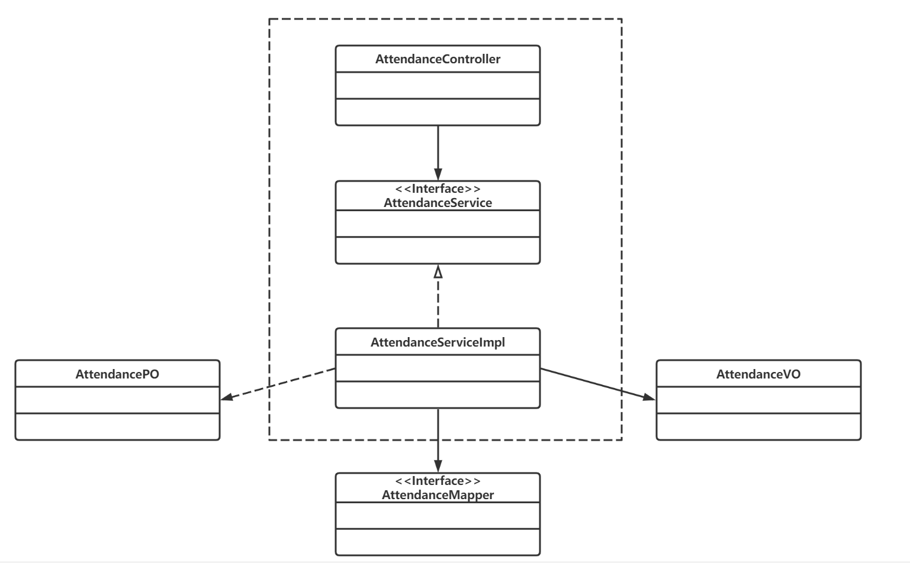

###### 各个类的职责

| 模块                 | 职责                                                        |
| -------------------- | ----------------------------------------------------------- |
| AttendanceController | 负责实现签到信息的前后端交互                                |
| AttendanceService    | 负责实现签到信息的增删改查功能                              |
| AttendanceMapper     | 负责提供签到相关数据与持久化相关的接口                      |
| AttendanceVO         | 签到增删改查功能的实现载体，存有员工id,姓名，打卡日期等信息 |
| AttendancePO         | 签到增删改查功能的实现载体，存有员工id,姓名，打卡日期等信息 |

##### （3）模块内部类的接口规范

###### Attendance模块的接口规范

| 接口名字                                 | 语法                                       | 前置条件       | 后置条件                                                     |
| ---------------------------------------- | ------------------------------------------ | -------------- | ------------------------------------------------------------ |
| AttendanceController.addAttendRecord     | addAttendRecord(AttendanceVO attendanceVO) | 员工当天未打卡 | 将打卡信息传给后端AttendanceService,添加一个员工打卡记录     |
| AttendanceController.deletePreRecord     | deletePreRecord(String dateStr)            | 日期合法       | 将日期传给后端AttendanceService，删除该日期之前所有的打卡记录 |
| AttendanceController.countMonthAttend    | countMonthAttend(Integer uid)              | 员工信息存在   | 将员工id传给后端将日期传给后端AttendanceService，查询该员工该月打卡次数 |
| AttendanceController.countDayAttend      | countDayAttend(Integer uid)                | 员工信息存在   | 将员工id传给后端将日期传给后端AttendanceService，查询该员工当日是否打卡 |
| AttendanceController.findAllAttendRecord | findAllAttendRecord()                      | 无             | 从AttendanceService获得所有打卡信息                          |

###### Attendance模块的服务接口

| 服务名                             | 服务                                                     |
| ---------------------------------- | -------------------------------------------------------- |
| AttendanceService.addAttendRecord  | 将打卡信息传给AttendanceMapper                           |
| AttendanceService.deletePreRecord  | 将日期传给AttendanceMapper，删除该日期之前所有的打卡记录 |
| AttendanceService.countMonthRecord | 将员工id传给AttendanceMapper，查询该员工该月打卡次数     |
| AttendanceService.countDayAttend   | 将员工id传给AttendanceMapper，查询该员工当天是否打卡     |
| AttendanceService.findAll          | 从AttendanceMapper获得所有打卡信息                       |

##### （4）业务逻辑层的动态模型

下图表明了在ERP系统中，Account.addAttendRecord的相关对象之间的协作

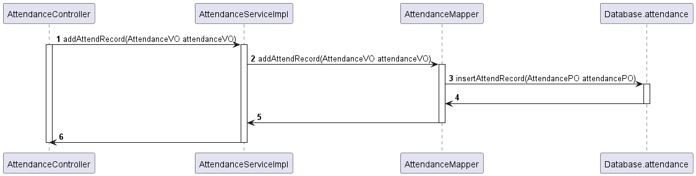

##### （5）业务逻辑层的设计原理

利用委托式控制风格，每个界面需要访问的业务逻辑由各自的控制器委托给不同的领域对象。

#### 4.1.2 Accountbl模块

##### （1）模块概述

1. Accountbl模块承担的需求参见需求规格说明文档功能需求及相关非功能需求说明文档。
2. Accountbl模块的职责及接口参见软件系统结构描述文档。

##### （2）整体结构

根据体系结构的设计，我们将系统分为展示层、逻辑层、数据层。为了增加灵活性，我们添加了接口，比如在Controller层和业务逻辑层之间我们添加了AccountService，业务逻辑层与数据层之间我们添加了AccountMapper接口。为了隔离业务逻辑职责和逻辑控制职责，我们增加了AccountController，这样AccountController会将具体的业务逻辑委托给AccountService。AccountPO作为账户的持久化对象而添加到设计模型中。

###### Accountbl模块的设计如下图：

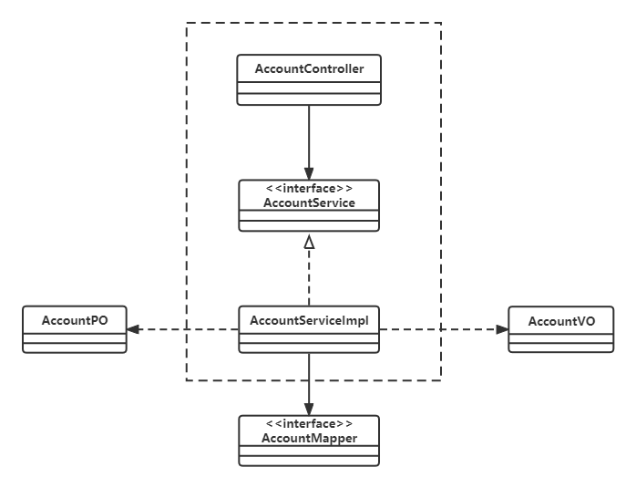

###### 各个类的职责

| 模块              | 职责                                                 |
| ----------------- | ---------------------------------------------------- |
| AccountController | 负责实现账户信息的前后端交互                         |
| AccountServicel   | 负责实现账户的增删改查功能                           |
| AccountMapper     | 负责提供酒店相关数据与持久化相关的接口               |
| AccountVO         | 账户增删改查功能的实现载体，存有账户名称、余额等信息 |
| AccountPO         | 账户增删改查功能的实现载体，存有账户名称、余额等信息 |

##### （3）模块内部类的接口规范

Accountbl模块的各个类的职责和内部类的接口规范已在ERP系统软件体系结构文档中描述。

###### Account模块的接口规范

| 接口名字                          | 语法                                                   | 前置条件                     | 后置条件                                      |
| --------------------------------- | ------------------------------------------------------ | ---------------------------- | --------------------------------------------- |
| AccountController.findAllAccounts | findAllAccounts()                                      | 无                           | 从AccountService获得所有账户信息              |
| AccountController.addAccount      | addAccount(AccountVO accountVO)                        | 输入合法                     | 将账户信息传给后端AccountServic，添加一个账户 |
| AccountController.deleteAccount   | deleteAccount(String bankAccount)                      | 账户名称存在                 | 将被删除的账户信息传给后端AccountService      |
| AccountController.updateAmount    | updateAmount(String bankAccount,String transferAmount) | 账户名称存在，转账金额为数字 | 将更新信息传给后端AccountService              |
| AccountController.findByKeyword   | findByKeyword(String keyword)                          | 输入合法                     | 将关键字传给后端AccountService搜索            |

###### Account模块的服务接口

| 服务名                           | 服务                              |
| -------------------------------- | --------------------------------- |
| AccountService.getAllAccounts    | 从AccountMapper获得所有账户信息   |
| AccountService.addAccount        | 将账户信息传给AccountMapper       |
| AccountService.deleteByName      | 将账户名称传给AccountMapper       |
| AccountService.findAccountByName | 从AccountMapper获得预期的账户信息 |
| AccountService.updateAmount      | 将账户信息传给AccountMapper       |
| AccountService.findByKeyword     | 从AccountMapper获得预期的账户信息 |

##### （4）业务逻辑层的动态模型

- 下图表明了在ERP系统中，Account.addAccount的相关对象之间的协作

- 下图表明了在ERP系统中，Account.deleteAccount的相关对象之间的协作

- 下图表明了在ERP系统中，Account.updateAccount的相关对象之间的协作

- 下图表明了在ERP系统中，Account.findAccountByKeyword的相关对象之间的协作

##### （5）业务逻辑层的设计原理

利用委托式控制风格，每个界面需要访问的业务逻辑由各自的控制器委托给不同的领域对象。

#### 4.1.3 Paymentbl模块

##### （1）模块概述

1. Paymentbl模块承担的需求参见需求规格说明文档功能需求及相关非功能需求说明文档。
2. Paymentbl模块的职责及接口参见软件系统结构描述文档。

##### （2）整体结构

根据体系结构的设计，我们将系统分为展示层、逻辑层、数据层。为了增加灵活性，我们添加了接口，比如在Controller层和业务逻辑层之间我们添加了PaymentService，业务逻辑层与数据层之间我们添加了PaymentMapper接口。为了隔离业务逻辑职责和逻辑控制职责，我们增加了PaymentController，这样PaymentController会将具体的业务逻辑委托给PaymentService，PaymentService将其他具体的业务过程按照对于不同逻辑实体的处理分配给CustomerService和AccountService来完成。PaymentPO作为付款单的持久化对象而添加到设计模型中。

###### Paymentbl模块的设计如下图：

###### 各个类的职责：

| 模块              | 职责                                                         |
| ----------------- | ------------------------------------------------------------ |
| PaymentController | 负责实现付款单的前后端交互                                   |
| PaymentService    | 负责实现付款单的制定和审批功能                               |
| PaymentMapper     | 负责提供付款单相关数据与持久化相关的接口                     |
| PaymentVO         | 付款单制定和审批功能的实现载体，存有客户id、操作员、总额汇总等信息 |
| PaymentPO         | 付款单制定和审批功能的实现载体，存有单据编号、客户id、操作员、总额汇总、单据状态等信息 |
| CustomerService   | 根据客户id查找客户信息；更新客户信息                         |
| AccountService    | 根据账户名称查找账户信息；更新账户信息                       |

##### （3）模块内部类的接口规范

Paymentbl模块的各个类的职责和内部类的接口规范已在ERP系统软件体系结构文档中描述。

###### Payment模块的接口规范

| 接口名字                           | 语法                                                         | 前置条件                                | 后置条件                                         |
| ---------------------------------- | ------------------------------------------------------------ | --------------------------------------- | ------------------------------------------------ |
| PaymentController.makePayment      | makePayment(UserVO userVO, PaymentSheetVO paymentSheetVO)    | 输入合法                                | 将付款单信息传给后端PaymentService               |
| PaymentController.showSheetByState | showSheetByState(FinanceSheetState state)                    | state为“待审批”、“审批成功”、“审批失败” | 根据state从PaymentService中获得相应付款单        |
| PaymentController.Approval         | Approval(String paymentId,                         FinanceSheetState state) | 输入合法                                | 将付款单单号和状态传给后端PaymentService进行审批 |

###### Payment模块的服务接口

| 服务名                                | 服务                                           |
| ------------------------------------- | ---------------------------------------------- |
| PaymentService.makePaymentSheet       | 创建付款单，并传给PaymentMapper                |
| PaymentService.getPaymentSheetByState | 根据state从PaymentMapper中获得预期的付款单信息 |
| paymentSheetApproval.approval         | 审批付款单，修改付款单的状态                   |

##### （4）业务逻辑层的动态模型

- 下图表明了在ERP系统中，Payment.makePaymentSheet的相关对象之间的协作

- 下图表明了在ERP系统中，Payment.getPaymentSheetByState的相关对象之间的协作

- 下图表明了在ERP系统中，Payment.approval的相关对象之间的协作

##### （5）业务逻辑层的设计原理

利用委托式控制风格，每个界面需要访问的业务逻辑由各自的控制器委托给不同的领域对象。

#### 4.1.4 Receiptbl模块

##### （1）模块概述

1. Receiptbl模块承担的需求参见需求规格说明文档功能需求及相关非功能需求说明文档。
2. Receiptbll模块的职责及接口参见软件系统结构描述文档。

##### （2）整体结构

根据体系结构的设计，我们将系统分为展示层、逻辑层、数据层。为了增加灵活性，我们添加了接口，比如在Controller层和业务逻辑层之间我们添加了ReceiptService，业务逻辑层与数据层之间我们添加了ReceiptMapper接口。为了隔离业务逻辑职责和逻辑控制职责，我们增加了ReceiptController，这样ReceiptController会将具体的业务逻辑委托给ReceiptService，ReceiptService将其他具体的业务过程按照对于不同逻辑实体的处理分配给CustomerService和AccountService来完成。PaymentPO作为付款单的持久化对象而添加到设计模型中。

###### Receiptbl模块的设计如下图：

###### 各个类的职责：

| 模块              | 职责                                                         |
| ----------------- | ------------------------------------------------------------ |
| ReceiptController | 负责实现收款单的前后端交互                                   |
| ReceiptService    | 负责实现收款单的制定和审批功能                               |
| ReceiptMapper     | 负责提供收款单相关数据与持久化相关的接口                     |
| ReceiptVO         | 收款单制定和审批功能的实现载体，存有客户id、操作员、总额汇总等信息 |
| ReceiptPO         | 收款单制定和审批功能的实现载体，存有单据编号、客户id、操作员、总额汇总、单据状态等信息 |
| CustomerService   | 根据客户id查找客户信息；更新客户信息                         |
| AccountService    | 根据账户名称查找账户信息；更新账户信息                       |

##### （3）模块内部类的接口规范

###### Receipt模块的接口规范

| 接口名字                           | 语法                                                         | 前置条件                                | 后置条件                                         |
| ---------------------------------- | ------------------------------------------------------------ | --------------------------------------- | ------------------------------------------------ |
| ReceiptController.makeReceipt      | makeReceipt(UserVO userVO,ReceiptSheetVO receiptSheetVO)     | 输入合法                                | 将收款单信息传给后端PaymentService               |
| ReceiptController.showSheetByState | showSheetByState(FinanceSheetState state)                    | state为“待审批”、“审批成功”、“审批失败” | 根据state从ReceiptService中获得相应付款单        |
| ReceiptController.Approval         | Approval(String receiptId,                          FinanceSheetState state) | 输入合法                                | 将收款单单号和状态传给后端PaymentService进行审批 |

###### Receipt模块的服务接口

| 服务名                                | 服务                                           |
| ------------------------------------- | ---------------------------------------------- |
| ReceiptService.makeReceiptSheet       | 创建收款单，并传给ReceiptMapper                |
| ReceiptService.getReceiptSheetByState | 根据state从ReceiptMapper中获得预期的收款单信息 |
| ReceiptSheetApproval.approval         | 审批收款单，更改收款单的状态                   |

##### （4）业务逻辑层的动态模型

- 下图表明了在ERP系统中，Receipt.makeReceiptSheet的相关对象之间的协作

- 下图表明了在ERP系统中，Receipt.getPaymentSheetByState的相关对象之间的协作

- 下图表明了在ERP系统中，Receipt.approval的相关对象之间的协作

##### （5）业务逻辑层的设计原理

利用委托式控制风格，每个界面需要访问的业务逻辑由各自的控制器委托给不同的领域对象。

#### 4.1.5 OpeningEstablishbl模块

##### （1）模块概述

1. OpeningEstablishbl模块承担的需求参见需求规格说明文档功能需求及相关非功能需求说明文档。
2. OpeningEstablishbl模块的职责及接口参见软件系统结构描述文档。

##### （2）整体结构

###### OpeningEstablishbl模块的设计如下图：

###### 各个类的职责：

| 模块                       | 职责                                           |
| -------------------------- | ---------------------------------------------- |
| OpeningEstablishController | 负责实现期初建账的前后端数据交互               |
| OpeningEstablishService    | 负责实现保存期初建账的商品、客户、账户信息功能 |
| OpeningEstablishMapper     | 负责提供期初建账相关数据与持久化相关的接口     |
| AccountService             | 向系统中添加账户信息                           |
| CustomerService            | 向系统中添加客户信息                           |
| ProductService             | 向系统中添加商品信息                           |

##### （3）模块内部类的接口规范

###### OpeningEstablish模块的接口规范

| 接口名字                                     | 语法                                      | 前置条件                                                | 后置条件                                                     |
| -------------------------------------------- | ----------------------------------------- | ------------------------------------------------------- | ------------------------------------------------------------ |
| OpeningEstablishController.establishProduct  | establishProduct(CreateProductVO product) | 输入合法                                                | 往productList中增加一个商品                                  |
| OpeningEstablishController.establishCustomer | establishCustomer(CustomerVO customer)    | 输入合法                                                | 往customerList中增加一个商品                                 |
| OpeningEstablishController.establishAccount  | establishAccount(AccountVO account)       | 输入合法                                                | 往customerList中增加一个商品                                 |
| OpeningEstablishController.establish()       | establish()                               | productList、customerList、customerList中已添加相应信息 | 将productList、customerList、customerList传给OpenEstablishService进行期初建账 |

###### OpeningEstablish模块的服务接口

| 服务名                            | 服务                                                         |
| --------------------------------- | ------------------------------------------------------------ |
| openingEstablishService.establish | 将相应列表传给productService、customerService、accountService，插入商品、客户、账户信息 |

##### （4）业务逻辑层的动态模型

- 下图表明了在ERP系统中，OpeningEstablishService.establish的相关对象之间的协作

##### （5）业务逻辑层的设计原理

利用委托式控制风格，每个界面需要访问的业务逻辑由各自的控制器委托给不同的领域对象。

#### 4.1.6 SheetsReviewbl模块

##### （1）模块概述

1. SheetsReviewbl模块承担的需求参见需求规格说明文档功能需求及相关非功能需求说明文档。
2. SheetsReviewbl模块的职责及接口参见软件系统结构描述文档。

##### （2）整体结构

###### SheetsReviewbl模块的设计如下图：

###### 各个类的职责：

| 模块                   | 职责                                                         |
| ---------------------- | ------------------------------------------------------------ |
| SheetsReviewController | 负责实现查看经营里程表、销售明细表、经营情况表的前后端数据交互 |
| SheetsReviewService    | 负责实现查看经营里程表、销售明细表、经营情况表功能           |
| SaleService            | 查看销售信息                                                 |
| SaleReturnService      | 查看销售退货信息                                             |
| WarehouseService       | 查看仓库信息                                                 |
| ProductService         | 查看商品信息                                                 |
| PurchaseService        | 查看进货信息                                                 |
| PurchaseReturnsService | 查看进货退货信息                                             |
| PaymentService         | 查看付款信息                                                 |
| ReceiptService         | 查看收款信息                                                 |
| UserService            | 查看用户信息                                                 |
| GiftSheetService       | 查看赠品信息                                                 |
| CustomerService        | 查看客户信息                                                 |
| PromotionStrategy      | 使用促销策略                                                 |

##### （3）模块内部类的接口规范

###### SheetsReview模块的接口规范

| 接口名字                                      | 语法                                                         | 前置条件 | 后置条件                                           |
| --------------------------------------------- | ------------------------------------------------------------ | -------- | -------------------------------------------------- |
| SheetsReviewController.getSaleDetail          | getSaleDetail(String beginDateStr,String endDateStr,                                String productName,String customerName,                                String operatorName,String warehouseId) | 输入合法 | 系统显示销售明细表，显示符合条件的所有商品销售记录 |
| SheetsReviewController.getProcessSheet        | getProcessSheet(String beginDateStr,String endDateStr,                                String sheetType,String customerName,                                String operatorName,String warehouseId) | 输入合法 | 系统显示符合条件的所有单据                         |
| SheetsReviewController.getOperationSheet      | getOperationSheet()                                          | 无       | 系统显示经营情况表                                 |
| SheetsReviewController.getIncomeAfterDiscount | getIncomeAfterDiscount()                                     | 无       | 系统显示折让后总收入明细                           |
| SheetsReviewController.getExpenditure         | getExpenditure()                                             | 无       | 系统显示总支出明细                                 |
| SheetsReviewController.generateRedFlush       | generateRedFlush(SheetVO sheetVO)                            | 单据存在 | 系统为该单据生成红冲                               |

###### SheetsReview模块的服务接口

| 服务名                                       | 服务                                                         |
| -------------------------------------------- | ------------------------------------------------------------ |
| SheetsReviewService.getSaleDetailByTime      | 返回此时间段内的销售详细信息                                 |
| SheetsReviewService.getSaleDetailByProduct   | 返回有关此商品的销售详细信息                                 |
| SheetsReviewService.getSaleDetailByCustomer  | 返回有关此客户的销售详细信息                                 |
| SheetsReviewService.getSaleDetailByOperator  | 返回有关此操作员的销售详细信息                               |
| SheetsReviewService.getSaleDetailByWarehouse | 返回有关此仓库的销售详细信息                                 |
| SheetsReviewService.getIncomeAfterDiscount   | 返回收入类信息：销售收入、商品类收入、折让后的总收入         |
| SheetsReviewService.getTotalIncomeDiscount   | 返回总折让数额                                               |
| SheetsReviewService.redFlush                 | 生成一个一模一样、仅把数量取负数的单子并入账，以此来抵消之前的单子 |
| SheetsReviewService.getTotalExpenditure      | 返回支出类信息：销售成本、商品类支出、人力成本、总支出       |
| SheetsReviewService.getTotalProfit           | 返回总利润                                                   |
| SheetsReviewService.getOperationSheet        | 返回经营情况表，包括收入类信息、支出类信息、利润             |
| SheetsReviewService.getSheetByTime           | 返回此时间段内的所有单据                                     |
| SheetsReviewService.getSheetBySheetType      | 根据单据类型返回单据                                         |
| SheetsReviewService.getSheetByCustomerName   | 返回有关此客户的单据信息                                     |
| SheetsReviewService.getSheetByOperatorName   | 输入操作员名字在数据库中存在                                 |

##### （4）业务逻辑层的动态模型

- 下图表明了在ERP系统中，SheetReview.getSaleDetail的相关对象之间的协作

- 下图表明了在ERP系统中，SheetReview.getSheet的相关对象之间的协作

- 下图表明了在ERP系统中，SheetReview.getOperationSheet的相关对象之间的协作

- 下图表明了在ERP系统中，SheetReview.redFlush的相关对象之间的协作

##### （5）业务逻辑层的设计原理

利用委托式控制风格，每个界面需要访问的业务逻辑由各自的控制器委托给不同的领域对象。

#### 4.1.7 Personnelbl模块

##### （1）模块概述

1. Personnelbl模块承担的需求参见需求规格说明文档功能需求及相关非功能需求说明文档。
2. Personnelbl模块的职责及接口参见软件系统结构描述文档。

##### （2）整体结构

###### Personnelbl模块的设计如下图：

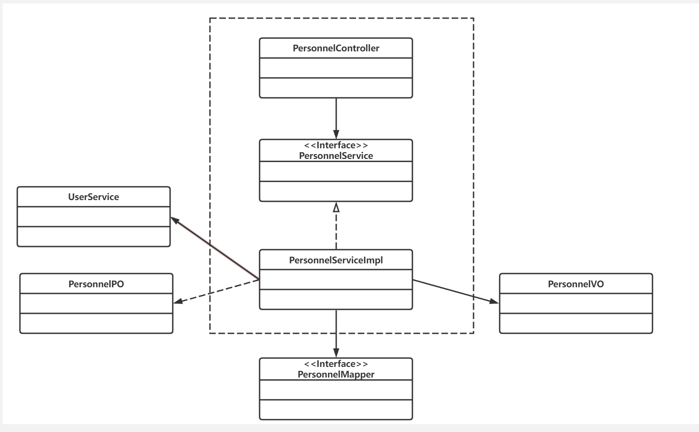

##### （3）模块内部类的接口规范

###### Personnel模块的接口规范

| 接口名字                                | 语法                                     | 前置条件     | 后置条件                                          |
| --------------------------------------- | ---------------------------------------- | ------------ | ------------------------------------------------- |
| PersonnelController.createPersonnel     | createPersonnel(PersonnelVO personnelVO) | 输入合法     | 将员工信息传给后端PersonnelService,添加员工信息   |
| PersonnelController.findAllPersonnel    | findAllPersonnel()                       | 无           | 从PersonnelService获取所有员工信息                |
| PersonnelController.findPersonnelById   | findPersonnelById(Integer id)            | 员工信息存在 | 将员工id传给后端PersonnelService,获取该员工信息   |
| PersonnelController.findPersonnelByName | findPersonnelByName(String name)         | 员工信息存在 | 将员工姓名传给后端PersonnelService,获取该员工信息 |
| PersonnelController.updatePersonnel     | updatePersonnel(PersonnelVO personnelVO) | 输入合法     | 将员工信息传给后端PersonnelService,修改员工信息   |
| PersonnelController.deletePersonnel     | deletePersonnel(Integer id)              | 员工信息存在 | 将员工id传给后端PersonnelService,删除该员工信息   |

###### Personnel模块的服务接口

| 服务名                            | 服务                                  |
| --------------------------------- | ------------------------------------- |
| PersonnelService.createPersonnel  | 将新增的员工信息传给PersonnelMapper   |
| PersonnelService.findById         | 将要查询的员工id传给PersonnelMapper   |
| PersonnelService.findByName       | 将要查询的员工姓名传给PersonnelMapper |
| PersonnelService.findAllPersonnel | 从PersonnelMapper中获取所有员工信息   |
| PersonnelService.updatePersonnel  | 将要修改的员工信息传给PersonnelMapper |
| PersonnelService.deleteById       | 将要删除的员工id传给PersonnelMapper   |

##### （4）业务逻辑层的动态模型

下图表明了在ERP系统中，Personnel.Add的相关对象之间的协作

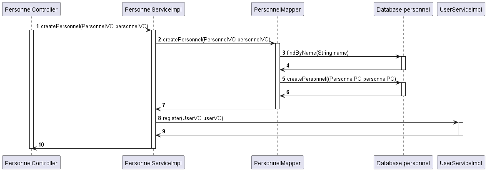

##### （5）业务逻辑层的设计原理

利用委托式控制风格，每个界面需要访问的业务逻辑由各自的控制器委托给不同的领域对象。

#### 4.1.8 Salarybl模块

##### （1）模块概述

1. Salarybl模块承担的需求参见需求规格说明文档功能需求及相关非功能需求说明文档。
2. Salarybl模块的职责及接口参见软件系统结构描述文档。

##### （2）整体结构

###### Salarybl模块的设计如下图：

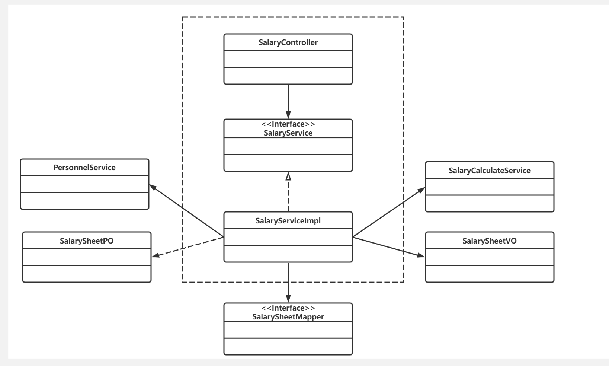

##### （3）模块内部类的接口规范

###### Salary模块的接口规范

| 接口名字                               | 语法                                                  | 前置条件             | 后置条件                                             |
| -------------------------------------- | ----------------------------------------------------- | -------------------- | ---------------------------------------------------- |
| SalaryController.makeSalarySheet       | makeSalarySheet(SalarySheetVO salarySheetVO)          | 输入合法             | 将工资单信息传给后端SalaryService                    |
| SalaryController.makeSimpleSalarySheet | makeSimpleSalarySheet(Integer uid)                    | 员工存在             | 将员工id传给后端SalaryService计算员工工资明细        |
| SalaryController.makeAllSalarySheet    | makeAllSalarySheet()                                  | 无                   | 从SalaryService制定当月需要制定的所有员工工资单      |
| SalaryController.getByState            | getByState(SalarySheetState state)                    | state合法            | 从SalaryService获取所有该状态的工资单                |
| SalaryController.approval              | approval(String salarySheetId,SalarySheetState state) | 工资单存在，状态合法 | 将工资单id,审批后的状态传给后端SalaryService审批单据 |
| SalaryController.getAllSalarySheet     | getAllSalarySheet()                                   | 无                   | 从SalaryService获取所有工资单                        |

###### Salary模块的服务接口

| 服务名                                | 服务                                               |
| ------------------------------------- | -------------------------------------------------- |
| SalaryService.makeSalarySheet         | 制定工资单，传给SalaryMapper                       |
| SalaryService.makeAllSalarySheet      | 制定所有当月需要制定的员工工资单，传给SalaryMapper |
| SalaryService.makeSimpleSalarySheet   | 根据员工id,算出工资单明细，制定工资单草稿          |
| SalaryService.getSalaryServiceByState | 从SalaryMapper中获取符合状态的工资单               |
| SalaryService.getAllSalarySheet       | 从SalaryMapper中获取所有的工资单                   |
| SalaryService.getYearActualSalary     | 从SalaryMapper获取员工前11个月工资总额             |

##### （4）业务逻辑层的动态模型

下图表明了在ERP系统中，Salary.MakeSalarySheet的相关对象之间的协作

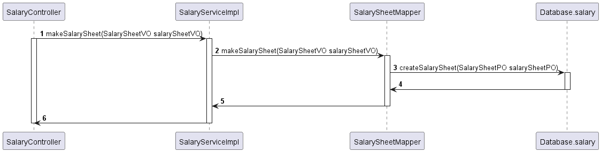

下图表明了在ERP系统中，Salary.MakeSimpleSalarySheet的相关对象之间的协作

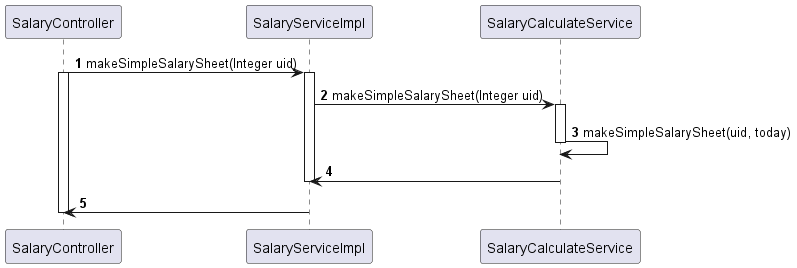

下图表明了在ERP系统中，Salary.approve的相关对象之间的协作

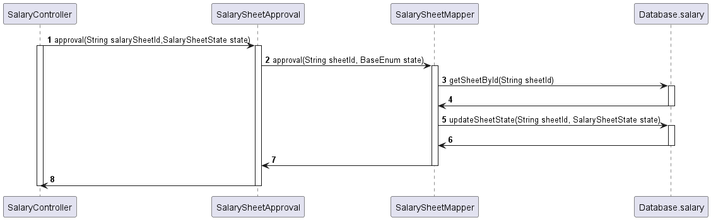

##### （5）业务逻辑层的设计原理

利用委托式控制风格，每个界面需要访问的业务逻辑由各自的控制器委托给不同的领域对象。

#### 4.1.9 SalarySystembl模块

##### （1）模块概述

1. SalarySystembl模块承担的需求参见需求规格说明文档功能需求及相关非功能需求说明文档。
2. SalarySystembl模块的职责及接口参见软件系统结构描述文档。

##### （2）整体结构

###### SalarySystembl模块的设计如下图：

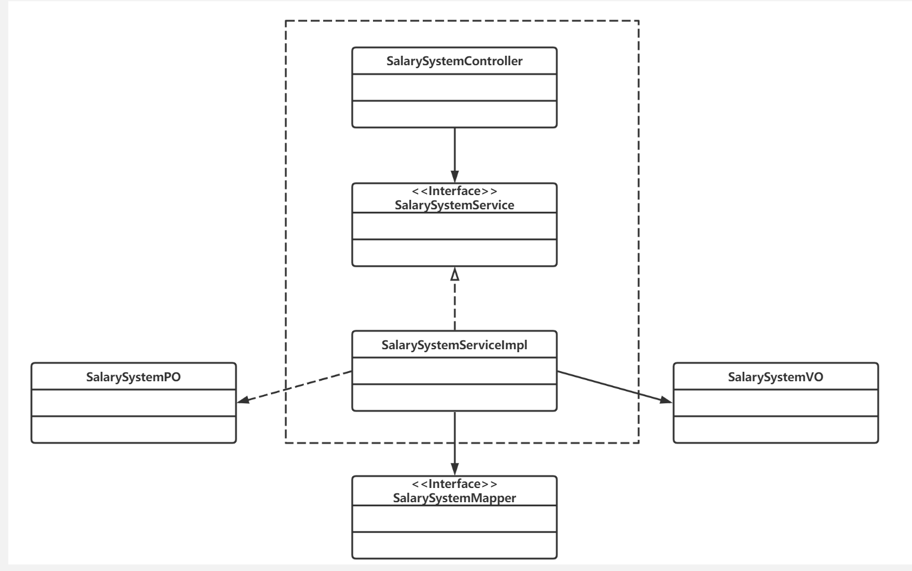

##### （3）模块内部类的接口规范

###### SalarySystem模块的接口规范

| 接口名字                                   | 语法                                              | 前置条件 | 后置条件                                              |
| ------------------------------------------ | ------------------------------------------------- | -------- | ----------------------------------------------------- |
| SalarySystemController.createSalarySystem  | createSalarySystem(SalarySystemVO salarySystemVO) | 输入合法 | 将薪酬规则传给后端SalarySystemService,制定薪酬规则    |
| SalarySystemController.updateSalarySystem  | updateSalarySystem(SalarySystemVO salarySystemVO) | 输入合法 | 将薪酬规则传给后端SalarySystemService,修改薪酬规则    |
| SalarySystemController.findAllSalarySystem | findAllSalarySystem()                             | 无       | 从SalarySystemService获取所有的薪酬规则               |
| SalarySystemController.deleteSalarySystem  | deleteSalarySystem(Role role)                     | 职务存在 | 将职务传给后端SalarySystemService，删除对应的薪酬规则 |

###### SalarySystem模块的服务接口

| 服务名                                 | 服务                                           |
| -------------------------------------- | ---------------------------------------------- |
| SalarySystemService.insertSalarySystem | 制定薪酬规则，传给SalarySystemMapper           |
| SalarySystemService.updateByRole       | 更新薪酬规则，传给SalarySystemMapper           |
| SalarySystemService.deleteByRole       | 将Role传给SalarySystemMapper,删除薪酬规则      |
| SalarySystemService.findSalarySystem   | 根据职务从SalarySystemMapper获取对应的薪酬规则 |
| SalarySystemService.findAll            | 从SalarySystemMapper获取所有薪酬规则           |

##### （4）业务逻辑层的动态模型
下图表明了在ERP系统中，SalarySystem.Add的相关对象之间的协作

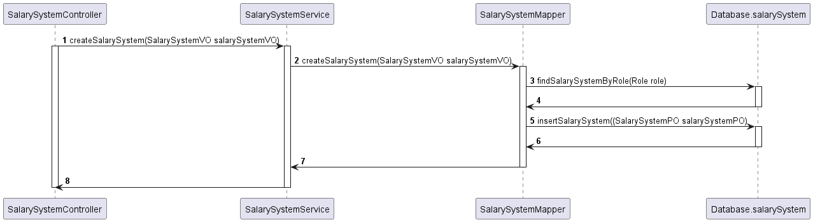

##### （5）业务逻辑层的设计原理

利用委托式控制风格，每个界面需要访问的业务逻辑由各自的控制器委托给不同的领域对象。

#### 4.1.10 Bonusbl模块

##### （1）模块概述

Bonusbl模块承担的需求参见灯具开关企业ERP系统软件需求规格说明文档

Bonusbl模块的职责及接口参见ERP系统软件体系结构文档

##### （2）整体结构
根据体系结构的设计，我们将系统分为了展示层、业务逻辑层、数据层。为了
增加灵活性，我们会添加接⼝。⽐如Controller层和业务逻辑层之间，我们设置了BonusService接口。
业务逻辑层和数据层之间，我们设置了BonusMapper接口。为了隔离业务逻辑职责和逻辑控制职责，我们增加了BonusController，这样BonusController会将具体的业务逻辑委托给BonusService。BonusPO作为年终奖的持久化对象而添加到设计模型中

###### Bonusbl模块的设计如下图：
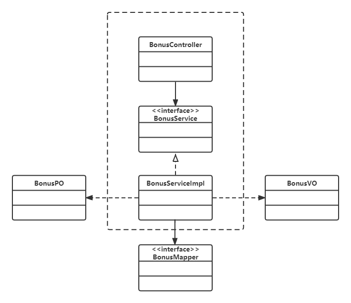

| 模块                   | 职责                                                         |
| ---------------------- | ------------------------------------------------------------ |
| BonusController        | 负责实现“年终奖制定”的前后端的数据交互                       |
| BonusServiceImpl       | 负责实现“年终奖制定”的增改查功能                             |
| BonusVO                | 年终奖增改查功能的实现载体，存有员工uid、年份、前11个月薪资、年终奖的信息 |
| BonusPO                | 年终奖增改查功能的实现载体，存有员工uid、年份、前11个月薪资、年终奖的信息 |
| SalarySheetServiceImpl | 负责实现对员工前11个月薪资总和的查询功能                     |

##### （3）模块内部类的接口规范

###### Bonus模块的接口规范

Bonus模块的各个类的职责和内部类的接口规范已在ERP系统软件体系结构文档中描述。

| 接口名字                     | 语法                                                         | 前置条件 | 后置条件                                           |
| ---------------------------- | ------------------------------------------------------------ | :------- | :------------------------------------------------- |
| BonusController.searchSalary | searchSalary(Integer uid , Integer year , BigDecimal salary , BigDecimal bonus) | 输入合法 | 从BonusService获得员工对应年份的前11个月的薪资总和 |
| BonusController.makeBonus    | makeBonus(BonusVO bonusVO)                                   | 输入合法 | 将年终奖信息传给后端BonusService                   |
| BonusController.getBonusList | getBonusList()                                               | 无       | 从BonusService获得所有年终奖信息                   |

###### Bonus模块的服务接口

| 服务名                                                       | 服务                                    |
| ------------------------------------------------------------ | --------------------------------------- |
| BonusServiceImpl.searchSalary(BonusVO bonusVO)               | 从BonusMapper获得员工前11个月薪资的总和 |
| BonusServiceImpl.makeBonus(BonusVO bonusVO)                  | 将年终奖信息传递给BonusMapper           |
| BonusServiceImpl.getBonusList()                              | 从BonusMapper获得获得所有年终奖信息     |
| BonusServiceImpl.getYearActualSalary(Integer uid, Date date) | 从BonusMapper获得员工前11个月薪资的总和 |

##### （4）业务逻辑层的动态模型
- 下图表明了在ERP系统中，Bonus.searchSalary的相关对象之间的协作。
  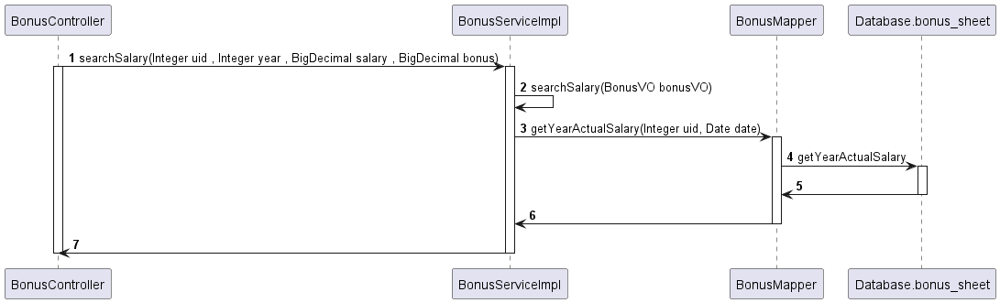
- 下图表明了在ERP系统中，Bonus.makeBonus的相关对象之间的协作。
  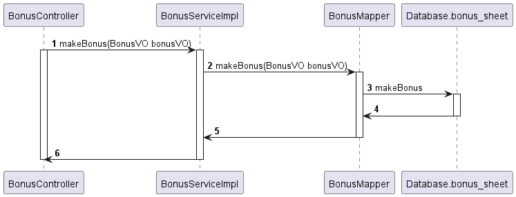
- 下图表明了在ERP系统中，Bonus.getBonusList的相关对象之间的协作。
  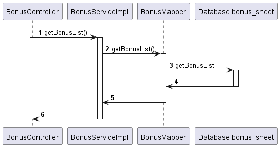

##### （5）业务逻辑层的设计原理

利⽤委托式控制⻛格，每个界⾯需要访问的业务逻辑由各⾃的控制器委托给不同的领域对象。

#### 4.1.11 Promotionbl模块

##### （1）模块概述

Promotionbl模块承担的需求参见灯具开关企业ERP系统软件需求规格说明文档

Promotionbl模块的职责及接口参见ERP系统软件体系结构文档

##### （2）整体结构

根据体系结构的设计，我们将系统分为了展示层、业务逻辑层、数据层。为了
增加灵活性，我们会添加接⼝。⽐如Controller层和业务逻辑层之间，我们设置了PromotionService接口。
业务逻辑层和数据层之间，我们设置了PromotionStrategyByUserLevelMapper、PromotionStrategyByPricePacksMapper、PromotionStrategyByTotalPriceMapper接口。为了隔离业务逻辑职责和逻辑控制职责，我们增加了PromotionController，这样PromotionController会将具体的业务逻辑委托给PromotionService。PromotionStrategyByUserLevelPO、PromotionStrategyByPricePacksPO、PromotionStrategyByTotalPricePO作为年终奖的持久化对象而添加到设计模型中

###### Promotionbl模块的设计如下图：

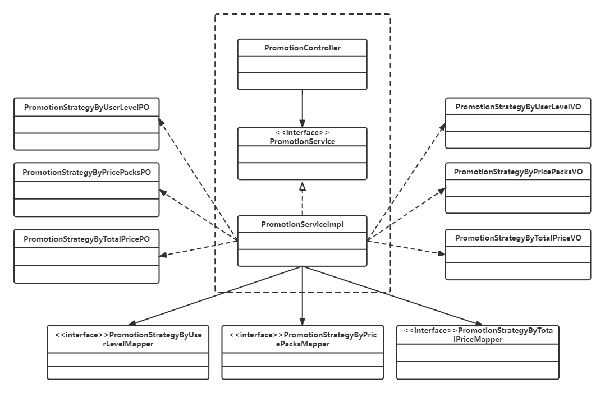

##### （3）模块内部类的接口规范

###### Promotion模块的接口规范

| 接口名字                                               | 语法                                              | 前置条件 | 后置条件                                                     |
| ------------------------------------------------------ | ------------------------------------------------- | -------- | ------------------------------------------------------------ |
| PromotionController.getAllPromotionStrategyByUserLevel | getAllPromotionStrategyByUserLevel()              | 无       | 从PromotionService获得所有客户级别促销策略                   |
| PromotionController.getAllStrategyByPricePack          | getAllStrategyByPricePack()                       | 无       | 从PromotionService获得所有特价包促销策略                     |
| PromotionController.getAllStrategyByTotalPrice         | getAllStrategyByTotalPrice()                      | 无       | 从PromotionService获得所有总价促销策略                       |
| PromotionController.addUserLevel                       | addUserLevel(PromotionStrategyByUserLevelVO vo)   | 输入合法 | 将客户级别促销策略信息存入列表                               |
| PromotionController.addPricePack                       | addPricePack(PromotionStrategyByPricePacksVO vo)  | 输入合法 | 将特价包促销策略信息存入列表                                 |
| PromotionController.addTotalPrice                      | addTotalPrice(PromotionStrategyByTotalPriceVO vo) | 输入合法 | 将总价促销策略信息存入列表                                   |
| PromotionController.makePromotionStrategyByUserLevel   | makePromotionStrategyByUserLevel()                | 无       | 将客户级别促销策略信息列表传给PromotionService，制定客户级别促销策略 |
| PromotionController.makePromotionStrategyByPricePacks  | makePromotionStrategyByPricePacks()               | 无       | 将特价包促销策略信息列表传给PromotionService，制定特价包促销策略 |
| PromotionController.makePromotionStrategyByTotalPrice  | makePromotionStrategyByTotalPrice()               | 无       | 将总价促销策略信息列表传给PromotionService，制定总价促销策略 |

###### Promotion模块的服务接口

| 服务名                                                | 服务                                                         |
| ----------------------------------------------------- | ------------------------------------------------------------ |
| PromotionService.findAllPromotionStrategyByUserLevel  | 从PromotionStrategyByUserLevelMapper获取全部客户级别促销策略 |
| PromotionService.findAllPromotionStrategyByPricePacks | 从PromotionStrategyByPricePacksMapper获取全部特价包促销策略  |
| PromotionService.findAllPromotionStrategyByTotalPrice | 从PromotionStrategyByTotalPriceMapper获取全部总价促销策略    |
| PromotionService.makePromotionStrategyByUserLevel     | 完整客户级别促销策略信息并传给PromotionStrategyByUserLevelMapper |
| PromotionService.makePromotionStrategyByPricePacks    | 完整特价包促销策略信息并传给PromotionStrategyByPricePacksMapper |
| PromotionService.makePromotionStrategyByTotalPrice    | 完整总价促销策略信息并传给PromotionStrategyByTotalPriceMapper |

##### （4）业务逻辑层的动态模型
- 下图表明了在ERP系统中，PromotionController.getAllPromotionStrategyByUserLevel的相关对象之间的协作。
  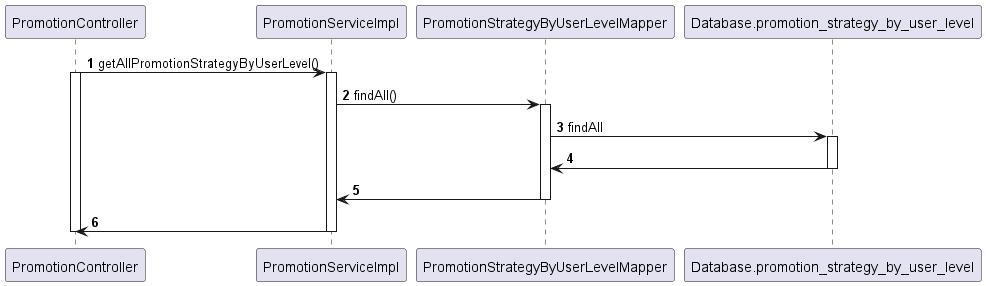
- 下图表明了在ERP系统中，PromotionController.getAllStrategyByPricePack的相关对象之间的协作。
  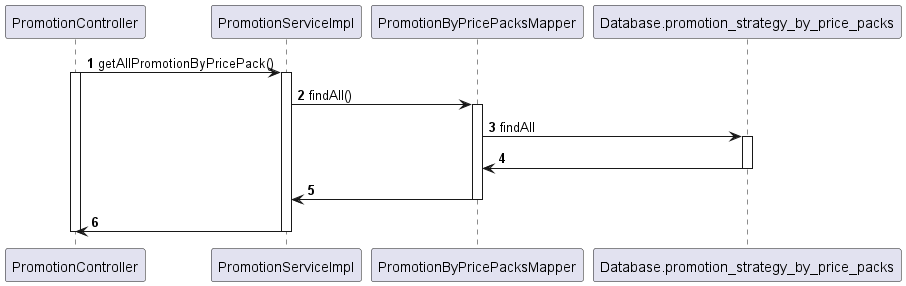
- 下图表明了在ERP系统中，PromotionController.getAllStrategyByTotalPrice的相关对象之间的协作。
  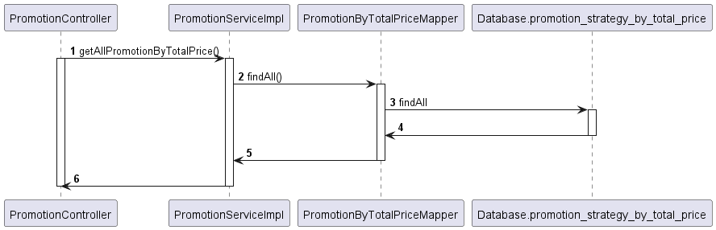
- 下图表明了在ERP系统中，PromotionController.addUserLevel的相关对象之间的协作。
  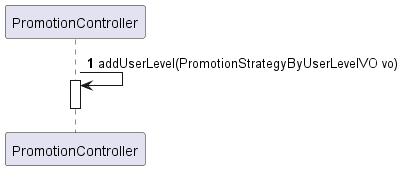
- 下图表明了在ERP系统中，PromotionController.addPricePack的相关对象之间的协作。
  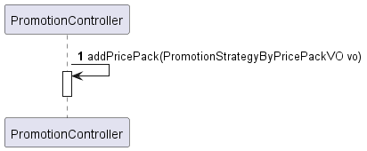
- 下图表明了在ERP系统中，PromotionController.addTotalPrice的相关对象之间的协作。
  
- 下图表明了在ERP系统中，PromotionController.makePromotionStrategyByUserLevel的相关对象之间的协作。
  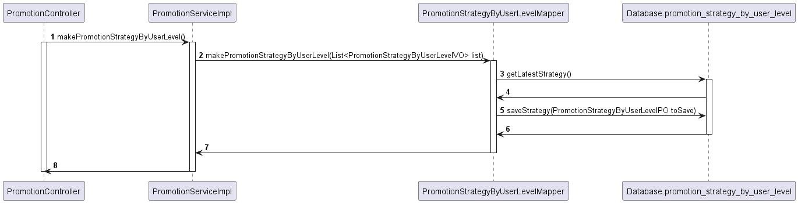
- 下图表明了在ERP系统中，PromotionController.makePromotionStrategyByPricePack的相关对象之间的协作。
  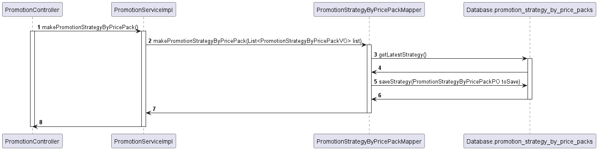
- 下图表明了在ERP系统中，PromotionController.makePromotionStrategyByTotalPrice的相关对象之间的协作。
  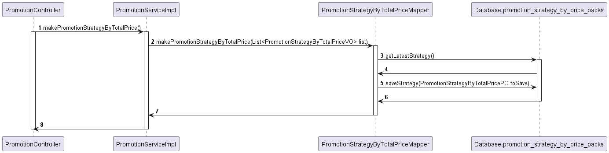

##### （5）业务逻辑层的设计原理

利⽤委托式控制⻛格，每个界⾯需要访问的业务逻辑由各⾃的控制器委托给不同的领域对象。

#### 4.1.12 Giftbl模块

##### （1）模块概述

1. Giftbl模块承担的需求参见需求规格说明文档功能需求及相关非功能需求说明文档。
2. Giftbl模块的职责及接口参见软件系统结构描述文档。

##### （2）整体结构

###### Giftbl模块的设计如下图

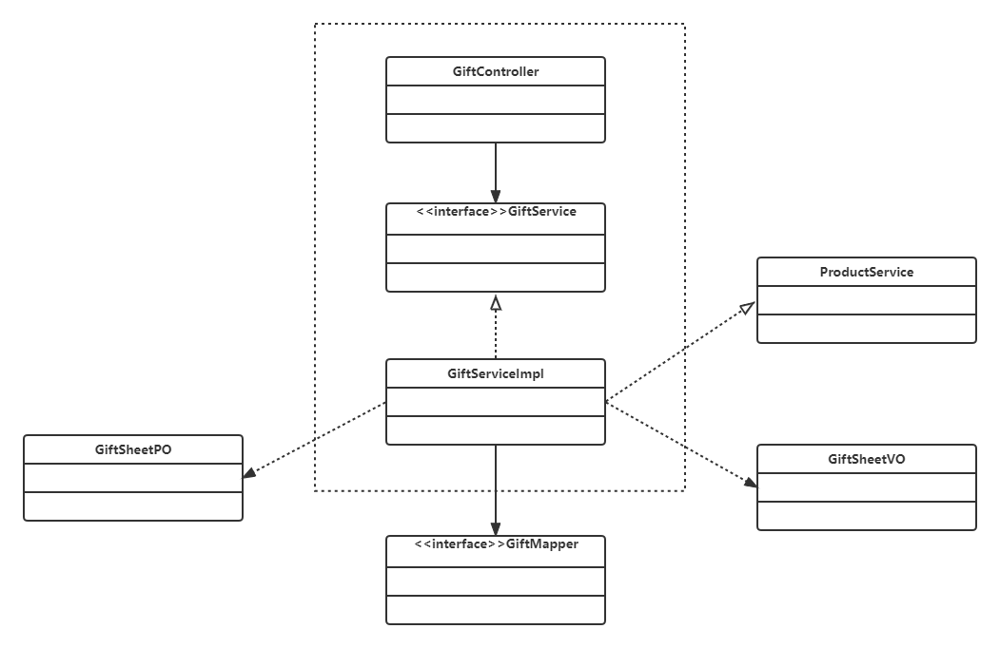

###### 各个类的职责

| 模块           | 职责                                                         |
| -------------- | ------------------------------------------------------------ |
| GiftController | 负责实现赠送单的前后端交互                                   |
| GiftService    | 负责实现赠送单的制定和审批功能                               |
| GiftMapper     | 负责提供赠送单相关数据与持久化相关的接口                     |
| GiftSheetVO    | 赠送单制定和审批功能的实现载体，存有单据编号、关联的销售单id、商品id、商品数量、商品单价等信息 |
| GiftSheetPO    | 赠送单制定和审批功能的实现载体，存有单据编号、关联的销售单id、商品id、商品数量、商品单价等信息 |
| ProductService | 根据商品id查找商品信息                                       |

##### （3）模块内部类的接口规范

###### Giftbl模块的接口规范

| 接口名字                        | 语法                                                         | 前置条件                                | 后置条件                                      |
| ------------------------------- | ------------------------------------------------------------ | --------------------------------------- | --------------------------------------------- |
| GiftController.showSheetByState | showSheetByState(GiftSheetState state)                       | state为“待审批”、“审批成功”、“审批失败” | 根据state从GiftService中获得相应赠送单        |
| GiftController.Approval         | Approval(String giftId,                          GiftSheetState state) | 输入合法                                | 将赠送单单号和状态传给后端GiftService进行审批 |

###### Giftbl模块的服务接口

| 服务名                           | 服务                                        |
| -------------------------------- | ------------------------------------------- |
| GiftService.makeGiftSheet        | 创建赠送单，并传给GiftMapper                |
| GifttService.getGiftSheetByState | 根据state从GiftMapper中获得预期的赠送单信息 |
| GiftSheetApproval.approval       | 审批赠送单，更改赠送单的状态                |

##### （4）业务逻辑层的动态模型

- 下图表明了在ERP系统中，Gift.getGiftSheetByState的相关对象之间的协作

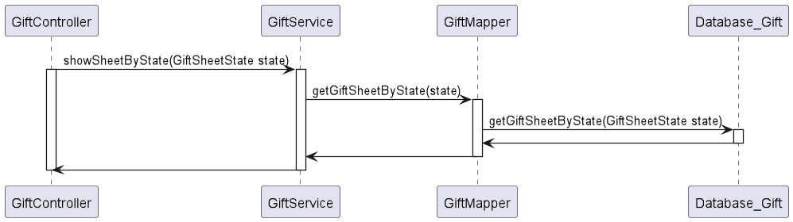

- 下图表明了在ERP系统中，Gift.approval的相关对象之间的协作

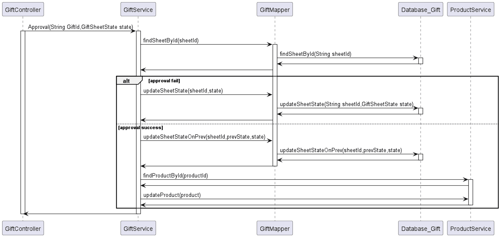

##### （5）业务逻辑层的设计原理

利用委托式控制风格，每个界面需要访问的业务逻辑由各自的控制器委托给不同的领域对象。

## 5.依赖视角

下图分别是前端和后端各⾃的包之间的依赖关系。
·
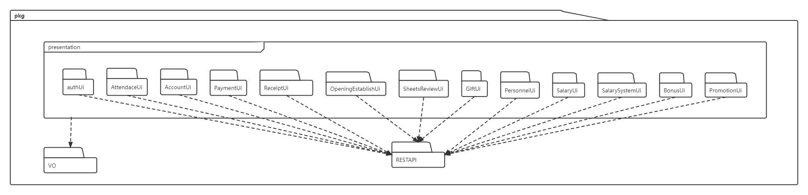
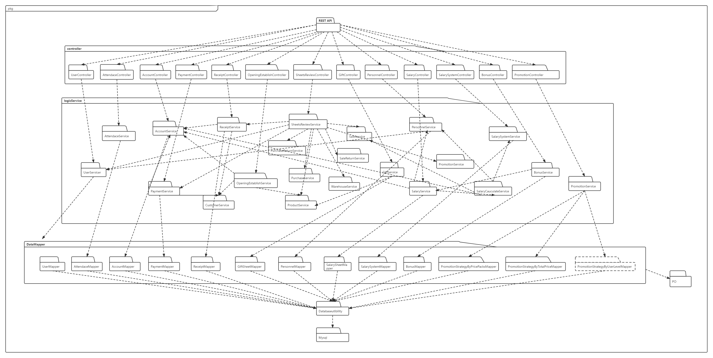
