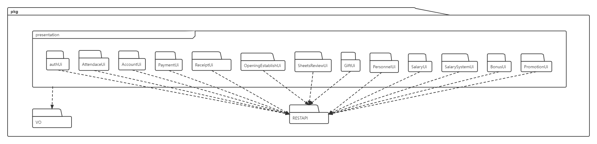
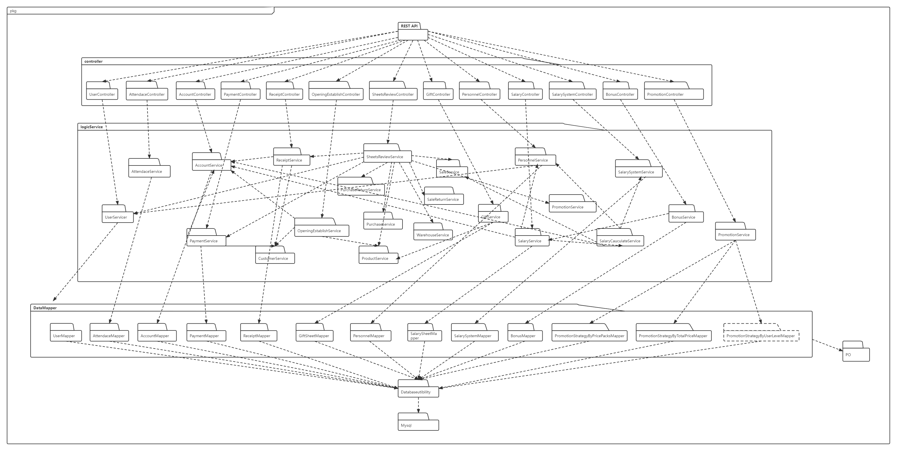

# 1. ERP系统软件体系结构说明文档

[TOC]

## 1.1. 文档修改历史

| 修改人员       | 日期       | 修改原因                         | 版本号 |
| -------------- | ---------- | -------------------------------- | ------ |
| 胡雨翎         | 2022.07.05 | 创建了软件体系结构文档           | V1.0   |
| 胡雨翎         | 2022.07.07 | 完成逻辑视图、组合视角、模块职责 | V1.1   |
| 陈亦骁、胡雨翎 | 2022.07.08 | 完成财务人员相关接口规范         | V1.2   |
| 陈灵灵         | 2022.07.09 | 完成人力资源人员相关接口规范     | V1.3   |
| 陈超           | 2022.07.09 | 完成总经理相关接口规范           | v1.4   |
| 胡雨翎         | 2022.07.10 | 完善文档和最终检查               | v1.5   |


# 2.引言

## 2.1. 编制目的

1. 本文档详细完成了ERP系统财务人员、人力资源人员、总经理部分的概要设计，达到指导详细设计和开发的目的，同时实现和测试人员及用户的沟通。
2. 本报告面向开发人员、测试人员及最终用户而编写，是了解系统的导航。

## 2.2. 词汇表

| 词汇名称 | 词汇含义             | 备注 |
| -------- | -------------------- | ---- |
| ERP      | 企业资源规划管理系统 |      |

## 2.3. 参考资料

1. IEEE标准
2. 《软件⼯程与计算（卷⼆）软件开发的技术基础》
3. ERP系统用例文档
4. ERP系统需求规格说明文档


# 3. 产品概述

参考ERP系统用例文档和需求规格说明文档中对产品的概括描述。

**注明：**本文档仅包括lab7需求的相关说明


# 4. 逻辑视图

- 处理静态设计模型

- ERP管理系统中，选择了分层体系结构风格，将系统分为4部分（presentation, controller, service, data）能够很好地示意整个⾼层抽象。presentation部分包含了GUI页面的实现，controller部分负责接受前端发送的请求并分发给相应的service，service部分负责业务逻辑的实现，data部分负责数据的持久化和访问。分层体系结构的逻辑视角和逻辑设计方案如下图所示：

  - 参照体系结构风格的包图表达逻辑视角

  

  - 软件体系结构逻辑设计方案


# 5. 组合视角

## 5.1. 开发包图

- 表示软件组件在开发时环境中的静态组织

  - 描述开发包以及相互间的依赖
  - 绘制开发包图

  | 开发包                              | 依赖的其他开发包                                             |
  | ----------------------------------- | ------------------------------------------------------------ |
  | authUi                              | UserController,Vue组件库包,vo, RESTAPI                       |
  | attendanceUi                        | AttendanceController,Vue组件库包,vo, RESTAPI                 |
  | accountUi                           | AccountController,Vue组件库包,vo, RESTAPI                    |
  | paymentUi                           | PaymentController,Vue组件库包,vo, RESTAPI                    |
  | receiptUi                           | ReceiptController,Vue组件库包,vo, RESTAPI                    |
  | openingEstablishUi                  | OpeningEstablishController,Vue组件库包,vo, RESTAPI           |
  | sheetsReviewUi                      | SheetsReviewController,Vue组件库包,vo, RESTAPI               |
  | giftUi                              | GiftController,Vue组件库包,vo, RESTAPI                       |
  | personnelUi                         | PersonnelController,Vue组件库包,vo, RESTAPI                  |
  | salaryUi                            | SalaryController,Vue组件库包,vo, RESTAPI                     |
  | salarySystemUi                      | SalarySystemController,Vue组件库包,vo, RESTAPI               |
  | bonusUi                             | BonusController,Vue组件库包,vo, RESTAPI                      |
  | promotionStrategyUi                 | promotionStrategyController,Vue组件库包,vo, RESTAPI          |
  | UserController                      | UserService                                                  |
  | AccountController                   | AccountService                                               |
  | AttendanceController                | AttendanceService                                            |
  | PaymentController                   | PaymentService                                               |
  | ReceiptController                   | ReceiptService                                               |
  | OpeningEstablishController          | OpeningEstablishService                                      |
  | SheetsReviewController              | SheetsReviewService                                          |
  | GiftController                      | GiftSheetService                                             |
  | PersonnelController                 | PersonnelService                                             |
  | SalaryController                    | SalaryService                                                |
  | SalarySystemController              | SalarySystemService                                          |
  | BonusController                     | BonusService                                                 |
  | promotionController                 | promotionService                                             |
  | UserService                         | UserMapper                                                   |
  | AccountService                      | AccountMapper                                                |
  | AttendanceService                   | AttendanceMapper                                             |
  | PaymentService                      | PaymentMapper,CustomerService,AccountService                 |
  | ReceiptService                      | ReceiptMapper,CustomerService,AccountService                 |
  | OpeningEstablishService             | ProductService,CustomerService,AccountService                |
  | SheetsReviewService                 | saleService,saleReturnsService,productService,warehouseService,purchaseReturnsService,purchaseService,paymentService,receiptService,userService,promotionService |
  | GiftSheetService                    | GiftSheetMapper,ProductService                               |
  | PersonnelService                    | PersonnelMapper,UserService                                  |
  | SalaryService                       | SalarySheetMapper,SalaryCalculateService,AccountService,PersonnelService |
  | SalarySystemService                 | SalarySystemMapper                                           |
  | SalaryCauculateService              | SalarySystemService,PersonnelService,SalaryCalculateStrategy,SaleService,AttendanceService |
  | BonusService                        | BonusMapper,SalaryService                                    |
  | promotionService                    | PromotionStrategyByUserLevelMapper,PromotionStrategyByPricePacksMapper,PromotionStrategyByTotalPriceMapper |
  | AccountMapper                       | Datausability, po                                            |
  | AttendanceMapper                    | Datausability, po                                            |
  | BonusMapper                         | Datausability, po                                            |
  | GiftSheetMapper                     | Datausability, po                                            |
  | PaymentMapper                       | Datausability, po                                            |
  | PersonnelMapper                     | Datausability, po                                            |
  | PromotionStrategyByPricePacksMapper | Datausability, po                                            |
  | PromotionStrategyByTotalPriceMapper | Datausability, po                                            |
  | PromotionStrategyByUserLevelMapper  | Datausability, po                                            |
  | ReceiptMapper                       | Datausability, po                                            |
  | SalarySheetMapper                   | Datausability, po                                            |
  | SalarySystemMapper                  | Datausability, po                                            |
  | UserMapper                          | Datausability, po                                            |
  | VO                                  |                                                              |
  | PO                                  |                                                              |
  | Vue组件库                           |                                                              |
  | Java RMI                            |                                                              |
  | Databaseutibility                   | JDBC,Mysql                                                   |
  | RESTAPI                             |                                                              |

- ERP系统客户端开发包图如图所示：



- 服务器端开发包图如图所示：



## 5.2. 运行时进程

- 在ERP管理系统中，会有多个网页端进程和一个服务器端进程，其进程图如下图所示：


## 5.3. 物理部署

- 处理如何将软件组件映射到硬件基础设施，部署图如下图所示：


# 6. 架构设计

- 描述功能分解和如何在不同的层中安排软件模块
  - 描述架构中的对象，包含架构图
  - 描述组件接口信息
    - 包括：语法、前置条件、后置条件

## 6.1. 模块职责

- 客户端模块和服务端模块视图分别如下图所示：
  - 客户端模块视图
  
  
  
  - 服务器端模块视图
  
  
  
- 客户端各层和服务端各层职责分别如下表所示：
  - 客户端各层职责
  
  |       层       | 职责                                          |
  | :------------: | --------------------------------------------- |
  |    启动模块    | 负责初始化网络通信机制，启动用户界面          |
  |   用户界面层   | ERP系统客户端用户界面，使用Vue.js框架实现     |
  | 客户端网络模块 | 使用RESTful风格接口通过HTTP请求实现前后端通信 |
  
  - 服务器端各层职责
  
  |       层       | 职责                                         |
  | :------------: | -------------------------------------------- |
  |    启动模块    | 负责初始化网络通信机制，启动后端服务器       |
  |   业务逻辑层   | 对于用户界面输入的进行响应并进行业务处理逻辑 |
  |     数据层     | 负责数据的持久化和数据访问接口               |
  | 服务端网络模块 | 通过RESTful风格的接口处理前端发出的请求      |
  
  - 层之间调用接口
  
  | 接口                                                         | 服务调用方       | 服务提供方       |
  | ------------------------------------------------------------ | ---------------- | ---------------- |
  | AccountService<br>AttendanceService<br>BonusService<br>GiftSheetService<br>OpeningEstablishService<br>PaymentService<br>PersonnelService<br>PromotionService<br>ReceiptService<br>SalaryCalculateService<br>SalaryService<br>SalarySystemService<br>SheetsReviewService | 客户端展示层     | 客户端业务逻辑层 |
  | AccountMapper<br>AttendanceMapper<br>BonusMapper<br>GiftSheetMapper<br>PaymentMapper<br>PersonnelMapper<br>PromotionStrategyByPricePacks<br>PromotionStrategyByTotalPrice<br>PromotionStrategyByUserLevel<br>ReceiptMapper<br>SalarySheetMappler<br>SalarySystemMapper<br>UserMapper<br> | 客户端业务逻辑层 | 服务端数据层     |
  

借用账户管理用例来说明层之间的调用，如下图所示。每一层之间都是由上层依赖了一个接口（需接口），而下层实现这个接口（供接口）。AccountService提供了Account界面所需要的所有业务逻辑功能。AccountDAO提供了对数据库的增删改查等操作。这样的实现就大大降低了层与层之间的耦合。


## 6.2. 用户界面层分解

根据需求，存在16个用户界面：登陆界面、账户管理界面、收款单制定及审批界面、付款单制定及审批界面、查看销售明细表界面、查看经营历程表界面、查看经营情况表界面、期初建账界面、员工信息管理界面、员工打卡管理界面、薪酬规则制定界面、工资单制定及审批界面、用户级别促销策略制定界面、特价包促销策略制定界面、不同总价促销策略制定界面、年终奖制定界面。界面跳转如下图所示：


### 6.2.1. 职责

- 类图
  
  - 服务器端和客户端的用户界面设计接口是一致的，只是具体的页面不⼀样。用户界面类如图所示：
  
    

| 模块                       | 职责                                           |
| -------------------------- | ---------------------------------------------- |
| AccountController          | 负责账户管理界面                               |
| AttendanceController       | 负责员工打卡管理界面                           |
| BonusController            | 负责年终奖制定界面                             |
| GiftController             | 负责赠品单界面                                 |
| OpeningEstablishController | 负责期初建账界面                               |
| PaymentController          | 负责付款单界面                                 |
| PersonnelControler         | 负责员工管理界面                               |
| PromotionController        | 负责促销策略界面                               |
| ReceiptController          | 负责收款单界面                                 |
| SalaryController           | 负责工资单界面                                 |
| SalarySystemController     | 负责薪酬规则制定界面                           |
| SheetsReviewController     | 负责销售明细表、经营历程表、经营情况表查看界面 |

### 6.2.2. 接口规范

#### 6.2.2.1. Account模块的接口规范

| 接口名字                          | 语法                                                   | 前置条件                     | 后置条件                                      |
| --------------------------------- | ------------------------------------------------------ | ---------------------------- | --------------------------------------------- |
| AccountController.findAllAccounts | findAllAccounts()                                      | 无                           | 从AccountService获得所有账户信息              |
| AccountController.addAccount      | addAccount(AccountVO accountVO)                        | 输入合法                     | 将账户信息传给后端AccountServic，添加一个账户 |
| AccountController.deleteAccount   | deleteAccount(String bankAccount)                      | 账户名称存在                 | 将被删除的账户信息传给后端AccountService      |
| AccountController.updateAmount    | updateAmount(String bankAccount,String transferAmount) | 账户名称存在，转账金额为数字 | 将更新信息传给后端AccountService              |
| AccountController.findByKeyword   | findByKeyword(String keyword)                          | 输入合法                     | 将关键字传给后端AccountService搜索            |

#### 6.2.2.2. Account模块的服务接口

| 服务名                           | 服务                              |
| -------------------------------- | --------------------------------- |
| AccountService.getAllAccounts    | 从AccountMapper获得所有账户信息   |
| AccountService.addAccount        | 将账户信息传给AccountMapper       |
| AccountService.deleteByName      | 将账户名称传给AccountMapper       |
| AccountService.findAccountByName | 从AccountMapper获得预期的账户信息 |
| AccountService.updateAmount      | 将账户信息传给AccountMapper       |
| AccountService.findByKeyword     | 从AccountMapper获得预期的账户信息 |

#### 6.2.2.3. Attendance模块的接口规范

| 接口名字                                 | 语法                                       | 前置条件       | 后置条件                                                     |
| ---------------------------------------- | ------------------------------------------ | -------------- | ------------------------------------------------------------ |
| AttendanceController.addAttendRecord     | addAttendRecord(AttendanceVO attendanceVO) | 员工当天未打卡 | 将打卡信息传给后端AttendanceService,添加一个员工打卡记录     |
| AttendanceController.deletePreRecord     | deletePreRecord(String dateStr)            | 日期合法       | 将日期传给后端AttendanceService，删除该日期之前所有的打卡记录 |
| AttendanceController.countMonthAttend    | countMonthAttend(Integer uid)              | 员工信息存在   | 将员工id传给后端将日期传给后端AttendanceService，查询该员工该月打卡次数 |
| AttendanceController.countDayAttend      | countDayAttend(Integer uid)                | 员工信息存在   | 将员工id传给后端将日期传给后端AttendanceService，查询该员工当日是否打卡 |
| AttendanceController.findAllAttendRecord | findAllAttendRecord()                      | 无             | 从AttendanceService获得所有打卡信息                          |


#### 6.2.2.4. Attendance模块的服务接口

| 服务名                             | 服务                                                     |
| ---------------------------------- | -------------------------------------------------------- |
| AttendanceService.addAttendRecord  | 将打卡信息传给AttendanceMapper                           |
| AttendanceService.deletePreRecord  | 将日期传给AttendanceMapper，删除该日期之前所有的打卡记录 |
| AttendanceService.countMonthRecord | 将员工id传给AttendanceMapper，查询该员工该月打卡次数     |
| AttendanceService.countDayAttend   | 将员工id传给AttendanceMapper，查询该员工当天是否打卡     |
| AttendanceService.findAll          | 从AttendanceMapper获得所有打卡信息                       |


#### 6.2.2.5. Bonus模块的接口规范

| 接口名字                     | 语法                                                         | 前置条件 | 后置条件                                           |
| ---------------------------- | ------------------------------------------------------------ | :------- | :------------------------------------------------- |
| BonusController.searchSalary | searchSalary(Integer uid , Integer year , BigDecimal salary , BigDecimal bonus) | 输入合法 | 从BonusService获得员工对应年份的前11个月的薪资总和 |
| BonusController.makeBonus    | makeBonus(BonusVO bonusVO)                                   | 输入合法 | 将年终奖信息传给后端BonusService                   |
| BonusController.getBonusList | getBonusList()                                               | 无       | 从BonusService获得所有年终奖信息                   |

#### 6.2.2.6. Bonus模块的服务接口

| 服务名                                                   | 服务                                    |
| -------------------------------------------------------- | --------------------------------------- |
| BonusService.searchSalary(BonusVO bonusVO)               | 从BonusMapper获得员工前11个月薪资的总和 |
| BonusService.makeBonus(BonusVO bonusVO)                  | 将年终奖信息传递给BonusMapper           |
| BonusService.getBonusList()                              | 从BonusMapper获得获得所有年终奖信息     |
| BonusService.getYearActualSalary(Integer uid, Date date) | 从BonusMapper获得员工前11个月薪资的总和 |

#### 6.2.2.7. Gift模块的接口规范

| 接口名字                        | 语法                                                    | 前置条件                                | 后置条件                                     |
| ------------------------------- | ------------------------------------------------------- | --------------------------------------- | -------------------------------------------- |
| GiftController.showSheetByState | showSheetByState(GiftSheetState state)                  | state为“待审批”、“审批成功”、“审批失败” | 从GiftSheetService获得相应赠品单信息         |
| GiftController.firstApproval    | firstApproval(String giftSheetId, GiftSheetState state) | 赠品单号存在，state合法                 | 将单号和状态传给后端GiftSheetService进行审批 |

#### 6.2.2.8. Gift模块的服务接口

| 服务名                                                       | 服务                             |
| ------------------------------------------------------------ | -------------------------------- |
| GiftSheetService.getGiftSheetByState                         | 从GiftMapper中获取相应赠品单信息 |
| giftSheetApproval.approval(String giftSheetId,GiftSheetState state) | 将审批信息传给GiftMapper         |

#### 6.2.2.9. OpeningEstablish模块的接口规范

| 接口名字                                     | 语法                                      | 前置条件                                                | 后置条件                                                     |
| -------------------------------------------- | ----------------------------------------- | ------------------------------------------------------- | ------------------------------------------------------------ |
| OpeningEstablishController.establishProduct  | establishProduct(CreateProductVO product) | 输入合法                                                | 往productList中增加一个商品                                  |
| OpeningEstablishController.establishCustomer | establishCustomer(CustomerVO customer)    | 输入合法                                                | 往customerList中增加一个商品                                 |
| OpeningEstablishController.establishAccount  | establishAccount(AccountVO account)       | 输入合法                                                | 往customerList中增加一个商品                                 |
| OpeningEstablishController.establish()       | establish()                               | productList、customerList、customerList中已添加相应信息 | 将productList、customerList、customerList传给OpenEstablishService进行期初建账 |

#### 6.2.2.10. OpeningEstablish模块的服务接口

| 服务名                            | 服务                                                         |
| --------------------------------- | ------------------------------------------------------------ |
| openingEstablishService.establish | 将相应列表传给productService、customerService、accountService，插入商品、客户、账户信息 |

#### 6.2.2.11. Payment模块的接口规范

| 接口名字                           | 语法                                                         | 前置条件                                | 后置条件                                         |
| ---------------------------------- | ------------------------------------------------------------ | --------------------------------------- | ------------------------------------------------ |
| PaymentController.makePayment      | makePayment(UserVO userVO, PaymentSheetVO paymentSheetVO)    | 输入合法                                | 将付款单信息传给后端PaymentService               |
| PaymentController.showSheetByState | showSheetByState(FinanceSheetState state)                    | state为“待审批”、“审批成功”、“审批失败” | 根据state从PaymentService中获得相应付款单        |
| PaymentController.Approval         | Approval(String paymentId,                         FinanceSheetState state) | 输入合法                                | 将付款单单号和状态传给后端PaymentService进行审批 |

#### 6.2.2.12. Payment模块的服务接口

| 服务名                                | 服务                                           |
| ------------------------------------- | ---------------------------------------------- |
| PaymentService.makePaymentSheet       | 创建付款单，并传给PaymentMapper                |
| PaymentService.getPaymentSheetByState | 根据state从PaymentMapper中获得预期的付款单信息 |
| paymentSheetApproval.approval         | 审批付款单，修改付款单的状态                   |

#### 6.2.2.13. Personnel模块的接口规范

| 接口名字                                | 语法                                     | 前置条件     | 后置条件                                          |
| --------------------------------------- | ---------------------------------------- | ------------ | ------------------------------------------------- |
| PersonnelController.createPersonnel     | createPersonnel(PersonnelVO personnelVO) | 输入合法     | 将员工信息传给后端PersonnelService,添加员工信息   |
| PersonnelController.findAllPersonnel    | findAllPersonnel()                       | 无           | 从PersonnelService获取所有员工信息                |
| PersonnelController.findPersonnelById   | findPersonnelById(Integer id)            | 员工信息存在 | 将员工id传给后端PersonnelService,获取该员工信息   |
| PersonnelController.findPersonnelByName | findPersonnelByName(String name)         | 员工信息存在 | 将员工姓名传给后端PersonnelService,获取该员工信息 |
| PersonnelController.updatePersonnel     | updatePersonnel(PersonnelVO personnelVO) | 输入合法     | 将员工信息传给后端PersonnelService,修改员工信息   |
| PersonnelController.deletePersonnel     | deletePersonnel(Integer id)              | 员工信息存在 | 将员工id传给后端PersonnelService,删除该员工信息   |

#### 6.2.2.14. Personnel模块的服务接口

| 服务名                            | 服务                                  |
| --------------------------------- | ------------------------------------- |
| PersonnelService.createPersonnel  | 将新增的员工信息传给PersonnelMapper   |
| PersonnelService.findById         | 将要查询的员工id传给PersonnelMapper   |
| PersonnelService.findByName       | 将要查询的员工姓名传给PersonnelMapper |
| PersonnelService.findAllPersonnel | 从PersonnelMapper中获取所有员工信息   |
| PersonnelService.updatePersonnel  | 将要修改的员工信息传给PersonnelMapper |
| PersonnelService.deleteById       | 将要删除的员工id传给PersonnelMapper   |


#### 6.2.2.15. Promotion模块的接口规范

| 接口名字                                               | 语法                                              | 前置条件 | 后置条件                                                     |
| ------------------------------------------------------ | ------------------------------------------------- | -------- | ------------------------------------------------------------ |
| PromotionController.getAllPromotionStrategyByUserLevel | getAllPromotionStrategyByUserLevel()              | 无       | 从PromotionService获得所有客户级别促销策略                   |
| PromotionController.getAllStrategyByPricePack          | getAllStrategyByPricePack()                       | 无       | 从PromotionService获得所有特价包促销策略                     |
| PromotionController.getAllStrategyByTotalPrice         | getAllStrategyByTotalPrice()                      | 无       | 从PromotionService获得所有总价促销策略                       |
| PromotionController.addUserLevel                       | addUserLevel(PromotionStrategyByUserLevelVO vo)   | 输入合法 | 将客户级别促销策略信息存入列表                               |
| PromotionController.addPricePack                       | addPricePack(PromotionStrategyByPricePacksVO vo)  | 输入合法 | 将特价包促销策略信息存入列表                                 |
| PromotionController.addTotalPrice                      | addTotalPrice(PromotionStrategyByTotalPriceVO vo) | 输入合法 | 将总价促销策略信息存入列表                                   |
| PromotionController.makePromotionStrategyByUserLevel   | makePromotionStrategyByUserLevel()                | 无       | 将客户级别促销策略信息列表传给PromotionService，制定客户级别促销策略 |
| PromotionController.makePromotionStrategyByPricePacks  | makePromotionStrategyByPricePacks()               | 无       | 将特价包促销策略信息列表传给PromotionService，制定特价包促销策略 |
| PromotionController.makePromotionStrategyByTotalPrice  | makePromotionStrategyByTotalPrice()               | 无       | 将总价促销策略信息列表传给PromotionService，制定总价促销策略 |


#### 6.2.2.16. Promotion模块的服务接口

| 服务名                                                | 服务                                                         |
| ----------------------------------------------------- | ------------------------------------------------------------ |
| PromotionService.findAllPromotionStrategyByUserLevel  | 从PromotionStrategyByUserLevelMapper获取全部客户级别促销策略 |
| PromotionService.findAllPromotionStrategyByPricePacks | 从PromotionStrategyByPricePacksMapper获取全部特价包促销策略  |
| PromotionService.findAllPromotionStrategyByTotalPrice | 从PromotionStrategyByTotalPriceMapper获取全部总价促销策略    |
| PromotionService.makePromotionStrategyByUserLevel     | 完整客户级别促销策略信息并传给PromotionStrategyByUserLevelMapper |
| PromotionService.makePromotionStrategyByPricePacks    | 完整特价包促销策略信息并传给PromotionStrategyByPricePacksMapper |
| PromotionService.makePromotionStrategyByTotalPrice    | 完整总价促销策略信息并传给PromotionStrategyByTotalPriceMapper |


#### 6.2.2.17. Receipt模块的接口规范

| 接口名字                           | 语法                                                         | 前置条件                                | 后置条件                                         |
| ---------------------------------- | ------------------------------------------------------------ | --------------------------------------- | ------------------------------------------------ |
| ReceiptController.makeReceipt      | makeReceipt(UserVO userVO,ReceiptSheetVO receiptSheetVO)     | 输入合法                                | 将收款单信息传给后端PaymentService               |
| ReceiptController.showSheetByState | showSheetByState(FinanceSheetState state)                    | state为“待审批”、“审批成功”、“审批失败” | 根据state从ReceiptService中获得相应付款单        |
| ReceiptController.Approval         | Approval(String receiptId,                          FinanceSheetState state) | 输入合法                                | 将收款单单号和状态传给后端PaymentService进行审批 |

#### 6.2.2.18. Receipt模块的服务接口

| 服务名                                | 服务                                           |
| ------------------------------------- | ---------------------------------------------- |
| ReceiptService.makeReceiptSheet       | 创建收款单，并传给ReceiptMapper                |
| ReceiptService.getReceiptSheetByState | 根据state从ReceiptMapper中获得预期的收款单信息 |
| ReceiptSheetApproval.approval         | 审批收款单，更改收款单的状态                   |

#### 6.2.2.19. Salary模块的接口规范

| 接口名字                               | 语法                                                  | 前置条件             | 后置条件                                             |
| -------------------------------------- | ----------------------------------------------------- | -------------------- | ---------------------------------------------------- |
| SalaryController.makeSalarySheet       | makeSalarySheet(SalarySheetVO salarySheetVO)          | 输入合法             | 将工资单信息传给后端SalaryService                    |
| SalaryController.makeSimpleSalarySheet | makeSimpleSalarySheet(Integer uid)                    | 员工存在             | 将员工id传给后端SalaryService计算员工工资明细        |
| SalaryController.makeAllSalarySheet    | makeAllSalarySheet()                                  | 无                   | 从SalaryService制定当月需要制定的所有员工工资单      |
| SalaryController.getByState            | getByState(SalarySheetState state)                    | state合法            | 从SalaryService获取所有该状态的工资单                |
| SalaryController.approval              | approval(String salarySheetId,SalarySheetState state) | 工资单存在，状态合法 | 将工资单id,审批后的状态传给后端SalaryService审批单据 |
| SalaryController.getAllSalarySheet     | getAllSalarySheet()                                   | 无                   | 从SalaryService获取所有工资单                        |

#### 6.2.2.20. Salary模块的服务接口

| 服务名                                | 服务                                               |
| ------------------------------------- | -------------------------------------------------- |
| SalaryService.makeSalarySheet         | 制定工资单，传给SalaryMapper                       |
| SalaryService.makeAllSalarySheet      | 制定所有当月需要制定的员工工资单，传给SalaryMapper |
| SalaryService.makeSimpleSalarySheet   | 根据员工id,算出工资单明细，制定工资单草稿          |
| SalaryService.getSalaryServiceByState | 从SalaryMapper中获取符合状态的工资单               |
| SalaryService.getAllSalarySheet       | 从SalaryMapper中获取所有的工资单                   |
| SalaryService.getYearActualSalary     | 从SalaryMapper获取员工前11个月工资总额             |

#### 6.2.2.21. SalarySystem模块的接口规范

| 接口名字                                   | 语法                                              | 前置条件 | 后置条件                                              |
| ------------------------------------------ | ------------------------------------------------- | -------- | ----------------------------------------------------- |
| SalarySystemController.createSalarySystem  | createSalarySystem(SalarySystemVO salarySystemVO) | 输入合法 | 将薪酬规则传给后端SalarySystemService,制定薪酬规则    |
| SalarySystemController.updateSalarySystem  | updateSalarySystem(SalarySystemVO salarySystemVO) | 输入合法 | 将薪酬规则传给后端SalarySystemService,修改薪酬规则    |
| SalarySystemController.findAllSalarySystem | findAllSalarySystem()                             | 无       | 从SalarySystemService获取所有的薪酬规则               |
| SalarySystemController.deleteSalarySystem  | deleteSalarySystem(Role role)                     | 职务存在 | 将职务传给后端SalarySystemService，删除对应的薪酬规则 |

#### 6.2.2.22. SalarySystem模块的服务接口

| 服务名                                 | 服务                                           |
| -------------------------------------- | ---------------------------------------------- |
| SalarySystemService.insertSalarySystem | 制定薪酬规则，传给SalarySystemMapper           |
| SalarySystemService.updateByRole       | 更新薪酬规则，传给SalarySystemMapper           |
| SalarySystemService.deleteByRole       | 将Role传给SalarySystemMapper,删除薪酬规则      |
| SalarySystemService.findSalarySystem   | 根据职务从SalarySystemMapper获取对应的薪酬规则 |
| SalarySystemService.findAll            | 从SalarySystemMapper获取所有薪酬规则           |

#### 6.2.2.23. SheetsReview模块的接口规范

| 接口名字                                      | 语法                                                         | 前置条件 | 后置条件                                           |
| --------------------------------------------- | ------------------------------------------------------------ | -------- | -------------------------------------------------- |
| SheetsReviewController.getSaleDetail          | getSaleDetail(String beginDateStr,String endDateStr,                                String productName,String customerName,                                String operatorName,String warehouseId) | 输入合法 | 系统显示销售明细表，显示符合条件的所有商品销售记录 |
| SheetsReviewController.getProcessSheet        | getProcessSheet(String beginDateStr,String endDateStr,                                String sheetType,String customerName,                                String operatorName,String warehouseId) | 输入合法 | 系统显示符合条件的所有单据                         |
| SheetsReviewController.getOperationSheet      | getOperationSheet()                                          | 无       | 系统显示经营情况表                                 |
| SheetsReviewController.getIncomeAfterDiscount | getIncomeAfterDiscount()                                     | 无       | 系统显示折让后总收入明细                           |
| SheetsReviewController.getExpenditure         | getExpenditure()                                             | 无       | 系统显示总支出明细                                 |
| SheetsReviewController.generateRedFlush       | generateRedFlush(SheetVO sheetVO)                            | 单据存在 | 系统为该单据生成红冲                               |

#### 6.2.2.24. SheetsReview模块的服务接口

| 服务名                                       | 服务                                                         |
| -------------------------------------------- | ------------------------------------------------------------ |
| SheetsReviewService.getSaleDetailByTime      | 返回此时间段内的销售详细信息                                 |
| SheetsReviewService.getSaleDetailByProduct   | 返回有关此商品的销售详细信息                                 |
| SheetsReviewService.getSaleDetailByCustomer  | 返回有关此客户的销售详细信息                                 |
| SheetsReviewService.getSaleDetailByOperator  | 返回有关此操作员的销售详细信息                               |
| SheetsReviewService.getSaleDetailByWarehouse | 返回有关此仓库的销售详细信息                                 |
| SheetsReviewService.getIncomeAfterDiscount   | 返回收入类信息：销售收入、商品类收入、折让后的总收入         |
| SheetsReviewService.getTotalIncomeDiscount   | 返回总折让数额                                               |
| SheetsReviewService.redFlush                 | 生成一个一模一样、仅把数量取负数的单子并入账，以此来抵消之前的单子 |
| SheetsReviewService.getTotalExpenditure      | 返回支出类信息：销售成本、商品类支出、人力成本、总支出       |
| SheetsReviewService.getTotalProfit           | 返回总利润                                                   |
| SheetsReviewService.getOperationSheet        | 返回经营情况表，包括收入类信息、支出类信息、利润             |
| SheetsReviewService.getSheetByTime           | 返回此时间段内的所有单据                                     |
| SheetsReviewService.getSheetBySheetType      | 根据单据类型返回单据                                         |
| SheetsReviewService.getSheetByCustomerName   | 返回有关此客户的单据信息                                     |
| SheetsReviewService.getSheetByOperatorName   | 输入操作员名字在数据库中存在                                 |

### 6.2.3. 用户界面模块设计原理

用户界面利用vue.js框架实现。

## 6.3. 业务逻辑层分解

业务逻辑层分解如图所示：

### 6.3.1. 职责

| 模块                   | 职责                                                         |
| ---------------------- | ------------------------------------------------------------ |
| Account                | 负责实现对应账户管理界面所需要的服务                         |
| Attendance             | 负责实现对应员工打卡界面所需要的服务                         |
| Bonus                  | 负责实现对应制定年终奖界面所需要的服务                       |
| GiftSheet              | 负责实现对应赠品单管理界面所需要的服务                       |
| OpeningEstablish       | 负责实现对应期初建账界面所需要的服务                         |
| Payment                | 负责实现对应付款单管理界面所需要的服务                       |
| Personnel              | 负责实现对应员工管理界面所需要的服务                         |
| Promotion              | 负责实现对应制定促销策略界面所需要的服务                     |
| PromotionStrategy      |                                                              |
| Receipt                | 负责实现对应收款单管理界面所需要的服务                       |
| SalaryCaculate         | 负责实现计算工资单明细所需要的服务                           |
| SalaryCaculateStrategy | 不同薪资计算方式所需要的服务                                 |
| Salary                 | 负责实现对应工资单制定界面所需要的服务                       |
| SalarySystem           | 负责实现对应薪酬规则制定界面所需要的服务                     |
| SheetsReview           | 负责实现对应查看销售明细表、经营历程表、经营情况表界面所需要的服务 |

### 6.3.2. 接口规范

#### Account模块的接口规范

| 接口名字                         | 语法                              | 前置条件               | 后置条件                                      |
| -------------------------------- | --------------------------------- | ---------------------- | --------------------------------------------- |
| AccountService.addAccount        | addAccount(AccountVO accountVO)   | 输入合法               | 将账户信息传递给AccountMapper                 |
| AccountService.deleteByName      | deleteByName(String name)         | 账户名称在数据库中存在 | 将账户名称传递给AccountMapper                 |
| AccountService.updateAmount      | updateAmount(AccountPO accountPO) | 输入合法               | 将账户信息传递给AccountMapper                 |
| AccountService.findByKeyword     | findByKeyword(String keyword)     | 无                     | 从AccountMapper中获得相应关键字的全部账户信息 |
| AccountService.getAllAccounts    | getAllAccounts()                  | 无                     | 从AccountMapper中获得所有账户信息             |
| AccountService.findAccountByName | findAccountByName(String name)    | 账户名称在数据库中存在 | 从AccountMapper中获得对应的账户信息           |

#### Account模块需要的服务

| 服务名                      | 服务                     |
| --------------------------- | ------------------------ |
| AccountMapper.findByName    | 根据账户名返回对应的账户 |
| AccountMapper.addAccount    | 插入账户                 |
| AccountMapper.deleteByName  | 根据账户名删除账户       |
| AccountMapper.findById      | 根据编号返回对应账户     |
| AccountMapper.updateOne     | 更新账户信息             |
| AccountMapper.findByKeyword | 根据关键字返回对应的账户 |
| AccountMapper.findAll       | 返回所有账户信息         |

#### Attendance模块的接口规范

| 接口名字                           | 语法                                       | 前置条件 | 后置条件                                            |
| ---------------------------------- | ------------------------------------------ | -------- | --------------------------------------------------- |
| AttendanceService.addAttendRecord  | addAttendRecord(AttendanceVO attendanceVO) | 输入合法 | 将签到信息传递给AttendanceMapper                    |
| AttendanceService.deletePreRecord  | deletePreRecord(String dateStr)            | 日期合法 | 将日期传给AttendanceMapper,删除日期以前的签到记录   |
| AttendanceService.countMonthRecord | countMonthRecord(Integer uid)              | 员工存在 | 将员工号传给AttendanceMapper,查询该员工当月签到次数 |
| AttendanceService.countDayAttend   | countDayAttend(Integer uid)                | 员工存在 | 将员工号传给AttendanceMapper,查询该员工当天是否签到 |
| AttendanceService.findAll          | findAll()                                  | 无       | 从AttendanceMapper中获取所有签到记录                |


#### Attendance模块需要的服务

| 服务名                              | 服务                       |
| ----------------------------------- | -------------------------- |
| AttendanceMapper.insertAttendRecord | 添加一条签到记录           |
| AttendanceMapper.deletePreRecord    | 删除日期之前所有的签到记录 |
| AttendanceMapper.countAttendRecord  | 查询员工当月签到次数       |
| AttendanceMapper.countDayAttend     | 查询员工当日是否签到       |
| AttendanceMapper.findAll            | 获取所有的签到记录         |


#### Bonus模块的接口规范

| 接口名字                         | 语法                                        | 前置条件             | 服务                                    |
| -------------------------------- | ------------------------------------------- | -------------------- | --------------------------------------- |
| BonusService.searchSalary        | searchSalary(BonusVO bonusVO)               | 员工前11个月工资存在 | 从BonusMapper获得员工前11个月薪资的总和 |
| BonusService.makeBonus           | makeBonus(BonusVO bonusVO)                  | 输入合法             | 将年终奖信息传递给BonusMapper           |
| BonusService.getBonusList        | getBonusList()                              | 无                   | 从BonusMapper获得获得所有年终奖信息     |
| BonusService.getYearActualSalary | getYearActualSalary(Integer uid, Date date) | 员工前11个月工资存在 | 从BonusMapper获得员工前11个月薪资的总和 |

#### Bonus模块需要的服务

| 接口名字                        | 服务                                         |
| ------------------------------- | -------------------------------------------- |
| BonusMapper.searchSalary        | 根据员工编号和年份获得员工前11个月薪资的总和 |
| BonusMapper.makeBonus           | 保存年终奖信息到BonusMapper                  |
| BonusMapper.getBonusList        | 获得获得所有年终奖信息                       |
| BonusMapper.getYearActualSalary | 根据员工编号和年份获得员工前11个月薪资的总和 |
| BonusMapper.createBonus         | 创建年终奖信息到BonusMapper                  |

#### GiftSheet模块的接口规范

| 接口名字                             | 语法                                      | 前置条件                                                | 后置条件                                    |
| ------------------------------------ | ----------------------------------------- | ------------------------------------------------------- | ------------------------------------------- |
| GiftSheetService.makeGiftSheet       | makeGiftSheet(GiftSheetPO giftSheetPO)    | 输入合法                                                | 将赠品单信息传递给GiftSheetMapper           |
| GiftSheetService.getGiftSheetByState | getGiftSheetByState(GiftSheetState state) | state为“待审批”、“审批成功”、“审批失败”                 | 从GiftSheetMapper中获取相应状态的赠品单信息 |
| GiftSheetApproval.approval           | approval(String SheetId, BaseEnum state)  | 赠品单单号存在，state为“待审批”、“审批成功”、“审批失败” | 更新赠品单状态                              |

#### GiftSheet模块需要的服务

| 服务名                            | 服务                            |
| --------------------------------- | ------------------------------- |
| GiftSheetMapper.getLatestSheet    | 获得最近一张赠品单信息          |
| GiftSheetMapper.saveSheet         | 保存赠品单信息到GiftSheetMapper |
| GiftSheetMapper.findAll           | 获得所有赠品单信息              |
| GiftSheetMapper.findAllByState    | 根据状态获取赠品单信息          |
| ProductService.getOneProductByPid | 根据商品编号获得商品信息        |
| ProductService.updateProduct      | 更新商品信息                    |

#### OpeningEstablish模块的接口规范

| 接口名字                          | 语法                                                         | 前置条件 | 后置条件                                                     |
| --------------------------------- | ------------------------------------------------------------ | -------- | ------------------------------------------------------------ |
| OpeningEstablishService.establish | establish(List<CreateProductVO> createProductVOList,                    List<CustomerVO> customerVOList,List<AccountVO> accountVOList) | 无       | 将三个list分别传给 ProductService、CustomerService、AccountService，添加商品、客户、账户信息 |

#### OpeningEstablish模块需要的服务

| 服务名                       | 服务                                             |
| ---------------------------- | ------------------------------------------------ |
| ProductService.createProduct | 将商品信息传递给ProductMapper，插入一个商品信息  |
| CustomerService.addCustomer  | 将客户信息传递给CustomerMapper，插入一个客户信息 |
| AccountService.addAccount    | 将账户信息传递给AccountMapper，插入一个账户信息  |

#### Payment模块的接口规范

| 接口名字                              | 语法                                                         | 前置条件                                                | 后置条件                                  |
| ------------------------------------- | ------------------------------------------------------------ | ------------------------------------------------------- | ----------------------------------------- |
| PaymentService.makePaymentSheet       | makePaymentSheet(UserVO userVO, PaymentSheetVO paymentSheetVO) | 输入合法                                                | 在PaymentMapper中创建付款单               |
| PaymentService.getPaymentSheetByState | getPaymentSheetByState(FinanceSheetState state)              | 状态为“待审批”、“审批成功“、”审批失败“                  | 根据状态从PaymentMapper中获取付款单       |
| PaymentService.getPaymentSheetById    | getPaymentSheetById(String paymentSheetId)                   | 付款单单号在数据库中存在                                | 根据付款单单号从PaymentMapper中获取付款单 |
| PaymentSheetApproval.approval         | approval(String sheetId, BaseEnum state)                     | 付款单单号存在，state为“待审批”、“审批成功”、“审批失败” | 更新付款单信息                            |

#### Payment模块需要的服务

| 服务名                              | 服务                                        |
| ----------------------------------- | ------------------------------------------- |
| PaymentMapper.getLatestSheet        | 获取最近一张付款单信息                      |
| PaymentMapper.saveBatchSheetContent | 向PaymentMapper中插入一张付款单上的具体内容 |
| PaymentMapper.saveSheet             | 在PaymentMapper中存入一张付款单信息         |
| PaymentMapper.findAllSheet          | 查询所有付款单信息                          |
| PaymentMapper.findAllByState        | 根据状态查询付款单信息                      |
| PaymentMapper.findContentBySheetId  | 根据付款单单号获取单据具体内容              |
| PaymentMapper.findSheetById         | 根据付款单单号获取单据信息                  |
| CustomerService.findCustomerById    | 根据客户编号从CustomerMapper中获取客户信息  |
| CustomerService.updateCustomer      | 更新CustomerMapper中客户数据                |
| AccountService.findAccountByName    | 根据账户名称从AccountMapper中获取账户信息   |
| AccountService.updateAmount         | 更新AccountMapper中账户数据                 |

#### Personnel模块的接口规范

| 接口名字                          | 语法                                     | 前置条件 | 后置条件                              |
| --------------------------------- | ---------------------------------------- | -------- | ------------------------------------- |
| PersonnelService.createPersonnel  | createPersonnel(PersonnelVO personnelVO) | 输入合法 | 将新增的员工信息传给PersonnelMapper   |
| PersonnelService.findById         | findById(Integer id)                     | 员工存在 | 将要查询的员工id传给PersonnelMapper   |
| PersonnelService.findByName       | findByName(String name)                  | 员工存在 | 将要查询的员工姓名传给PersonnelMapper |
| PersonnelService.findAllPersonnel | findAllPersonnel()                       | 无       | 从PersonnelMapper中获取所有员工信息   |
| PersonnelService.updatePersonnel  | updatePersonnel(PersonnelVO personnelVO) | 输入合法 | 将要修改的员工信息传给PersonnelMapper |
| PersonnelService.deleteById       | deleteById(Integer id)                   | 员工存在 | 将要删除的员工id传给PersonnelMapper   |


#### Personnel模块需要的服务

| 服务名                          | 服务                 |
| ------------------------------- | -------------------- |
| PersonnelMapper.createPersonnel | 新增员工信息         |
| PersonnelMapper.updateByName    | 更新员工信息         |
| PersonnelMapper.findByName      | 由姓名查找员工信息   |
| PersonnelMapper.findById        | 由员工id查找员工信息 |
| PersonnelMapper.findAll         | 查询所有员工信息     |
| PersonnelMapper.deleteById      | 由员工id删除员工信息 |
| userService.register            | 注册账号             |


#### Promotion模块的接口规范

| 接口名字                                              | 语法                                                         | 前置条件 | 后置条件                                                     |
| ----------------------------------------------------- | ------------------------------------------------------------ | -------- | ------------------------------------------------------------ |
| PromotionService.findAllPromotionStrategyByUserLevel  | findAllPromotionStrategyByUserLevel()                        | 无       | 从PromotionStrategyByUserLevelMapper获取全部客户级别促销策略 |
| PromotionService.findAllPromotionStrategyByPricePacks | findAllPromotionStrategyByPricePacks()                       | 无       | 从PromotionStrategyByPricePacksMapper获取全部特价包促销策略  |
| PromotionService.findAllPromotionStrategyByTotalPrice | findAllPromotionStrategyByTotalPrice()                       | 无       | 从PromotionStrategyByTotalPriceMapper获取全部总价促销策略    |
| PromotionService.makePromotionStrategyByUserLevel     | makePromotionStrategyByUserLevel(List< PromotionStrategyByUserLevelVO> list) | 输入合法 | 完整客户级别促销策略信息并传给PromotionStrategyByUserLevelMapper |
| PromotionService.makePromotionStrategyByPricePacks    | makePromotionStrategyByPricePacks(PromotionStrategyByPricePacksVO promotionStrategyByPricePacksVO) | 输入合法 | 完整特价包促销策略信息并传给PromotionStrategyByPricePacksMapper |
| PromotionService.makePromotionStrategyByTotalPrice    | makePromotionStrategyByTotalPrice(List< PromotionStrategyByTotalPriceVO> list) | 输入合法 | 完整总价促销策略信息并传给PromotionStrategyByTotalPriceMapper |

#### Promotion模块需要的服务

| 服务名                                                | 服务                                                       |
| ----------------------------------------------------- | ---------------------------------------------------------- |
| PromotionStrategyByUserLevelMapper.findAll            | 获取全部客户级别促销策略信息                               |
| PromotionStrategyByUserLevelMapper.getLatestStrategy  | 获取最新的客户级别促销策略信息                             |
| PromotionStrategyByUserLevelMapper.saveStrategy       | 在PromotionStrategyByUserLevelMapper中存入客户级别促销策略 |
| PromotionStrategyByPricePacksMapper.findAll           | 获取全部特价包促销策略信息                                 |
| PromotionStrategyByPricePacksMapper.getLatestStrategy | 获取最新的特价包促销策略信息                               |
| PromotionStrategyByPricePacksMapper.saveStrategy      | 在PromotionStrategyByPricePacksMapper中存入特价包促销策略  |
| PromotionStrategyByTotalPriceMapper.findAll           | 获取全部总价促销策略信息                                   |
| PromotionStrategyByTotalPriceMapper.getLatestStrategy | 获取最新的总价促销策略信息                                 |
| PromotionStrategyByTotalPriceMapper.saveStrategy      | 在PromotionStrategyByTotalPriceMapper中存入总价促销策略    |

#### PromotionStrategy模块的接口规范

| 接口名字                                      | 语法                                     | 前置条件 | 后置条件                       |
| --------------------------------------------- | ---------------------------------------- | -------- | ------------------------------ |
| PromotionStrategyByPricePacks.updateSaleSheet | updateSaleSheet(SaleSheetPO saleSheetPO) | 无       | 根据特价包销售策略更新销售表   |
| PromotionStrategyByTotalPrice.updateSaleSheet | updateSaleSheet(SaleSheetPO saleSheetPO) | 无       | 根据特总价销售策略更新销售表   |
| PromotionStrategyByUserLevel.updateSaleSheet  | updateSaleSheet(SaleSheetPO saleSheetPO) | 无       | 根据用户级别销售策略更新销售表 |

#### PromotionStrategy模块需要的服务

| 服务名                                                       | 服务                                             |
| ------------------------------------------------------------ | ------------------------------------------------ |
| SaleSheetMapper.findContentBySheetId                         | 根据销售表单号获取表单内容                       |
| PromotionStrategyByPricePacksMapper.findAll                  | 获取全部特价包促销策略信息                       |
| PromotionStrategyByTotalPriceMapper.getLatestStrategy        | 获取最新的总价促销策略信息                       |
| PromotionStrategyByTotalPriceMapper.findStrategyByTotalPrice | 根据总价获取总价促销策略信息                     |
| GiftSheetService.makeGiftSheet                               | 制定赠品表                                       |
| promotionStrategyByUserLevelMapper.getLatestStrategy         | 获取最新的客户级别促销策略信息                   |
| CustomerMapper.findOneById                                   | 根据id获取客户信息                               |
| PromotionStrategyByUserLevelMapper.findStrategyBySidAndLevel | 根据促销策略id和用户级别获取用户级别促销策略信息 |


#### Receipt模块的接口规范

| 接口名字                              | 语法                                                         | 前置条件                                                | 后置条件                                  |
| ------------------------------------- | ------------------------------------------------------------ | ------------------------------------------------------- | ----------------------------------------- |
| ReceiptService.makeReceiptSheet       | makeReceiptSheet(UserVO userVO, ReceiptSheetVO receiptSheetVO) | 输入合法                                                | 在ReceiptMapper中创建收款单               |
| ReceiptService.getReceiptSheetByState | getReceiptSheetByState(FinanceSheetState state)              | 状态为“待审批”、“审批成功“、”审批失败“                  | 根据状态从ReceiptMapper中获取收款单       |
| ReceiptService.getReceiptSheetById    | getReceiptSheetById(String receiptSheetId)                   | 收款单单号在数据库中存在                                | 根据收款单单号从ReceiptMapper中获取收款单 |
| ReceiptSheetApproval.approval         | approval(String sheetId, BaseEnum state)                     | 收款单单号存在，state为“待审批”、“审批成功”、“审批失败” | 更新收款单信息                            |

#### Receipt模块需要的服务

| 服务名                              | 服务                                        |
| ----------------------------------- | ------------------------------------------- |
| ReceiptMapper.getLatestSheet        | 获取最近一张收款单信息                      |
| ReceiptMapper.saveBatchSheetContent | 向ReceiptMapper中插入一张收款单上的具体内容 |
| ReceiptMapper.saveSheet             | 在ReceiptMapper中存入一张收款单信息         |
| ReceiptMapper.findAllSheet          | 查询所有收款单信息                          |
| ReceiptMapper.findAllByState        | 根据状态查询收款单信息                      |
| ReceiptMapper.findContentBySheetId  | 根据收款单单号获取单据具体内容              |
| ReceiptMapper.findSheetById         | 根据收款单单号获取单据信息                  |
| CustomerService.findCustomerById    | 根据客户编号从CustomerMapper中获取客户信息  |
| CustomerService.updateCustomer      | 更新CustomerMapper中客户数据                |
| AccountService.findAccountByName    | 根据账户名称从AccountMapper中获取账户信息   |
| AccountService.updateAmount         | 更新AccountMapper中账户数据                 |

#### SalaryCaculate模块的接口规范

| 接口名字                                     | 语法                                          | 前置条件           | 后置条件                                       |
| -------------------------------------------- | --------------------------------------------- | ------------------ | ---------------------------------------------- |
| SalaryCalculateService.makeSimpleSalarySheet | makeSimpleSalarySheet(Integer uid, Date date) | 员工存在，日期合法 | 根据员工id计算该员工工资单明细，生成工资单草稿 |


#### SalaryCaculate模块需要的服务

| 服务名                                     | 服务                     |
| ------------------------------------------ | ------------------------ |
| SalarySystemService.findSalarySystem       | 根据员工职务查询薪酬规则 |
| PersonnelService.findById                  | 根据员工id查找员工信息   |
| SalaryCalculateStrategy.calculateRawSalary | 计算员工应发工资         |


#### SalaryCaculateStrategy模块的接口规范

| 接口名字                                   | 语法                                       | 前置条件           | 后置条件                     |
| ------------------------------------------ | ------------------------------------------ | ------------------ | ---------------------------- |
| SalaryCalculateStrategy.calculateRawSalary | calculateRawSalary(Integer uid, Date date) | 员工存在，日期合法 | 根据员工id计算该员工应发工资 |


#### SalaryCaculateStrategy模块需要的服务

| 服务名                                | 服务                                   |
| ------------------------------------- | -------------------------------------- |
| SalarySystemService.findSalarySystem  | 根据员工职务查询薪酬规则               |
| PersonnelService.findById             | 根据员工id查找员工信息                 |
| SaleSheetDao.getFinalAmountBySalesman | 统计销售人员本月销售总额，计算工资提成 |
| AttendanceDao.countAttendRecord       | 查询员工当月签到次数                   |
| BonusService.getBonus                 | 查询员工当年年终奖金额                 |


#### Salary模块的接口规范

| 接口名字                              | 语法                                            | 前置条件           | 后置条件                                           |
| ------------------------------------- | ----------------------------------------------- | ------------------ | -------------------------------------------------- |
| SalaryService.makeSalarySheet         | makeSalarySheet(SalarySheetVO salarySheetVO)    | 输入合法           | 制定工资单，传给SalaryMapper                       |
| SalaryService.getSalaryServiceByState | getSalaryServiceByState(SalarySheetState state) | 状态合法           | 从SalaryMapper中获取符合状态的工资单               |
| SalaryService.makeAllSalarySheet      | makeAllSalarySheet()                            | 无                 | 制定所有当月需要制定的员工工资单，传给SalaryMapper |
| SalaryService.getAllSalarySheet       | getAllSalarySheet()                             | 无                 | 从SalaryMapper中获取所有的工资单                   |
| SalaryService.makeSimpleSalarySheet   | makeSimpleSalarySheet(Integer uid)              | 员工存在           | 根据员工id,算出工资单明细，制定工资单草稿          |
| SalaryService.getYearActualSalary     | getYearActualSalary(Integer uid, Date date)     | 员工存在，日期合法 | 从SalaryMapper获取员工前11个月工资总额             |


#### Salary模块需要的服务

| 服务名                                       | 服务                                        |
| -------------------------------------------- | ------------------------------------------- |
| SalarySheetMapper.getLatestSheet             | 从SalarySheetMapper中查询当天上一份工资单   |
| SalarySheetMapper.createSalarySheet          | 向SalarySheetMapper中创建一张工资单         |
| SalarySheetMapper.getSalarySheetByState      | 从SalarySheetMapper中查询符合状态的工资单   |
| SalarySheetMapper.getAllSalarySheet          | 从SalarySheetMapper中查询所有工资单         |
| SalarySheetMapper.getYearActualSalary        | 从SalarySheetMapper中查询员工前11个月的工资 |
| PersonnelMapper.findByName                   | 从PersonnelMapper根据姓名查询员工信息       |
| PersonnelMapper.findAll()                    | 从PersonnelMapper中获取所有员工信息         |
| SalaryCalculateService.makeSimpleSalarySheet | 根据员工id,算出工资单明细，制定工资单草稿   |


#### SalarySystem模块的接口规范

| 接口名字                               | 语法                                              | 前置条件 | 后置条件                                       |
| -------------------------------------- | ------------------------------------------------- | -------- | ---------------------------------------------- |
| SalarySystemService.insertSalarySystem | insertSalarySystem(SalarySystemVO salarySystemVO) | 输入合法 | 制定薪酬规则，传给SalarySystemMapper           |
| SalarySystemService.updateByRole       | updateByRole(SalarySystemVO salarySystemVO)       | 输入合法 | 更新薪酬规则，传给SalarySystemMapper           |
| SalarySystemService.deleteByRole       | deleteByRole(Role role)                           | 职务存在 | 将Role传给SalarySystemMapper,删除薪酬规则      |
| SalarySystemService.findSalarySystem   | findSalarySystem(Role role)                       | 职务存在 | 根据职务从SalarySystemMapper获取对应的薪酬规则 |
| SalarySystemService.findAll            | findAll()                                         | 无       | 从SalarySystemMapper获取所有薪酬规则           |


#### SalarySystem模块需要的服务

| 服务名                                | 服务                                           |
| ------------------------------------- | ---------------------------------------------- |
| SalarySystemMapper.insertSalarySystem | 向SalarySystemMapper新增一条薪酬规则           |
| SalarySystemMapper.updateByRole       | 向SalarySystemMapper修改一条薪酬规则           |
| SalarySystemMapper.findByRole         | 根据职务从SalarySystemMapper获取对应的薪酬规则 |
| SalarySystemMapper.findAll            | 从SalarySystemMapper获取所有薪酬规则           |
| SalarySystemMapper.deleteByRole       | 在SalarySystemMapper中删除对应职务的薪酬规则   |


#### SheetsReview模块的接口规范

| 接口名字                                     | 语法                                                        | 前置条件                                                     | 后置条件                                                     |
| -------------------------------------------- | ----------------------------------------------------------- | ------------------------------------------------------------ | ------------------------------------------------------------ |
| SheetsReviewService.getSaleDetailByTime      | getSaleDetailByTime(String beginDateStr, String endDateStr) | 输入符合日期格式，开始时间小于结束时间                       | 返回此时间段内的销售详细信息                                 |
| SheetsReviewService.getSaleDetailByProduct   | getSaleDetailByProduct(String productName)                  | 输入商品名在数据库中存在                                     | 返回有关此商品的销售详细信息                                 |
| SheetsReviewService.getSaleDetailByCustome   | getSaleDetailByCustomer(String customerName)                | 输入客户名字在数据库中存在                                   | 返回有关此客户的销售详细信息                                 |
| SheetsReviewService.getSaleDetailByOperator  | getSaleDetailByOperator(String operatorName)                | 输入操作员名字在数据库中存在                                 | 返回有关此操作员的销售详细信息                               |
| SheetsReviewService.getSaleDetailByWarehouse | getSaleDetailByWarehouse(String warehouseId)                | 输入仓库号在数据库中存在                                     | 返回有关此仓库的销售详细信息                                 |
| SheetsReviewService.getIncomeAfterDiscount   | getIncomeAfterDiscount()                                    | 无                                                           | 返回收入类信息：销售收入、商品类收入、折让后的总收入         |
| SheetsReviewService.getTotalIncomeDiscount   | getTotalIncomeDiscount()                                    | 无                                                           | 返回总折让数额                                               |
| SheetsReviewService.redFlush                 | redFlush(SheetVO sheetVO)                                   | 该单据在数据库中存在                                         | 生成一个一模一样、仅把数量取负数的单子并入账，以此来抵消之前的单子 |
| SheetsReviewService.getTotalExpenditure      | getTotalExpenditure()                                       | 无                                                           | 返回支出类信息：销售成本、商品类支出、人力成本、总支出       |
| SheetsReviewService.getTotalProfit           | getTotalProfit()                                            | 无                                                           | 返回总利润                                                   |
| SheetsReviewService.getOperationSheet        | getOperationSheet()                                         | 无                                                           | 返回经营情况表，包括收入类信息、支出类信息、利润             |
| SheetsReviewService.getSheetByTime           | getSheetByTime(String beginDateStr, String endDateStr)      | 输入符合日期格式，开始时间小于结束时间                       | 返回此时间段内的所有单据                                     |
| SheetsReviewService.getSheetBySheetType      | getSheetBySheetType(String sheetType)                       | 单据类型为销售单\销售退货单\进货单\退货单\付款单\收款单中的一种 | 根据单据类型返回单据                                         |
| SheetsReviewService.getSheetByCustomerName   | getSheetByCustomerName(String customerName)                 | 输入客户名字在数据库中存在                                   | 返回有关此客户的单据信息                                     |
| SheetsReviewService.getSheetByOperatorName   | getSheetByOperatorName(String operatorName)                 | 输入操作员名字在数据库中存在                                 | 输入操作员名字在数据库中存在                                 |


#### SheetsReview模块需要的服务

| 服务名                                                | 服务                                 |
| ----------------------------------------------------- | ------------------------------------ |
| SaleSheetService.getSaleDetailByTime                  | 根据时间获取销售详细信息             |
| SaleSheetService.getSaleDetailByProduct               | 根据商品名称获取销售详细信息         |
| SaleSheetService.getSaleDetailByCustomer              | 根据客户名称获取销售详细信息         |
| SaleSheetService.getSaleDetailByOperator              | 根据操作员姓名获取销售详细信息       |
| SaleSheetService.getSaleDetailByWarehouse             | 根据仓库号获取销售详细信息           |
| SaleSheetService.findAllByCreateTime                  | 根据销售单创建时间获取销售单         |
| SaleSheetService.findAllSheet                         | 获取所有销售单                       |
| SaleSheetService.findAllByCustomerId                  | 根据客户Id获取销售单                 |
| SaleSheetService.findAllByOperatorName                | 根据操作员姓名获取销售单             |
| SaleReturnSheetService.findAllByCreateTime            | 根据创建时间获取销售退货单           |
| SaleReturnSheetService.findAll                        | 获取所有销售退货单                   |
| SaleReturnSheetService.findAllByCustomerId            | 根据客户Id获取销售退货单             |
| SaleReturnSheetService.findAllByOperatorName          | 根据操作员姓名获取销售退货单         |
| PurchaseSheetService.findAllByCreateTime              | 根据进货单创建时间获取进货单         |
| PurchaseSheetService.findAll                          | 获取所有进货单                       |
| PurchaseSheetService.findAllByCustomerId              | 根据客户Id获取进货单                 |
| PurchaseSheetService.findAllByOperatorName            | 根据操作员姓名获取进货单             |
| PurchaseReturnSheetService.findAllByCreateTime        | 根据进货退货单创建时间获取进货退货单 |
| PurchaseReturnSheetService.findAll                    | 获取所有进货单                       |
| PurchaseReturnSheetService.findAllByCustomerId        | 根据客户Id获取进货退货单             |
| PurchaseReturnSheetService.findAllByOperatorName      | 根据操作员姓名获取进货退货单         |
| PaymentService.findAllByCreateTime                    | 根据付款单创建时间获取付款单         |
| PaymentService.findAllSheet                           | 获取所有付款单                       |
| PaymentService.findAllByCustomerId                    | 根据客户Id创建时间获取付款单         |
| PaymentService.findAllByOperatorName                  | 根据操作员姓名获取付款单             |
| ReceiptService.findAllByCreateTime                    | 根据付款单创建时间获取收款单         |
| ReceiptService.findAllSheet                           | 获取所有收款单                       |
| ReceipttService.findAllByCustomerId                   | 根据客户Id创建时间获取收款单         |
| ReceiptService.findAllByOperatorName                  | 根据操作员姓名获取收款单             |
| CustomerService.findOneByName                         | 根据客户姓名获取客户                 |
| GiftSheetService.findAll                              | 获取所有赠品单                       |
| SaleService.getSaleSheetByState                       | 根据状态获取销售单                   |
| SaleService.getSaleSheetById                          | 根据销售单Id获取销售单               |
| SaleService.makeSaleSheet                             | 制定销售单，存入数据库               |
| SaleReturnsService.getSaleReturnsSheetById            | 根据销售退货单Id获取销售退货单       |
| SaleReturnsService.makeSaleReturnsSheet               | 制定销售退货单，存入数据库           |
| ProductService.queryAllProduct                        | 获取所有商品信息                     |
| WarehouseService.warehouseCounting                    | 获取所有库存盘点信息                 |
| PurchaseReturnsService.getPurchaseReturnsSheetByState | 根据状态获取退货单                   |
| PurchaseReturnsService.getPurchaseReturnsById         | 根据退货单Id获取退货单               |
| PurchaseReturnsService.makePurchaseReturnsSheet       | 制定退货单，存入数据库               |
| PurchaseService.getPurchaseSheetById                  | 根据进货单Id获取进货单               |
| PurchaseService.makePurchaseSheet                     | 制定进货单，存入数据库               |
| PaymentService.getPaymentSheetById                    | 根据付款单Id获取付款单               |
| PaymentService.makePaymentSheet                       | 制定付款单，存入数据库               |
| ReceiptService.getReceiptSheetById                    | 根据收款单Id获取收款单               |
| ReceiptService.makeReceiptSheet                       | 制定收款单，存入数据库               |
| UserService.findUserByName                            | 根据用户姓名返回用户信息             |

## 6.4. 数据层分解

数据层主要给业务逻辑层提供数据访问服务，包括对于持久化数据的增、删、改、查。Account、Attendance、GiftSheet、Payment、Personnel等业务逻辑需要的服务分别由AccountMapper、AttendanceMapper、GiftSheetMapper、PaymentMapper、PersonnelMapper接口提供。数据层模块的描述具体如下图所示：

### 6.4.1. 职责

| 模块                                | 职责                                                         |
| ----------------------------------- | ------------------------------------------------------------ |
| AccountMapper                       | 持久化数据库的接口。提供账户信息的集体载入、集体保存、增、删、改、查服务。 |
| AttendanceMapper                    | 持久化数据库的接口。提供员工打卡信息的集体载入、集体保存、增、删、改、查服务。 |
| BonusMapper                         | 持久化数据库的接口。提供年终奖信息的集体载入、集体保存、增、改、查服务。 |
| GiftSheetMapper                     | 持久化数据库的接口。提供赠品单信息的集体载入、集体保存、增、删、改、查服务。 |
| PaymentSheetMapper                  | 持久化数据库的接口。提供付款单信息的集体载入、集体保存、增、删、改、查服务。 |
| PersonnelMapper                     | 持久化数据库的接口。提供员工信息的集体载入、集体保存、增、删、改、查服务。 |
| PromotionStrategyByPricePacksMapper | 持久化数据库的接口。提供特价包促销策略信息的集体载入、集体保存、增、改、查服务。 |
| PromotionStrategyByTotalPriceMapper | 持久化数据库的接口。提供总价促销策略信息的集体载入、集体保存、增、改、查服务。 |
| PromotionStrategyByUserLevelMapper  | 持久化数据库的接口。提供客户级别促销策略信息的集体载入、集体保存、增、改、查服务。 |
| ReceiptSheetMapper                  | 持久化数据库的接口。提供收款单信息的集体载入、集体保存、增、删、改、查服务。 |
| SalarySheetMapper                   | 持久化数据库的接口。提供工资单信息的集体载入、集体保存、增、删、改、查服务。 |
| SalarySystemMapper                  | 持久化数据库的接口。提供薪酬规则信息的集体载入、集体保存、增、删、改、查服务。 |

### 6.4.2. 接口规范

#### AccountMapper

| 接口名称                       | 语法                            | 前置条件                   | 后置条件                                 |
| ------------------------------ | ------------------------------- | -------------------------- | ---------------------------------------- |
| AccountMapper.addAccount       | addAccount(AccountPO accountPO) | 数据库中不存在相同name的PO | 在数据库中插入一个PO                     |
| AccountMapper.deleteByName     | deleteByName(String name)       | 数据库中存在相同name的PO   | 在数据库中删除一个PO                     |
| AccountMapper.updateOne        | updateOne(AccountPO accountPO)  | 数据库中存在相同name的PO   | 更新一个PO                               |
| AccountMapper.findByName       | findByName(String name)         | 无                         | 按name查找返回相应的PO结果               |
| AccountMapper.findById         | findById(Integer id)            | 无                         | 按Id查找返回相应的PO结果                 |
| AccountMapper.getLatestAccount | getLatestAccount()              | 无                         | 返回数据库中最新插入的PO                 |
| AccountMapper.findByKeyword    | findByKeyword(String keyword)   | 无                         | 根据关键字进行模糊查找，返回相应的PO结果 |
| AccountMapper.findAll          | findAll()                       | 无                         | 返回所有PO                               |

#### AttendanceMapper

| 接口名称                            | 语法                                          | 前置条件         | 后置条件                     |
| ----------------------------------- | --------------------------------------------- | ---------------- | ---------------------------- |
| AttendanceMapper.insertAttendRecord | insertAttendRecord(AttendancePO attendancePO) | 员工当天尚未签到 | 在数据库中插入一个PO         |
| AttendanceMapper.deletePreRecord    | deletePreRecord(Date date)                    | 无               | 在数据库中删除PO             |
| AttendanceMapper.countAttendRecord  | countAttendRecord(Date date,Integer uid)      | 员工存在         | 数据库中查询员工当月签到次数 |
| AttendanceMapper.countDayAttend     | countDayAttend(Date date,Integer uid)         | 员工存在         | 数据库中查询员工当天签到次数 |
| AttendanceMapper.findAll            | findAll()                                     | 无               | 返回所有PO                   |


#### BonusMapper

| 接口名称                        | 语法                                        | 前置条件                      | 后置条件                     |
| ------------------------------- | ------------------------------------------- | ----------------------------- | ---------------------------- |
| BonusMapper.createBonus         | createBonus(BonusPO bonusPO)                | 无                            | 在数据库中插入一个PO         |
| BonusMapper.makeBonus           | makeBonus(BonusPO bonusPO)                  | 数据库中存在相同uid的date的PO | 更新PO状态                   |
| BonusMapper.getBonusList        | getBonusList()                              | 无                            | 返回所有PO                   |
| BonusMapper.getBonus            | getBonus(BonusPO bonusPO)                   | 数据库中存在相同uid的date的PO | 返回对应PO结果               |
| BonusMapper.getYearActualSalary | getYearActualSalary(Integer uid, Date date) | 数据库中存在相同uid的date的PO | 根据员工编号和日期返回PO结果 |

#### GiftSheetMapper

| 接口名称                               | 语法                                                         | 前置条件                 | 后置条件                     |
| -------------------------------------- | ------------------------------------------------------------ | ------------------------ | ---------------------------- |
| GiftSheetMapper.getLatestSheet         | getLatestSheet()                                             | 无                       | 获取数据库中最新插入的一个PO |
| GiftSheetMapper.saveSheet              | saveSheet(GiftSheetPO toSave)                                | 数据库中不存在相同ID的PO | 在数据库中插入一个PO         |
| GiftSheetMapper.findAllByState         | findAllByState(GiftSheetState state)                         | 无                       | 根据状态返回相应的PO结果     |
| GiftSheetMapper.findAll                | findAll()                                                    | 无                       | 返回所有PO                   |
| GiftSheetMapper.findSheetById          | findSheetById(String id)                                     | 无                       | 根据Id返回相应的PO结果       |
| GiftSheetMapper.updateSheetState       | updateSheetState(String sheetId, GiftSheetState state)       | 数据库中存在相同ID的PO   | 更新PO状态                   |
| GiftSheetMapper.updateSheetStateOnPrev | updateSheetStateOnPrev(String sheetId, GiftSheetState prev, GiftSheetState state) | 数据库中存在相同ID的PO   | 根据当前状态更新PO状态       |

#### PaymentSheetMapper

| 接口名称                                  | 语法                                                         | 前置条件                             | 后置条件                      |
| ----------------------------------------- | ------------------------------------------------------------ | ------------------------------------ | ----------------------------- |
| PaymentSheetMapper.getLatestSheet         | getLatestSheet()                                             | 无                                   | 获取数据库中最新插入的一个PO  |
| PaymentSheetMapper.saveSheet              | saveSheet(PaymentSheetPO toSave)                             | 数据库中不存在相同ID的PO             | 在数据库中插入一个PO          |
| PaymentSheetMapper.saveBatchSheetContent  | saveBatchSheetContent(List<ContentPO> paymentSheetContent)   | 相应付款单单号的付款单在数据库中存在 | 在数据库中插入ContentPO       |
| PaymentSheetMapper.findAllSheet           | findAllSheet()                                               | 无                                   | 返回所有PO                    |
| PaymentSheetMapper.findAllByState         | findAllByState(FinanceSheetState state)                      | 无                                   | 根据状态返回相应PO            |
| PaymentSheetMapper.findAllByCreateTime    | findAllByCreateTime(Date beginTime, Date endTime)            | 开始时间小于结束时间                 | 根据时间范围返回相应PO        |
| PaymentSheetMapper.findAllByCustomerId    | findAllByCustomerId(Integer id)                              | 无                                   | 根据客户Id返回相应PO          |
| PaymentSheetMapper.findAllByOperatorName  | findAllByOperatorName(String operator)                       | 无                                   | 根据操作员姓名返回相应PO      |
| PaymentSheetMapper.findSheetById          | findSheetById(String id)                                     | 无                                   | 根据单据编号返回相应PO        |
| PaymentSheetMapper.findContentBySheetId   | findContentBySheetId(String sheetId)                         | 无                                   | 根据单据编号返回相应ContentPO |
| PaymentSheetMapper.updateSheetState       | updateSheetState(String sheetId, FinanceSheetState state)    | 数据库中存在相同Id的PO               | 更新一个PO的状态              |
| PaymentSheetMapper.updateSheetStateOnPrev | updateSheetStateOnPrev(String sheetId, FinanceSheetState prev, FinanceSheetState state) | 数据库中存在相同Id的PO               | 根据当前状态更新一个PO的状态  |

#### PersonnelMapper

| 接口名称                        | 语法                                     | 前置条件                      | 后置条件             |
| ------------------------------- | ---------------------------------------- | ----------------------------- | -------------------- |
| PersonnelMapper.createPersonnel | createPersonnel(PersonnelPO personnelPO) | 数据库中不存在相同id,姓名的PO | 在数据库中插入一个PO |
| PersonnelMapper.updateByName    | updateByName(PersonnelPO personnelPO)    | 数据库中存在该姓名对应的PO    | 更新一个PO           |
| PersonnelMapper.findByName      | findByName(String name)                  | 数据库中存在该姓名对应的PO    | 根据员工姓名返回PO   |
| PersonnelMapper.findById        | findById(Integer id)                     | 数据库中存在该id对应的PO      | 根据员工id返回PO     |
| PersonnelMapper.findAll         | findAll()                                | 无                            | 返回所有PO           |
| PersonnelMapper.deleteById      | deleteById(Integer id)                   | 数据库中存在该id对应的PO      | 根据员工id删除对应PO |


#### PromotionStrategyByPricePacksMapper

| 接口名称                                              | 语法                                                 | 前置条件 | 后置条件             |
| ----------------------------------------------------- | ---------------------------------------------------- | -------- | -------------------- |
| PromotionStrategyByPricePacksMapper.findAll           | findAll()                                            | 无       | 返回所有PO           |
| PromotionStrategyByPricePacksMapper.getLatestStrategy | getLatestStrategy()                                  | 无       | 返回最新的PO         |
| PromotionStrategyByPricePacksMapper.saveStrategy      | saveStrategy(PromotionStrategyByPricePacksPO toSave) | 输入合法 | 在数据库中插入一个PO |

#### PromotionStrategyByTotalPriceMapper

| 接口名称                                                     | 语法                                                 | 前置条件 | 后置条件             |
| ------------------------------------------------------------ | ---------------------------------------------------- | -------- | -------------------- |
| PromotionStrategyByTotalPriceMapper.findAll                  | findAll()                                            | 无       | 返回所有PO           |
| PromotionStrategyByTotalPriceMapper.getLatestStrategy        | getLatestStrategy()                                  | 无       | 返回最新的PO         |
| PromotionStrategyByTotalPriceMapper.saveStrategy             | saveStrategy(PromotionStrategyByTotalPricePO toSave) | 输入合法 | 在数据库中插入一个PO |
| PromotionStrategyByTotalPriceMapper.numOfRecords             | numOfRecords()                                       | 无       | 返回PO的数目         |
| PromotionStrategyByTotalPriceMapper.findStrategyByTotalPrice | findStrategyByTotalPrice(BigDecimal totalPrice)      | 输入合法 | 根据总价返回PO       |

#### PromotionStrategyByUserLevelMapper

| 接口名称                                                     | 语法                                                | 前置条件 | 后置条件                       |
| ------------------------------------------------------------ | --------------------------------------------------- | -------- | ------------------------------ |
| PromotionStrategyByUserLevelMapper.findAll                   | findAll()                                           | 无       | 返回所有PO                     |
| PromotionStrategyByUserLevelMapper.getLatestStrategy         | getLatestStrategy()                                 | 无       | 返回最新的PO                   |
| PromotionStrategyByUserLevelMapper.saveStrategy              | saveStrategy(PromotionStrategyByUserLevelPO toSave) | 输入合法 | 在数据库中插入一个PO           |
| PromotionStrategyByUserLevelMapper.numOfRecords              | numOfRecords()                                      | 无       | 返回PO的数目                   |
| PromotionStrategyByUserLevelMapper.findStrategyBySidAndLevel | findStrategyBySidAndLevel(String sid,Integer level) | 输入合法 | 根据促销策略id和用户等级返回PO |

#### ReceiptSheetMapper

| 接口名称                                  | 语法                                                         | 前置条件                             | 后置条件                      |
| ----------------------------------------- | ------------------------------------------------------------ | ------------------------------------ | ----------------------------- |
| ReceiptSheetMapper.getLatestSheet         | getLatestSheet()                                             | 无                                   | 获取数据库中最新插入的一个PO  |
| ReceiptSheetMapper.saveSheet              | saveSheet(ReceiptSheetPO toSave)                             | 数据库中不存在相同ID的PO             | 在数据库中插入一个PO          |
| ReceiptSheetMapper.saveBatchSheetContent  | saveBatchSheetContent(List<ContentPO> receiptSheetContent)   | 相应收款单单号的收款单在数据库中存在 | 在数据库中插入ContentPO       |
| ReceiptSheetMapper.findAllSheet           | findAllSheet()                                               | 无                                   | 返回所有PO                    |
| ReceiptSheetMapper.findAllByState         | findAllByState(FinanceSheetState state)                      | 无                                   | 根据状态返回相应PO            |
| ReceiptSheetMapper.findAllByCreateTime    | findAllByCreateTime(Date beginTime, Date endTime)            | 开始时间小于结束时间                 | 根据时间范围返回相应PO        |
| ReceiptSheetMapper.findAllByCustomerId    | findAllByCustomerId(Integer id)                              | 无                                   | 根据客户Id返回相应PO          |
| ReceiptSheetMapper.findAllByOperatorName  | findAllByOperatorName(String operator)                       | 无                                   | 根据操作员姓名返回相应PO      |
| ReceiptSheetMapper.findSheetById          | findSheetById(String id)                                     | 无                                   | 根据单据编号返回相应PO        |
| ReceiptSheetMapper.findContentBySheetId   | findContentBySheetId(String sheetId)                         | 无                                   | 根据单据编号返回相应ContentPO |
| ReceiptSheetMapper.updateSheetState       | updateSheetState(String sheetId, FinanceSheetState state)    | 数据库中存在相同Id的PO               | 更新一个PO的状态              |
| ReceiptSheetMapper.updateSheetStateOnPrev | updateSheetStateOnPrev(String sheetId, FinanceSheetState prev, FinanceSheetState state) | 数据库中存在相同Id的PO               | 根据当前状态更新一个PO的状态  |

#### SalarySheetMapper

| 接口名称                                 | 语法                                                         | 前置条件                 | 后置条件                                   |
| ---------------------------------------- | ------------------------------------------------------------ | ------------------------ | ------------------------------------------ |
| SalarySheetMapper.createSalarySheet      | createSalarySheet(SalarySheetPO salarySheetPO)               | 数据库中不存在相同ID的PO | 在数据库中插入一个PO                       |
| SalarySheetMapper.getLatestSheet         | getLatestSheet()                                             | 无                       | 获取数据库中最新插入的一个PO               |
| SalarySheetMapper.getSalarySheetByState  | getSalarySheetByState(SalarySheetState state)                | 无                       | 根据状态返回相应PO                         |
| SalarySheetMapper.getAllSalarySheet      | getAllSalarySheet()                                          | 无                       | 返回所有PO                                 |
| SalarySheetMapper.getSheetById           | getSheetById(String id)                                      | 无                       | 根据单据编号返回相应PO                     |
| SalarySheetMapper.updateSheetState       | updateSheetState(String id,SalarySheetState state)           | 数据库中存在相同Id的PO   | 更新一个PO的状态                           |
| SalarySheetMapper.updateSheetStateOnPrev | updateSheetStateOnPrev(String id, SalarySheetState prev, SalarySheetState state) | 数据库中存在相同Id的PO   | 根据当前状态更新一个PO的状态               |
| SalarySheetMapper.getYearActualSalary    | getYearActualSalary(Integer uid, Date date)                  | 员工存在                 | 查询员工当年所有PO，计算员工前11个月的工资 |


#### SalarySystemMapper

| 接口名称                              | 语法                                              | 前置条件                   | 后置条件             |
| ------------------------------------- | ------------------------------------------------- | -------------------------- | -------------------- |
| SalarySystemMapper.insertSalarySystem | insertSalarySystem(SalarySystemPO salarySystemPO) | 数据库中不存在相同职务的PO | 在数据库中插入一个PO |
| SalarySystemMapper.updateByRole       | updateByRole(SalarySystemPO salarySystemPO)       | 数据库中对应职务的PO       | 更新一个PO           |
| SalarySystemMapper.findByRole         | findByRole(Role role)                             | 数据库中对应职务的PO       | 根据职务返回PO       |
| SalarySystemMapper.findAll            | findAll()                                         | 无                         | 返回所有PO           |
| SalarySystemMapper.deleteByRole       | deleteByRole(Role role)                           | 数据库中对应职务的PO       | 根据职务删除对应PO   |


# 7.信息视角

## 7.1. PO类

### AccountPO

```java
public class AccountPO {
    private Integer id;//账户ID
    private String name;//账户名称
    private BigDecimal amount;//账户余额
}
```

### AttendancePO

```java
public class AttendancePO {
    Integer id;//单号
    Integer uid;//员工id
    String uname;//姓名
    Date date;//打卡日期
}
```


### BonusPO

```java
public class BonusPO {
    private Integer uid;//员工uid
    private Integer year;//年份
    private BigDecimal salary;//前11个月薪资
    private BigDecimal bonus;//年终奖
}
```

### GiftSheetPO

```java
public class GiftSheetPO {
    String id;//赠送单id（格式为：ZSD-yyyyMMdd-xxxxx）
    String saleSheetId;//关联的销售单id
    String pid;//商品id
    Integer number;//商品数量
    BigDecimal unitPrice;//商品单价
    BigDecimal totalPrice;//总价
    GiftSheetState state;//状态
}
```

### PaymentSheetPO

```java
public class PaymentSheetPO extends SheetPO {
    private String id;//付款单单据编号（格式为：FKD-yyyyMMdd-xxxxx
    private Integer supplier;//供应商/销售商id
    private String operator;//操作员
    private BigDecimal totalAmount;//总额汇总
    private FinanceSheetState state;//单据状态
    private Date createTime;//创建时间
}
```

### PaymentSheetContentPO

```java
public class PaymentSheetContentPO {
    private Integer id;//自增id
    private String paymentSheetId;//付款单id
    private String bankAccount;//银行账户
    private BigDecimal transferAmount;//转账金额
    private String remark;//备注
}
```

### PersonnelPO

```java
public class PersonnelPO {
    private Integer id;//员工id
    private String name;//员工姓名
    private char gender;//性别
    private String birthday;//出生日期
    private String phoneNumber;//电话号码
    private Role role;//职位
    private String cardNumber;//银行卡号
}
```


### PromotionStrategyByPricePacksPO

```java
public class PromotionStrategyByPricePacksPO {
    String sid;//促销策略id（格式为：CXCLP-yyyyMMdd-xxxxx）
    String pid1;//商品1的id
    Integer number1;//商品1的数量
    String pid2;//商品2的id
    Integer number2;//商品2的数量
    BigDecimal reducePrice;//降价金额
    Date beginTime;//开始日期
    Date endTime;//结束日期
}
```

### PromotionStrategyBTotalPricePO

```java
public class PromotionStrategyByTotalPricePO {
    String sid;//促销策略id（格式为：CXCLT-yyyyMMdd-xxxxx）
    BigDecimal totalPrice;//满足优惠所需的总价
    BigDecimal voucherAmount;//代金券
    String gid;//赠品id
    Integer numOfGift;//赠品数
    Date beginTime;//开始日期
    Date endTime;//结束日期
}
```

### PromotionStrategyByUserlevelPO

```java
public class PromotionStrategyByUserLevelPO {
    String sid;//促销策略id（格式为：CXCLL-yyyyMMdd-xxxxx）
    Integer level;//用户等级
    BigDecimal discount;//折扣
    BigDecimal voucherAmount;//代金券
    String gid;//赠品id
    Integer numOfGift;//赠品数
    Date beginTime;//开始日期
    Date endTime;//结束日期
}
```

### ReceiptSheetPO

```java
public class ReceiptSheetPO extends SheetPO {
    private String id;//收款单单据编号（格式为：XSD-yyyyMMdd-xxxxx
    private Integer supplier;//供应商/销售商id
    private String operator;//操作员
    private BigDecimal totalAmount;//总额汇总
    private FinanceSheetState state;//单据状态
    private Date createTime;//创建时间
}

```

### ReceiptSheetContentPO

```java
public class ReceiptSheetContentPO {
    private Integer id;//自增id
    private String receiptSheetId;//收款单id
    private String bankAccount;//银行账户
    private BigDecimal transferAmount;//转账金额
    private String remark;//备注
}

```

### SalarySheetPO

```java
public class SalarySheetPO {
    private String id;//销售单单据编号（格式为：GZD-yyyyMMdd-xxxxx)
    private String uname;//员工姓名(可以在已有员工中选择)
    private int uid;//员工编号(根据员工姓名自动生成)
    private String accountName;//银行账户名字
    private BigDecimal rawSalary;//应发工资
    private BigDecimal personalIncomeTax;//个人所得税
    private BigDecimal unemploymentInsurance;//失业保险
    private BigDecimal housingProvidentFund;//住房公积金
    private BigDecimal actualSalary;//实发金额
    private SalarySheetState state;//单据状态
    private Date date;//工资单日期
    private String operator;//操作员
    private String remark;//备注
}
```


### SalarySystemPO

```java
public class SalarySystemPO {
    Role role;//职位
    BigDecimal base;//基本工资
    BigDecimal post;//岗位工资
    SalaryMethod salaryMethod;//薪资计算方式
    SalaryDistribution salaryDistribution;//发放方式
    BigDecimal unemploymentInsuranceRate;//失业险比率
    BigDecimal housingFundRate;//住房公积金比率
}

```


## 7.2.  数据库表

| 数据库中包含的表                  |
| --------------------------------- |
| account                           |
| attendance                        |
| bonus_sheet                       |
| gift_sheet                        |
| payment_sheet                     |
| payment_sheet_content             |
| personnel                         |
| promotion_strategy_by_price_packs |
| promotion_strategy_by_total_price |
| promotion_strategy_by_user_level  |
| receipt_sheet                     |
| receipt_sheet_content             |
| salary_sheet                      |
| salary_system                     |