# 灯具开关企业ERP系统软件需求规格说明文档

# 

| 变更人 | 变更时间 | 变更内容                                         | 版本号 |
| ------ | -------- | ------------------------------------------------ | ------ |
| 陈灵灵 | 2022.7.1 | 创建需求规格说明文档                             | V1.0   |
| 陈灵灵 | 2022.7.3 | 制定工资单由财务人员的用例变为人力资源人员的用例 | V1.1   |
| 胡雨翎 | 2022.7.8 | 添加了财务人员和总经理的功能需求                 | V1.2   |
| 陈灵灵 | 2022.7.8 | 添加人力资源用例的功能需求                       | V1.3   |
| 陈超   | 2022.7.9 | 添加了制定年终奖的功能需求                       | V1.4   |
| 陈亦骁 | 2022.7.9 | 添加了制定促销策略的功能需求                     | V1.5   |


[TOC]


## 1.引言

### 1.1目的

本文档描述了灯具开关企业ERP系统的功能需求和非功能需求。开发小组的软件系统实现与验证工作都以此文档为依据。

除特殊说明之外，本文档所包含的需求都是高优先级需求。

### 1.2范围

ERP系统是为灯具开关企业开发的业务系统，开发的目标是帮助该企业处理日常的重点业务，包括库存管理、销售管理、财务管理、人事管理和企业经营管理。

通过ERP系统的应用，期望帮助灯具开关企业适应公司规模扩大，企业业务量、办公场所、员工数增长的新环境，提高工作效率和用户满意度。

本文档只涉及财务管理、人事管理、企业经营管理相关需求。

### 1.3参考文献

1.IEEE标准

2.《软件工程与计算（卷二）:软件开发的技术基础》刘钦、丁二玉著。

3.ERP系统用例文档

## 2.总体描述

### 2.1项目前景

#### 2.1.1背景与机遇

一民营企业专业从事灯具开关行业，是某著名开关品牌的南京地区总代理，主要在南京 负责品牌的推广及项目的落地销售、分销的批发等工作，服务对象包括项目业主、施工单位、分销商、设计院、终端用户等。

现公司规模扩大，企业业务量、办公场所、员工数都发增长，为适应新的环境，提高工作效率和用户满意度，该公司聘南鲸软件科技公司开发一套 ERP系统。该系统主要包括库存管理、销售管理、财务管理、人事管理和企业经营管理。

#### 2.1.2业务需求

**BR1：**系统上线运行六个月后，积压的库存减少30%

最好情况：50%

最可能情况：30%

最坏情况：20%

**BR2：**系统上线运行六个月后，每月销售额增长20%

最好情况：40%

最可能情况：20%

最坏情况：10%

**BR3：**系统运行一个月后，财务人员和人力资源人员的工作效率至少提高20%

**BR4：**系统运行一周后，财务人员能熟练地制定单据、查看报表、期初建账

**BR5：**系统运行一周后，人力资源人员能熟练地进行员工信息管理，查看员工打卡情况，制定薪酬规则和工资单

**BR6：**系统运行一周后，总经理能熟练地查看各项报表，制定促销策略和年终奖

**BR7：**系统运行一个月后，总经理的决策时间减少15%

**BR8：**系统运行六个月后，企业的员工数增长15%

最好情况：20%

最可能情况：15%

最坏情况：5%

### 2.2项目功能

**SF1：**财务人员可以进行账户管理，包括增加账户、删除账户、修改账户属性、查询账户

**SF2：**财务人员可以根据筛选条件查看销售明细表、经营历程表、经营情况表

**SF3：**财务人员可以制定收款单、付款单

**SF4：**财务人员可以进行期初建账

**SF5：**除总经理外，所有员工工作日进行签到打卡，打卡与员工基本工资关联

**SF6：**人力资源人员进行员工信息管理，包括增、删、改、查

**SF7：**人力资源人员可以根据岗位进行薪酬规则制定

**SF8：**人力资源人员每月可以制定工资单

**SF9：**总经理可以进行各项单据审批

**SF10：**总经理查看销售明细表、经营历程表、经营情况表

**SF11：**总经理可以查看员工前11个月工资总和并制定年终奖

**SF12：**总经理可以制定促销策略

**SF13：**财务人员可以对经营历程表进行红冲和红冲并复制操作

### 2.3用户特征

| 用户         | 用户特征                                                     |
| ------------ | ------------------------------------------------------------ |
| 财务人员     | 1-2名，办公信息化系统较强。对新系统持积极态度，不希望增加现有工作量。他们需要进行账户管理、单据制定、报表查看、期初建账等财务类工作，希望ERP系统易于上手，并能提高他们的工作效率。 |
| 人力资源人员 | 1-2名，办公信息化系统较强。对新系统持积极态度，不希望增加现有工作量。他们需要进行员工管理、打卡管理、薪酬规则制定、工资单制定等工作，希望ERP系统易于上手，并能提高他们的工作效率。 |
| 总经理       | 2 名。能够熟练使用办公信息化系统。对新系统持积极态度。需要进行单据审批、报表查看、年终奖和促销策略制定等决策类工作，希望ERP系统能提高他们的工作效率，便于他们进行各项决策，以提高企业的经营利润。 |

### 2.4约束

**CON1：**开发过程中，开发者要提交用例文档、软件需求规格说明文档，设计描述文档。

**CON2：**项目前端使用Vue框架。

**CON3：**项目后端使用Springboot + MyBatis框架。

**CON4：**系统使用Web界面。

**CON5：**开发者要在一个月内完成开发与测试。

**CON6：**项目要使用持续集成方法进行开发。

### 2.5假设和依赖

**AE1：**每天系统登录用户数不会有太大的波动，系统被访问次数稳定，网络畅通，不会发生故障。

**AE2：**一天的各单据数量不超过99999条。

## 3.详细需求描述

### 3.1对外接口需求

#### 3.1.1用户界面

**UI1财务页面**

系统页面使用简约直观扁平化设计，左侧带有导航，易于定位，便于财务人员进行各项财务工作。

界面图示如下：

**UI1.1账户管理**

可以新增账户、查询账户、修改账户、删除账户

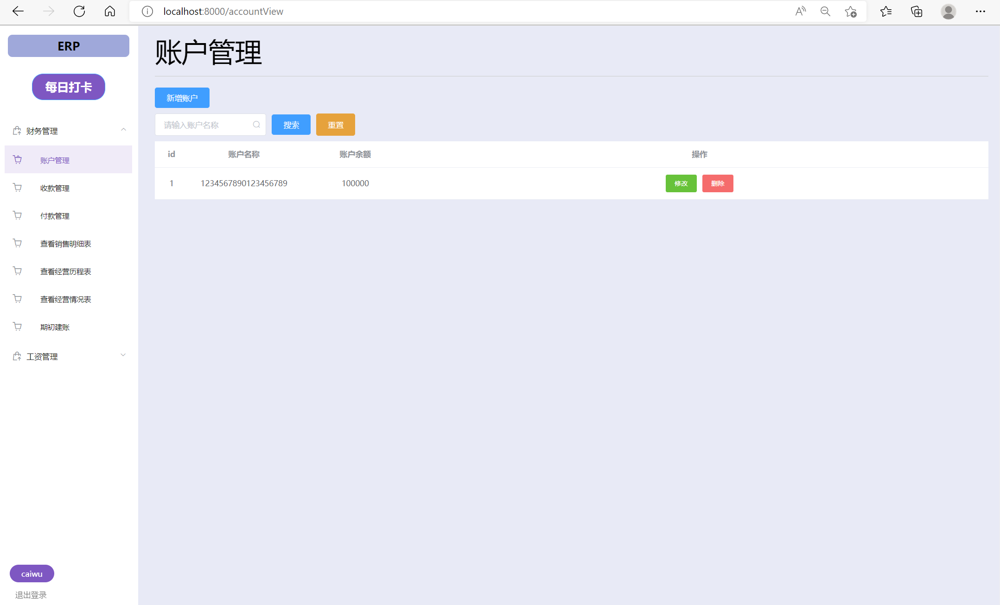

**UI1.2收款管理**

可以制定收款单，根据单据审批状态查看单据

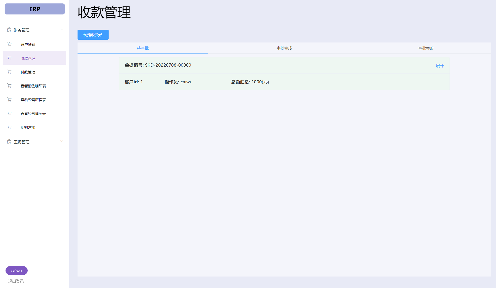


**UI1.3付款管理**

指定付款单，根据单据审批状态查看付款单

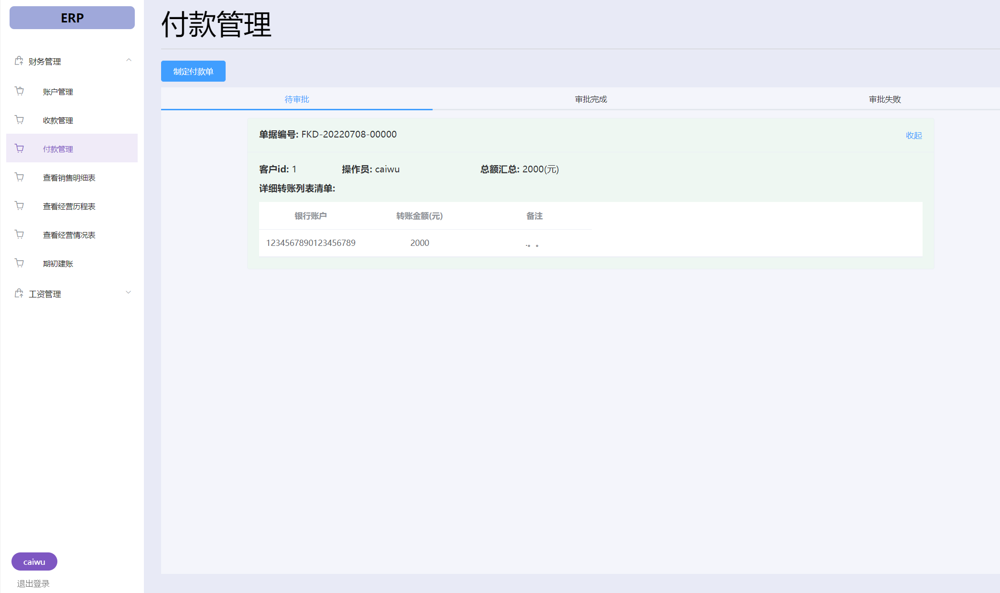


**UI1.4查看销售明细表**

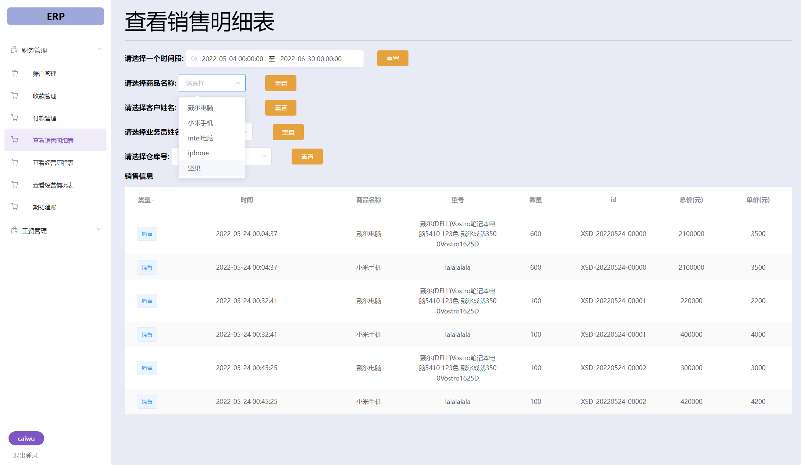

**UI1.5查看经营历程表**

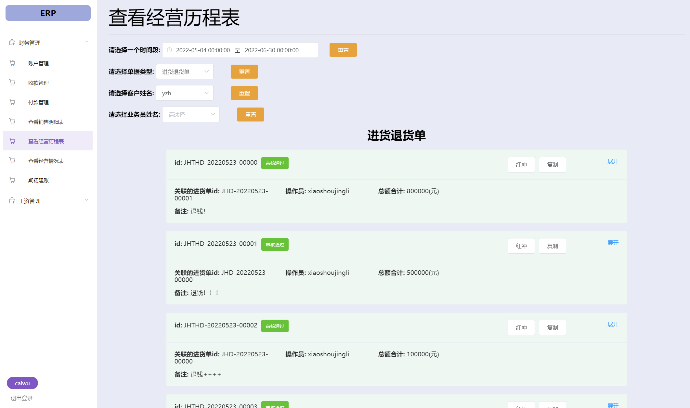

**UI1.6期初建账**

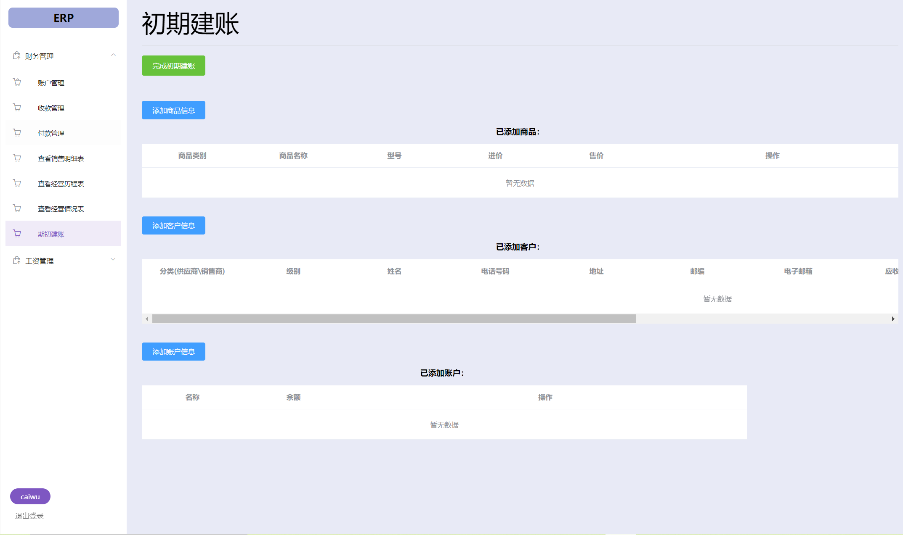

**UI2人力资源页面**

系统页面使用简约直观扁平化设计，左侧带有导航，易于定位，便于人力资源人员人员进行各项人事管理工作。

系统页面如下：

**UI2.1员工管理**

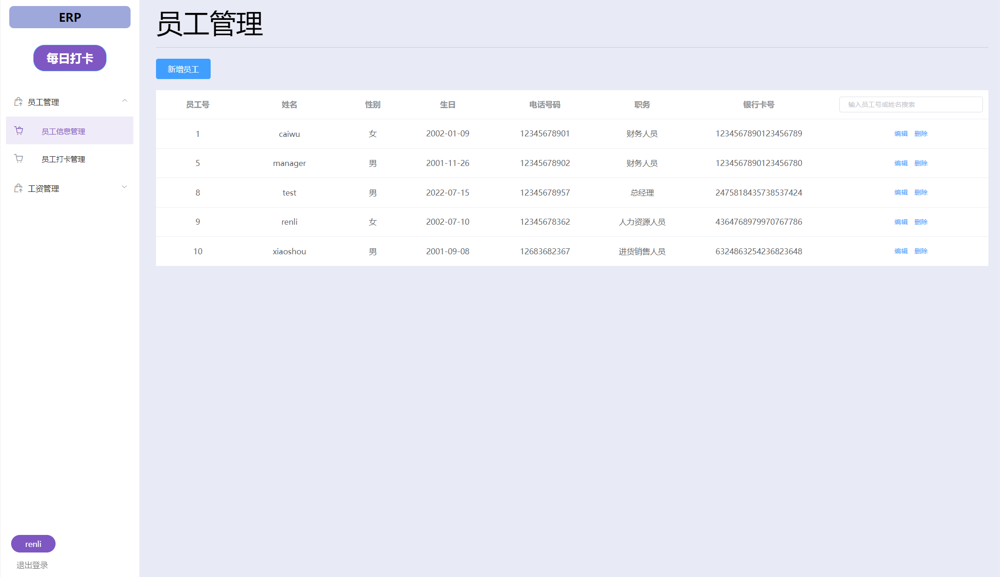

**UI2.2打卡管理**

除总经理外的员工,若当日没有打卡，系统左侧会有打卡按钮，点击即可打卡，打卡纪录显示在人力资源人员打卡管理页面

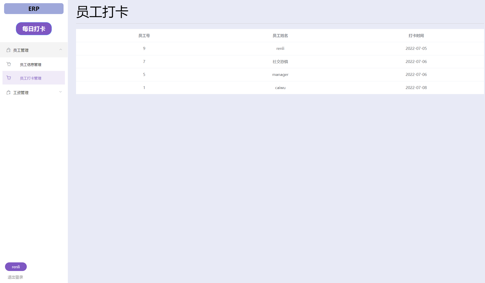

**UI2.3薪酬规则制定**

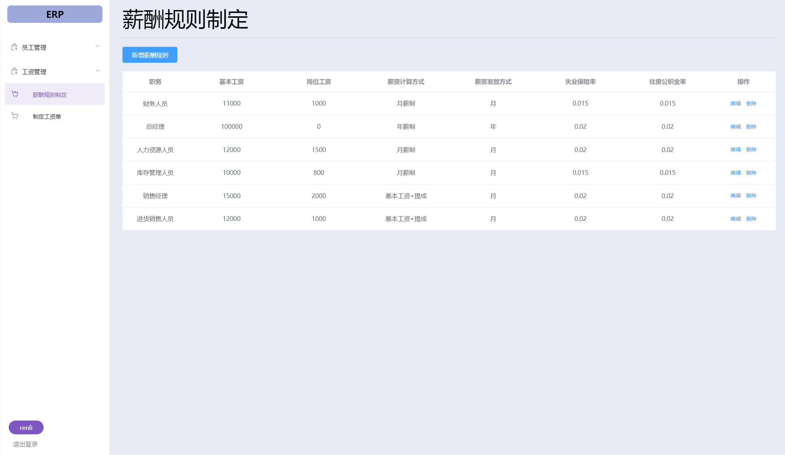

**UI2.4工资单制定**

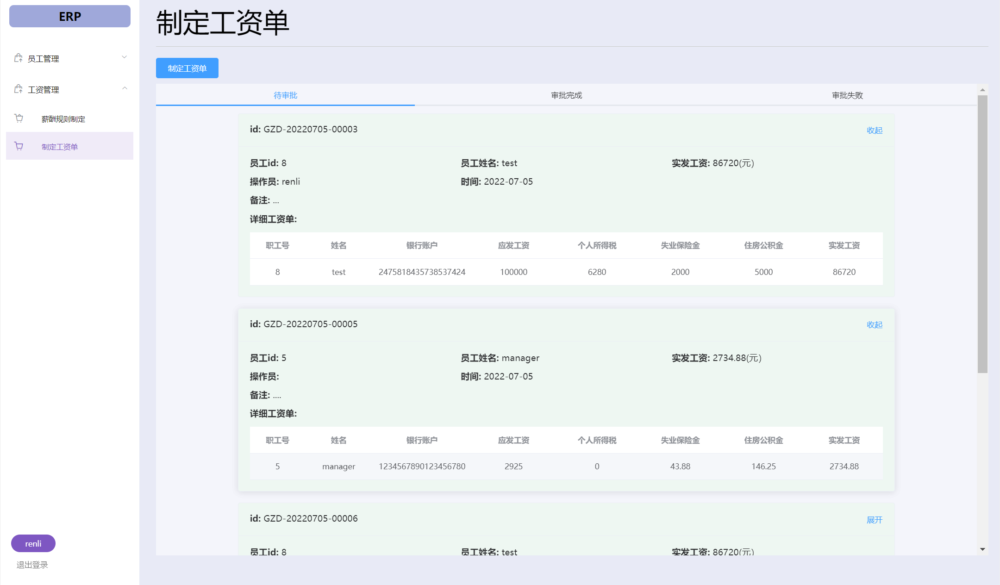

**UI3总经理页面**

系统页面使用简约直观扁平化设计，左侧带有导航，易于定位，便于总经理进行各项决策工作。

系统界面如下：

**UI3.1单据审批**

点击绿色按钮审批通过，红色按钮不通过。

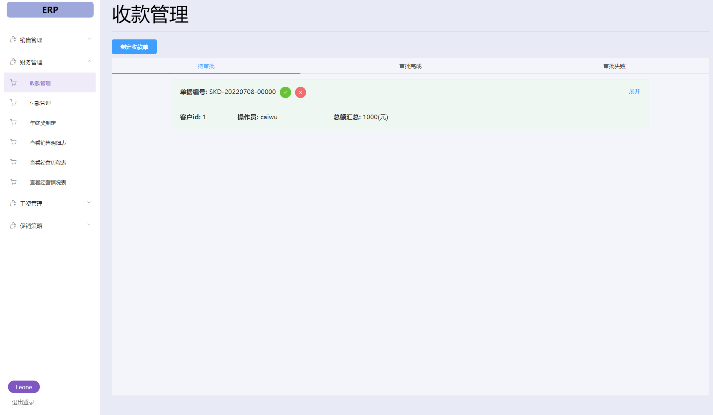

**UI3.2年终奖制定**

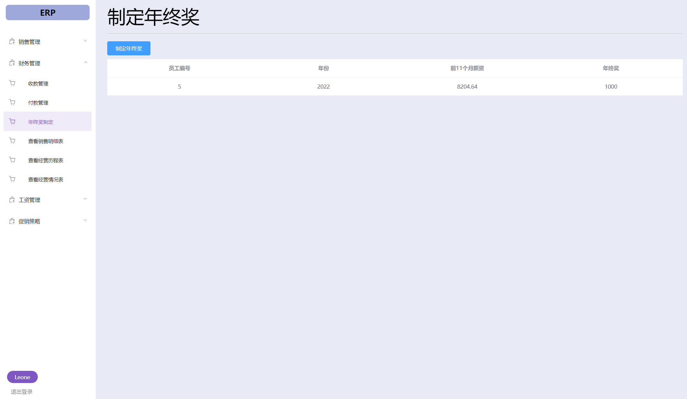

**UI3.3促销策略**

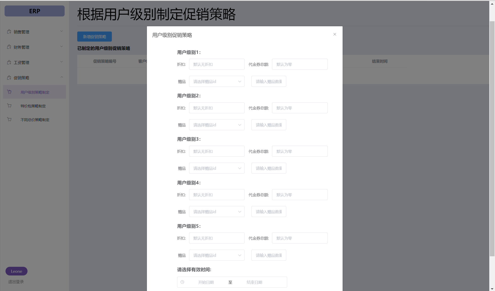

#### 3.1.2通信接口

**CI1：**后端使用RESTful的接口，由前端AXIOS调用并返回。

#### 3.1.3软件接口

使用MySQL作为底层数据库存储各项数据。

### 3.2功能需求

#### 3.2.1账户管理

##### 3.2.1.1特征

1. 在财务人员选择进行账户信息管理时，系统开始处理财务人员的请求，完成增加账户、修改账户、删除账户和模糊查询
2. 优先级==低

##### 3.2.1.2刺激/响应序列

- 刺激：财务人员选择新增账户
- 响应：系统弹出空白表单
- 刺激：财务人员填写账户名称、余额，点击立即创建
- 响应：系统显示创建结果。如果数据库中已存在同名账户，则创建失败
- 刺激：财务人员点击修改
- 响应：系统弹出表单，其中账户名称不可修改
- 刺激：财务人员修改余额，点击提交修改
- 响应：系统显示修改结果。如果余额不是数字，则修改失败
- 刺激：财务人员点击删除
- 响应：系统提示是否要删除改账户
- 刺激：财务人员点击确定/取消
- 响应：系统提示操作成功/系统提示已取消删除
- 刺激：财务人员在搜索框内输入关键字，点击查询
- 响应：系统显示查询结果
- 刺激：财务人员点击重置
- 响应：系统重新按账户编号显示所有账户信息

##### 3.2.1.3相应功能需求

| 编号                          | 功能描述                                                 |
| ----------------------------- | -------------------------------------------------------- |
| Account.Input                 | 系统应提供用户填写账户名称和余额、修改账户余额的界面     |
| Account.Save                  | 系统保存账户信息                                         |
| Account.List                  | 系统显示所有账户信息，按照id顺序从上到下排列             |
| Account.Update.Reload         | 系统应刷新所有账户信息                                   |
| Account.Update.Delete.Confirm | 用户删除账户，系统应提示是否确认删除                     |
| Account.Search.List           | 用户输入关键字进行查询，系统应根据关键字显示相应账户信息 |


#### 3.2.2制定收款单

##### 3.2.2.1特征

1. 财务人员选择制定收款单，收款单通过审批之后，财务人员会收到一条消息，根据该信息财务人员完成现实银行账户操作
2. 优先级==高

##### 3.2.2.2刺激/响应序列

- 刺激：财务人员选择制定收款单
- 响应：系统生成一个收款单草稿，包括客户和转账记录
- 刺激：财务人员选择客户并填写转账记录，点击立即创建
- 响应：系统自动将收款单状态设为待审批存入数据库，并重新显示所有收款单
- 刺激：财务人员按待审批/审批完成/审批失败三种状态选择查看收款单
- 响应：系统显示相应状态的收款单，按创建时间从上往下排列
- 刺激：财务人员选择展开某条收款单的详细信息
- 相应：系统显示收款单的详细转账记录

##### 3.2.2.3相应功能需求

| 编号                       | 功能描述                                                     |
| -------------------------- | ------------------------------------------------------------ |
| PaymentSheet.ShowByState   | 系统根据选择的状态显示相应的收款单（单据编号、客户id、操作员、总额汇总），按创建时间从上到下排列 |
| PaymentSheet.Detail        | 系统根据用户选定的收款单，显示此收款单的详细转账列表清单（银行账户、转账金额、备注） |
| PaymentSheet.Input         | 系统应允许填写收款单草稿，包括客户和转账记录（账户名字、转账金额、备注） |
| PaymentSheet.Save          | 系统保存收款单信息                                           |
| PaymentSheet.Update.Reload | 系统应刷新所有收款单信息                                     |


#### 3.2.3制定付款单

##### 3.2.3.1特征

1. 财务人员选择制定付款单，付款单通过审批之后，财务人员会收到一条消息，根据该信息财务人员完成现实银行账户操作
2. 优先级==高

##### 3.2.3.2刺激/响应序列

- 刺激：财务人员选择制定付款单
- 响应：系统生成一个付款单草稿，包括客户和转账记录
- 刺激：财务人员选择客户并填写转账记录，点击立即创建
- 响应：系统自动将付款单状态设为待审批存入数据库，并重新显示所有付款单
- 刺激：财务人员按待审批/审批完成/审批失败三种状态选择查看付款单
- 响应：系统显示相应状态的付款单，按创建时间从上往下排列
- 刺激：财务人员选择展开某条付款单的详细信息
- 相应：系统显示付款单的详细转账记录

##### 3.2.3.3相应功能需求

| 编号                       | 功能描述                                                     |
| -------------------------- | ------------------------------------------------------------ |
| ReceiptSheet.ShowByState   | 系统根据选择的状态显示相应的付款单（单据编号、客户id、操作员、总额汇总），按创建时间从上到下排列 |
| ReceiptSheet.Detail        | 系统根据用户选定的付款单，显示此付款单的详细转账列表清单（银行账户、转账金额、备注） |
| ReceiptSheet.Input         | 系统应允许填写付款单草稿，包括客户和转账记录（账户名字、转账金额、备注） |
| ReceiptSheet.Save          | 系统保存付款信息                                             |
| ReceiptSheet.Update.Reload | 系统应刷新所有付款信息                                       |


#### 3.2.4制定工资单

##### 3.2.4.1特征

1.系统确认是人力资源人员登录，显示工资管理的界面

用户新增工资单，选择员工姓名

创建工资单

2.优先级==高

##### 3.2.4.2刺激/相应序列

刺激：人力资源人员新建工资单

响应：系统生成工资单草稿

刺激：人力资源人员选择员工姓名

响应：系统计算出该员工工资单明细，更新工资单草稿

刺激：人力资源人员填写备注，确认制定工资单

响应：系统新增工资单，显示在页面上，并提示创建成功，创建失败则提示失败

刺激：人力资源人员取消操作

响应：系统返回原页面

刺激：人力资源人员根据待审批/审批完成/审批失败三种状态状态选择查看工资单

响应：系统显示符合条件的工资单

##### 3.2.4.3相应功能需求

| 编号                  | 功能描述                                                     |
| --------------------- | ------------------------------------------------------------ |
| Salary.Make           | 系统应该允许人力资源人员新建工资单，系统生成工资单草稿       |
| Salary.Make.Select    | 系统应该允许人力资源人员选择员工姓名                         |
| Salary.Make.Calculate | 用户选择员工姓名后，系统计算出该员工工资单明细，更新工资单草稿 |
| Salary.Make.Input     | 系统应允许人力资源人员填写工资单备注                         |
| Salary.Make.Success   | 人力资源人员确认制定工资单,系统新增工资单，显示在页面上，并提示创建成功 |
| Salary.Make.Fail      | 新增工资单失败，系统提示创建失败                             |
| Salary.Make.Cancel    | 人力资源人员取消操作,系统返回原页面                          |
| Salary.Search         | 系统应允许人力资源人员根据待审批/审批完成/审批失败三种状态状态选择查看工资单，系统显示符合条件的工资单 |


#### 3.2.5查看销售明细表

##### 3.2.5.1特征

1. 财务人员、总经理进入查看销售明细表的界面，可按时间区间，商品名，客户，业务员，仓库5个条件查询满足条件的销售单和销售退货单，并在界面上显示
2. 优先级==高

##### 3.2.5.2刺激/响应序列

- 刺激：财务人员、总经理进入查看销售明细表的界面
- 响应：系统按时间区间，商品名，客户，业务员，仓库5种条件默认值显示符合条件的销售单和销售退货单信息（类型、时间、商品名称、型号、数量、id、总价、单价）
- 刺激：财务人员、总经理按时间区间，商品名，客户，业务员，仓库5个条件进行筛选
- 响应：系统查找满足条件的销售单和销售退货单，并在界面上显示
- 刺激：财务人员、总经理重置某条件
- 响应：系统将该条件重新设为默认值，并查找满足条件的销售单和销售退货单在界面上显示

##### 3.2.5.3相应功能需求

| 编号                           | 功能描述                                                     |
| ------------------------------ | ------------------------------------------------------------ |
| SaleDetail.ShowByDefault       | 系统按时间区间，商品名，客户，业务员，仓库5种条件默认值显示符合条件的销售单和销售退货单 |
| SaleDetail.SelectByTime        | 财务人员、总经理筛选时间区间，系统显示符合5种条件的销售单和销售退货单 |
| SaleDetail.SelectByProduct     | 财务人员、总经理筛选商品名称，系统显示符合5种条件的销售单和销售退货单 |
| SaleDetail.SelectByCustomer    | 财务人员、总经理筛选客户姓名，系统显示符合5种条件的销售单和销售退货单 |
| SaleDetail.SelectByOperator    | 财务人员、总经理筛选业务员姓名，系统显示符合5种条件的销售单和销售退货单 |
| SaleDetail.SelectByWarehouseId | 财务人员、总经理筛选仓库号，系统显示符合5种条件的销售单和销售退货单 |
| SaleDetail.Reset               | 财务人员、总经理重置某个条件，系统重新按此条件的默认值显示符合5种条件的销售单和销售退货单 |


#### 3.2.6查看经营历程表

##### 3.2.6.1特征

1. 财务人员、总经理进入查看经营历程表的界面，可按时间区间，单据类型，客户，业务员4个条件筛选满足条件的单据，并在界面上显示
2. 优先级==高

##### 3.2.6.2刺激/响应序列

- 刺激：财务人员、总经理进入查看经营历程表的界面
- 响应：系统按时间区间，单据类型，客户，业务员4种条件默认值显示符合条件的销售类单据、进货类单据、财务类单据
- 刺激：财务人员、总经理按时间区间，商品名，客户，业务员4个条件进行筛选
- 响应：系统查找满足条件的单据，并在界面上显示
- 刺激：财务人员、总经理重置某条件
- 响应：系统将该条件重新设为默认值，并查找满足条件的单据在界面上显示
- 刺激：财务人员、总经理展开某个单据
- 响应：系统显示某个单据的详细信息

##### 3.2.6.3相应功能需求

| 编号                   | 功能描述                                                     |
| ---------------------- | ------------------------------------------------------------ |
| Sheet.ShowByDefault    | 系统按时间区间，商品名，客户，业务员4种条件默认值显示符合条件的单据 |
| Sheet.SelectByTime     | 财务人员、总经理筛选时间区间，系统显示符合4种条件的单据      |
| Sheet.SelectByProduct  | 财务人员、总经理筛选商品名称，系统显示符合4种条件的单据      |
| Sheet.SelectByCustomer | 财务人员、总经理筛选客户姓名，系统显示符合4种条件的单据      |
| Sheet.SelectByOperator | 财务人员、总经理筛选业务员姓名，系统显示符合4种条件的单据    |
| Sheet.Reset            | 财务人员、总经理重置某个条件，系统重新按此条件的默认值显示符合4种条件的单据 |
| Sheet.Detail           | 财务人员、总经理选择展开某单据，系统显示此单据的详细信息     |


#### 3.2.7红冲单据

##### 3.2.7.1特征

1. 财务人员对经营历程表中的某单据进行红冲操作，生成一个一模一样但是仅仅把数量取负的单子并入账，以此来抵消之前的单据
2. 优先级==中

##### 3.2.7.2刺激/响应序列

- 刺激：财务人员点击红冲按钮
- 响应：系统提示是否为该账单生成红冲
- 刺激：财务人员点击确定/取消
- 响应：系统生成一个把原单据各数量取负数的单据并提示创建成功/系统提示已取消红冲

##### 3.2.7.3相应功能需求

| 编号             | 功能描述                                       |
| ---------------- | ---------------------------------------------- |
| RedFlush.Confirm | 财务人员点击红冲按钮后，系统应提示是否确认红冲 |
| RedFlush.Save    | 系统保存红冲单据信息                           |


#### 3.2.8复制单据

##### 3.2.8.1特征

1. 完成红冲操作后，财务人员可对经营历程表中的某单据进行复制操作：系统生成一张以之前单据为模板的草稿单，给用户以编辑的机会
2. 优先级==高

##### 3.2.8.2刺激/响应序列

- 刺激：财务人员点击复制按钮
- 响应：系统显示一张以之前单据为模板的草稿单
- 刺激：财务人员编辑单据，点击立即创建
- 响应：系统生成单据并存入数据库

##### 3.2.8.3相应功能需求

| 编号            | 功能描述                   |
| --------------- | -------------------------- |
| CopySheet.Input | 系统应允许用户填写单据草稿 |
| CopySheet.Save  | 系统保存复制的单据信息     |


#### 3.2.9查看经营情况表

##### 3.2.9.1特征

1. 财务人员或总经理进入查看经营情况表界面，系统计算折让后总收入、总折让额、总支出、总利润，并显示在查看经营情况表界面中的三张表格中：经营情况表（折让后总收入、总折让额、总支出、总利润）、折让后总收入明细（销售收入、商品报溢收入、成本调价收入、进货退货差价、代金券与实际收款差额收入、总收入）、总支出明细（销售成本、商品报损、商品赠送、人力成本、总支出）
2. 优先级==高

##### 3.2.9.2刺激/响应序列

- 刺激：财务人员或总经理进入查看经营情况表界面
- 响应：系统显示经营情况表（折让后总收入、总折让额、总支出、总利润）、折让后总收入明细（销售收入、商品报溢收入、成本调价收入、进货退货差价、代金券与实际收款差额收入、总收入）、总支出明细（销售成本、商品报损、商品赠送、人力成本、总支出）

##### 3.2.9.3相应功能需求

| 编号                | 功能描述                                         |
| ------------------- | ------------------------------------------------ |
| OperationSheet.Show | 系统显示经营情况表、折让后总收入明细、总支出明细 |


#### 3.2.10期初建账

##### 3.2.10.1特征

1. 财务人员可以进行期初建账，添加商品信息（商品分类，某一商品的名称，类别，型号，进价/售价(默认为上年平均)，最近进价和最近售价留空），客户信息（客户分类，某一个客户的名称，联系方式等，应收应付(之前遗留)），银行账户信息（名称，余额）。期初的信息一旦建立完毕就会单独存储起来，同时将此信息作为系统的启动初始状态，之后的一切操作将会改变系统里的信息，但不会改变期初信息。期初信息随时可查。
2. 优先级==高

##### 3.2.10.2刺激/响应序列

- 刺激：财务人员点击添加商品信息
- 响应：系统弹出空白表单
- 刺激：财务人员填写表单，点击立即创建
- 响应：系统添加商品至已添加商品列表中
- 刺激：财务人员点击添加客户信息
- 响应：系统弹出空白表单
- 刺激：财务人员填写表单，点击立即创建
- 响应：系统添加客户至已添加客户列表中
- 刺激：财务人员点击添加账户信息
- 响应：系统弹出空白表单
- 刺激：财务人员填写表单，点击立即创建
- 响应：系统添加账户至已添加账户列表中
- 刺激：财务人员离开界面
- 响应：系统提醒用户若离开界面，则所有尚未完成初期建账所添加的商品、客户、账户信息都将丢失
- 刺激：财务人员点击完成初期建账
- 响应：系统提示是否完成最终期初建账
- 刺激：财务人员点击确定/取消
- 响应：系统提示创建成功，并显示所有期初建账信息列表/系统提示已取消

##### 3.2.10.3相应功能需求

| 编号                         | 功能描述                                                     |
| ---------------------------- | ------------------------------------------------------------ |
| OpeningEstablish.AddProduct  | 系统应允许用户添加商品                                       |
| OpeningEstablish.AddCustomer | 系统应允许用户添加客户                                       |
| OpeningEstablish.AddAccount  | 系统应允许用户添加账户                                       |
| OpeningEstablish.Input       | 系统应允许用户填写商品/客户/账户表单                         |
| OpeningEstablish.Save        | 系统应保存期初建账信息                                       |
| OpeningEstablish.List        | 系统应以列表形式展示所有期初建账信息，包括商品、客户、账户信息 |


#### 3.2.11员工管理

##### 3.2.11.1特征

1.系统确认是人力资源人员登录，显示员工管理的界面

系统显示已有的所有员工信息，可以按员工号和姓名搜索

用户添加员工的姓名、性别、生日、电话号码、职务、银行卡号

系统添加员工，并显示更新后的界面

2.优先级==高

##### 3.2.11.2刺激/响应序列

刺激：人力资源人员选择新增员工

响应：系统生成一张员工信息草稿单

刺激：人力资源人员编辑草稿单并确认

响应：系统添加员工信息，显示在页面上，提示添加成功

刺激：人力资源人员选择修改员工信息

响应：系统显示员工信息草稿单给用户编辑

刺激：人力资源人员编辑草稿单并确认

响应：系统修改员工信息，显示在页面上，提示修改成功

刺激：人力资源人员选择员工信息进行删除并确认

响应：系统删除该员工信息并提示删除成功

刺激：人力资源人员取消操作

响应：系统返回原页面

刺激：人力资源人员输入员工号或姓名搜索

响应：系统搜索符合条件的员工显示在页面上

##### 3.2.11.3相应功能需求

| 编号                     | 功能描述                                                     |
| ------------------------ | ------------------------------------------------------------ |
| Personnel.Add            | 系统应该允许人力资源人员新增员工，系统生成一张员工信息草稿单 |
| Personnel.Add.Input      | 系统应该允许人力资源人员编辑草稿单                           |
| Personnel.Add.Success    | 人力资源人员确认新增员工，系统统添加员工信息，显示在页面上，提示添加成功 |
| Personnel.Modify         | 系统应该允许人力资源人员修改员工，显示员工信息草稿单给用户编辑 |
| Personnel.Modify.Input   | 系统应该允许人力资源人员编辑员工信息                         |
| Personnel.Modify.Success | 用户确认修改，系统修改员工信息，显示在页面上，提示修改成功   |
| Personnel.Delete         | 系统应该允许人力资源人员选择员工信息进行删除                 |
| Personnel.Delete.Success | 用户确认删除，系统删除该员工信息并提示删除成功               |
| Personnel.Cancel         | 人力资源人员取消操作,系统返回原页面                          |
| Personnel.Search         | 系统应该允许人力资源人员输入员工号或姓名搜索员工信息,系统搜索符合条件的员工显示在页面上 |
| Personnel.ShowAll        | 系统将所有员工信息显示在页面上                               |


#### 3.2.12员工打卡

##### 3.2.12.2刺激/响应序列

刺激：用户当日尚未打卡时登录系统

响应：系统显示打卡按钮

刺激：用户点击打卡按钮

响应：系统更新打卡记录，显示签到成功，隐藏打卡按钮,打卡失败则提示失败

##### 3.2.12.3相应功能需求

| 编号           | 功能描述                                               |
| -------------- | ------------------------------------------------------ |
| Attend.Show    | 用户当日尚未打卡时登录系统，系统显示打卡按钮           |
| Attend.Click   | 用户点击打卡按钮,系统更新打卡记录                      |
| Attend.Success | 更新打卡记录成功，系统提示签到成功                     |
| Attend.Fail    | 更新打卡记录失败，系统提示签到失败                     |
| Attend.Hide    | 用户当日打过卡后登录系统或打卡成功后，系统隐藏打卡按钮 |


#### 3.2.13薪酬规则制定

##### 3.2.13.1特征

1.系统确认是人力资源人员登录，显示查看薪酬规则制定的界面

系统显示更新后的全部薪酬规则

用户添加薪酬规则的职务、基本工资、岗位工资等信息

系统新增薪酬规则5. 系统显示更新后的全部薪酬规则

2.优先级==高

##### 3.2.13.2刺激/响应序列

刺激：人力资源人员选择新增薪酬规则

响应：系统生成薪酬规则草稿单

刺激：人力资源人员编辑草稿单并确认新增

响应：系统根据职务检查是否重复制定，若没有，则系统新增薪酬规则并显示，提示新增成功，否则提示失败

刺激：人力资源人员修改薪酬规则

响应：系统显示薪酬规则草稿单给用户编辑

刺激：人力资源人员编辑草稿单并确认修改

响应：系统修改薪酬规则，提示修改成功

刺激：人力资源人员选择薪酬规则删除并确认

响应：系统删除该薪酬规则，提示删除成功

刺激：人力资源人员取消操作

响应：系统返回原页面

##### 3.2.13.3相应功能需求

| 编号                      | 功能描述                                                     |
| ------------------------- | ------------------------------------------------------------ |
| SalaryRule.Add            | 系统应该允许人力资源人员新增薪酬规则，系统生成一张薪酬规则草稿单 |
| SalaryRule.Add.Input      | 系统应该允许人力资源人员编辑薪酬规则草稿单                   |
| SalaryRule.Add.Success    | 人力资源人员确认新增薪酬规则，系统根据职务检查是否重复制定，若没有，则系统新增薪酬规则，显示在页面上，提示新增成功 |
| SalaryRule.Add.Fail       | 人力资源人员确认新增薪酬规则,系统检测出重复制定，提示失败    |
| SalaryRule.Modify         | 系统应该允许人力资源人员薪酬规则，显示薪酬规则草稿单给用户编辑 |
| SalaryRule.Modify.Input   | 系统应该允许人力资源人员编辑薪酬规则                         |
| SalaryRule.Modify.Success | 用户确认修改，系统修改薪酬规则，显示在页面上，提示修改成功   |
| SalaryRule.Delete         | 系统应该允许人力资源人员选择薪酬规则进行删除                 |
| SalaryRule.Delete.Success | 用户确认删除，系统删除该薪酬规则并提示删除成功               |
| SalaryRule.Cancel         | 人力资源人员取消操作,系统返回原页面                          |


#### 3.2.14制定促销策略

##### 3.2.14.1特征

1.系统确认是总经理登录，显示查看制定促销策略的界面

界面显示已建立的所有促销策略

总经理填写促销策略所需内容并创建促销策略

界面显示更新已建立的所有促销策略并显示

2.优先级==高

##### 3.2.14.2刺激/响应序列

刺激：总经理制定客户级别促销策略

响应：系统生成相应的草稿单

刺激：总经理根据不同用户级别填写折扣、代金卷总额、赠品，以及促销策略有效时间，并确认创建

响应：系统创建该促销策略，显示在页面上，提示用户创建成功

刺激：总经理制定特价包策略

响应：系统生成相应的草稿单

刺激：总经理选择组合销售的商品id,填写数量和降价金额，以及促销策略有效时间，并确认创建

响应：系统创建该促销策略，显示在页面上，提示用户创建成功

刺激：总经理制定不同总价策略

响应：系统生成相应的草稿单

刺激：总经理填写总价，代金卷总额，赠品，赠品数量，以及促销策略有效时间，并确认创建

响应：系统创建该促销策略，显示在页面上，提示用户创建成功

刺激：总经理取消制定促销策略

响应：系统返回原页面

##### 3.2.14.3相应功能需求

| 编号                                | 功能描述                                                     |
| ----------------------------------- | ------------------------------------------------------------ |
| PromotionStrategy.ClientLevel.Make  | 总经理制定客户级别促销策略,系统生成相应的草稿单              |
| PromotionStrategy.ClientLevel.Input | 系统应该允许总经理根据不同用户级别填写折扣、代金卷总额、赠品，以及促销策略有效时间 |
| PromotionStrategy.Combination.Make  | 总经理制定特价包策略,系统生成相应的草稿单                    |
| PromotionStrategy.Combination.Input | 系统应该允许总经理选择组合销售的商品id,填写数量和降价金额，以及促销策略有效时间 |
| PromotionStrategy.TotalPrice.Make   | 总经理制定不同总价策略,系统生成相应的草稿单                  |
| PromotionStrategy.TotalPrice.Input  | 系统应该允许总经理填写总价，代金卷总额，赠品，赠品数量，以及促销策略有效时间 |
| PromotionStrategy.Cancel            | 总经理取消制定促销策略，系统返回原页面                       |
| PromotionStrategy.Success           | 总经理确认创建，系统创建该促销策略，显示在页面上，提示用户创建成功 |
| PromotionStrategy.ShowAll           | 系统在页面上显示已经创建的促销策略                           |


#### 3.2.15制定年终奖

##### 3.2.15.1特征

1. 系统确认是总经理登录，显示查看制定年终奖的界面。界面显示已制定的所有年终奖。用户选择员工和年份，查询其11个月的工资。用户根据员工前11个月的工资及其业绩表现，制定年终奖。系统添加年终奖。界面显示更新后的所有年终奖
1. 优先级==中

##### 3.2.15.2刺激/响应序列

+ 刺激：总经理进入制定年终奖界面
+ 响应：系统默认显示所有已制定的年终奖
+ 刺激：总经理选择制定年终奖
+ 响应：系统生成制定年终奖草稿单
+ 刺激：总经理选择员工、年份，制定年终奖
+ 响应：系统返回草稿单，显示该员工前11个月的工资总和
+ 刺激：总经理填写年终奖
+ 响应：系统提示操作成功，系统制定年终奖，界面显示更新后的所有已制定年终奖

##### 3.2.15.3相应功能需求

| 编号               | 功能描述                                                     |
| ------------------ | ------------------------------------------------------------ |
| Bonus.Search       | 系统应该允许总经理制定年终奖，系统生成一张制定年终奖草稿单   |
| Bonus.Search.Input | 系统应该允许总经理编辑年终奖草稿单，选择员工、年份           |
| Bonus.Make         | 系统应该允许总经理制定年终奖，系统生成一张制定年终奖草稿单   |
| Bonus.Make.Input   | 系统应该允许总经理编辑年终奖草稿单，填写年终奖               |
| Bonus.Make.Success | 用户确认年终奖，系统提示操作成功，系统制定年终奖，界面显示更新后的所有已制定年终奖 |


#### 3.2.16审批收款单

##### 3.2.16.1特征

1. 总经理可以审批收款单。若通过审批，则将收款单的状态设置为审批完成，并更新客户的应付字段和账户余额。若未通过审批，则将收款单的状态设置为审批失败
2. 优先级==低

##### 3.2.16.2刺激/响应序列

- 刺激：总经理进入收款管理界面
- 响应：系统默认显示所有待审批收款单
- 刺激：总经理审批收款单
- 响应：系统提示操作成功，系统更新收款单状态，界面按收款单更新后的状态显示所有收款单

##### 3.2.16.3相应功能需求

| 编号                    | 功能描述                                                     |
| ----------------------- | ------------------------------------------------------------ |
| ApprovalReceipt.Success | 审批通过，系统将收款单状态设为审批完成                       |
| ApprovalReceipt.Fail    | 审批未通过，系统将收款单状态设为审批失败                     |
| ApprovalReceipt.Reload  | 审批单据后，系统应刷新界面，按收款单更新后的状态显示所有收款单 |


#### 3.2.17审批付款单

##### 3.2.17.1特征

1. 总经理可以审批付款单。若通过审批，则将付款单的状态设置为审批完成，并更新客户的应收字段和账户余额。若未通过审批，则将付款单的状态设置为审批失败
2. 优先级==低

##### 3.2.17.2刺激/响应序列

- 刺激：总经理进入付款管理界面
- 响应：系统默认显示所有待审批付款单
- 刺激：总经理审批付款单
- 响应：系统提示操作成功，系统更新付款单状态，界面按收款单更新后的状态显示所有付款单

##### 3.2.17.3相应功能需求

| 编号                    | 功能描述                                                     |
| ----------------------- | ------------------------------------------------------------ |
| ApprovalPayment.Success | 审批通过，系统将付款单状态设为审批完成                       |
| ApprovalPayment.Fail    | 审批未通过，系统将付款单状态设为审批失败                     |
| ApprovalPayment.Reload  | 审批单据后，系统应刷新界面，按收款单更新后的状态显示所有付款单 |

#### 3.2.18审批工资单

##### 3.2.18.1特征

1. 总经理可以审批工资单。若通过审批，则将工资单的状态设置为审批完成，并更新员工的账户余额。若未通过审批，则将工资单的状态设置为审批失败
2. 优先级==低

##### 3.2.18.2刺激/响应序列

- 刺激：总经理进入工资管理界面
- 响应：系统默认显示所有待审批工资单
- 刺激：总经理审批工资单
- 响应：系统提示操作成功，系统更新工资单状态，界面按工资单更新后的状态显示所有工资单

##### 3.2.18.3相应功能需求

| 编号                   | 功能描述                                                     |
| ---------------------- | ------------------------------------------------------------ |
| ApprovalSalary.Success | 审批通过，系统将工资单状态设为审批完成                       |
| ApprovalSalary.Fail    | 审批未通过，系统将工资单状态设为审批失败                     |
| ApprovalSalary.Reload  | 审批单据后，系统应刷新界面，按工资单更新后的状态显示所有工资单 |

### 3.3非功能需求

#### 3.3.1安全性

**Safety1：**系统应该只允许经过验证和授权的用户访问

**Safety2：**系统应该按照用户的身份验证用户相应的操作权限，其他身份的用户没有访问权限

#### 3.3.2可维护性

**Modifiability1：**如果系统要增加新的促销策略，要能够在0.25个人月内完成。

**Modifiability2：**在系统的各项单据数据格式发生变化时，系统要能在3人1天内完成。

**Modifiability3：**如果系统要增加或者改变薪水规则，系统要能在3人1天内完成。

**Modifiability4：**如果系统要增加新的员工职务，系统要能在3人1天内完成。

#### 3.3.3易用性

**Usability1：**使用系统一周的财务人员制定各项单据的效率要达到10单据/小时。

**Usability2：**使用系统一周的人力资源人员制定工资单的效率要达到10份/小时。

**Usability3：**使用系统一周的总经理审批单据的效率要达到10单据/小时。

#### 3.3.4可靠性

**Reliability：**在客户端与服务器通信时，如果网络故障，系统不能出现故障。

#### 3.3.5业务规则

**BR1：**员工打卡与薪资挂钩，该规则可能变化

员工每月打卡次数不得少于25次，少于25次每次扣除当月基本工资的1/30

**BR2：**薪水规则

库存人员和人力资源人员实行月薪制

销售人员实行基本工资+提成的制度

总经理实行年薪制


#### 3.3.6约束

**IC1：**系统要在网络上分布为一个服务器和多个客户端

**IC2：**系统要为不同的人员提供不同的部署

**IC3：**系统后端使用Java，MySQL，springboot进行开发，前端使用Vue进行开发

### 3.4数据需求

#### 3.4.1数据定义

```java
account(id,name,amount)
    
attendance(id,uid,uname,date)
    
bonussheet(uid,year,salary,bonus)
    
category(id,name,parent_id,is_leaf,item_count,item_index)
    
customer(id,type,level,name,phone,address,zipcode,email,line_of_credit,receivable,payable,operator)
    
gift_sheet(id,sale_sheet_id,pid,number,unit_price,total_price,state)
    
payment_sheet(id,supplier,operator,total_amount,state,create_time)
    
payment_sheet_content(id,payment_sheet_id,bank_account,transfer_amount,remark)    
    
personnel(id,name,gender,birthday,phone_number,role,card_number)
    
product(id,name,category_id,type,quantity,purchase_price,retail_price,recent_pp,recent_rp)
    
purchase_returns_sheet(id,purchase_sheet_id,operator,state,create_time,total_amount,remark)
    
purchase_returns_sheet_content(id,purchase_returns_sheet_id,pid,quantity,total_price,unit_price,remark)
    
purchase_sheet(id,supplier,operator,remark,total_amount,state,create_time)
    
purchase_sheet_content(id,purchase_sheet_id,pid,quantity,unit_price,total_price,remark)    
    
receipt_sheet(id,supplier,operator,total_amount,state,create_time)
    
receipt_sheet_content(id,receipt_sheet_id,bank_account,transfer_amount,remark)
    
salary_sheet(id,uname,uid,account_name,raw_salary,personnel_income_tax,unemployment_insurance,housing_provident_fund,actual_salary,state,date,operator,remark) 
    
salary_system(role,base,post,calculate_method,distribute_method,unemployment_insurance_rate,housing_fund_rate)
    
sale_returns_sheet(id,sale_sheet_id,salesman,operator,remark,raw_total_amount,state,final_amount,discount,voucher_amount,create_time)    
    
sale_returns_sheet_content(id,sale_returns_sheet_id,pid,quantity,unit_price,total_price,remark)    

sale_sheet(id,supplier,operator,remark,state,create_time,salesman,raw_total_amount,discount,final_amount,voucher_amount)  
    
sale_sheet_content(id,sale_sheet_id,pid,quantity,unit_price,total_price,remark)
    
user(id,name,password,role)    
    
```

**DR1：**系统需存储的数据实体以及关系如上（仅Lab7)

**DR2：**系统需要存储一年内的所有单据和报表

**DR3：**系统需要保证数据不溢出表示范围

**DR4：**系统需要存储的数据实体及其关系参见用例文档中的概念类图

#### 3.4.2默认数据

默认数据用于以下两种情况：

​	系统中新增加数据时

​	编辑数据不小心将相关内容清空时

**Default1：**各类单据的操作员默认为当前制定单据的用户

**Default2：**每天的收款单、付款单、工资单编号默认从00000起

**Default3：**各单据的创建时间默认为当前时间

**Default4：**各单据的备注默认为空

#### 3.4.3数据格式要求

**Format1：**收款单单据号的格式为SKD-yyyyMMdd-xxxxx

**Format2：**付款单单据号的格式为XJFYD-yyyyMMdd-xxxxx

**Format3：**工资单单据号的格式为GZD-yyyyMMdd-xxxxx

**Format4：**财务管理工作中各类单据、报表的时间格式为yyyy-MM-dd hh:mm:ss

**Format5：**员工的出生年月格式为yyyy-MM-dd，手机号必须为11位数字

**Format6：**工资单的制定时间格式为yyyy-MM-dd

**Format7：**涉及金额的数据格式必须是精确到精确到小数点后2位的浮点数

### 3.5其他需求

安装需求

**Install1：**在安装系统时，要初始化用户、库存、单据、报表等重要数据

**Install2：**系统投入使用时，需要对用户进行1天的集中培训


